# Learning Session — ML API Template Deep Dive

---

# 1. What is the need for lockfiles in Python packaging? What happens if I edit it?

## What

A lockfile (like `uv.lock`) is a file that records the **exact versions** of every dependency (and every transitive dependency) that was resolved and installed. It's the difference between "install FastAPI version 0.115 or higher" (what `pyproject.toml` says) and "install FastAPI 0.115.6, with starlette 0.41.2, with anyio 4.6.2, with sniffio 1.3.1..." (what the lockfile says).

## Why

Without a lockfile, two developers running `uv sync` on the same project at different times can end up with different dependency versions — because new versions get released constantly.

**Scenario without lockfile:**
- Monday: Developer A installs `httpx>=0.27.0` → gets httpx 0.27.2
- Friday: Developer B installs `httpx>=0.27.0` → gets httpx 0.28.0 (just released)
- httpx 0.28.0 has a breaking change → Developer B's code fails, Developer A's works fine

**Scenario with lockfile:**
- Monday: Developer A installs, lockfile records `httpx==0.27.2`
- Friday: Developer B runs `uv sync` → lockfile says `httpx==0.27.2` → gets the exact same version
- Both developers have identical environments

## How it works

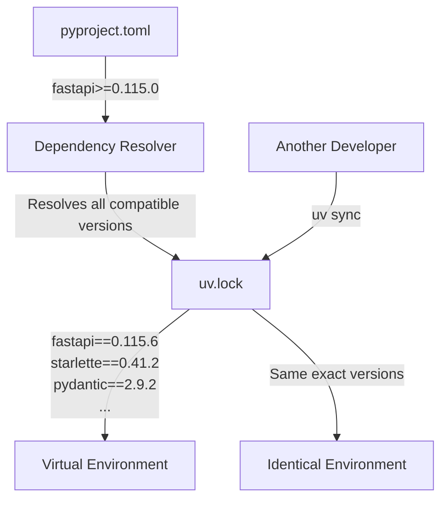

## What happens if you edit the lockfile?

**Don't.** The lockfile is auto-generated and auto-maintained.

- If you manually edit it, `uv` may reject it (checksum mismatch) or produce an inconsistent environment.
- If you delete it, `uv sync` will re-resolve from scratch — potentially picking newer versions.
- It gets **automatically updated** when you run:
  - `uv add <package>` — adds a package and re-resolves
  - `uv remove <package>` — removes and re-resolves
  - `uv lock --upgrade` — upgrades all packages to latest compatible versions
  - `uv lock` — re-resolves if `pyproject.toml` changed

## Key rules

| Action | Effect on lockfile |
|--------|-------------------|
| `uv add requests` | Updated automatically |
| `uv remove requests` | Updated automatically |
| `uv lock --upgrade` | Updated (all deps to latest) |
| Manually edit lockfile | **Don't** — will break checksums |
| Delete lockfile | Next `uv sync` creates a fresh one (versions may differ) |
| Commit lockfile to git | **Yes, always** — ensures team consistency |

---

# 2. What is the need for using Pydantic?

## What

Pydantic is a data validation library that uses Python type hints to define the shape of data and automatically validates it at runtime. In the context of an ML API, it validates every request coming in and every response going out.

## Why

Without Pydantic, you'd write manual validation code like this:

```python
# WITHOUT Pydantic — manual, error-prone, verbose
@app.post("/predict")
async def predict(request: Request):
    body = await request.json()
    
    # Manual validation
    if "text" not in body:
        return JSONResponse(status_code=422, content={"error": "text is required"})
    if not isinstance(body["text"], str):
        return JSONResponse(status_code=422, content={"error": "text must be a string"})
    if len(body["text"]) > 10000:
        return JSONResponse(status_code=422, content={"error": "text too long"})
    if "top_k" in body and not isinstance(body["top_k"], int):
        return JSONResponse(status_code=422, content={"error": "top_k must be int"})
    
    # Now use body["text"]...
```

With Pydantic:

```python
# WITH Pydantic — declarative, automatic, type-safe
from pydantic import BaseModel, Field

class PredictionRequest(BaseModel):
    text: str = Field(..., min_length=1, max_length=10000)
    top_k: int = Field(default=3, ge=1, le=10)

@app.post("/predict")
async def predict(body: PredictionRequest):
    # body.text is guaranteed to be a valid string, 1-10000 chars
    # body.top_k is guaranteed to be an int between 1 and 10
    # If validation fails, FastAPI auto-returns a 422 with details
    result = await service.predict(body.text)
```

## What problems it solves

1. **Input validation** — rejects malformed requests before they reach your model
2. **Type safety** — you know `body.text` is a `str`, not `None` or `42`
3. **Documentation** — FastAPI auto-generates Swagger docs from Pydantic models
4. **Serialization** — converts Python objects to JSON responses automatically
5. **Configuration** — `pydantic-settings` validates your env vars at startup (not at runtime when it's too late)

## When it matters for ML

```python
class InferenceRequest(BaseModel):
    """If someone sends garbage, Pydantic rejects it BEFORE it hits your GPU."""
    image_url: HttpUrl                          # Must be a valid URL
    confidence_threshold: float = Field(0.5, ge=0.0, le=1.0)  # Must be 0-1
    max_detections: int = Field(10, ge=1, le=100)              # Must be 1-100
    model_name: str = Field(..., pattern=r"^[a-z0-9_-]+$")    # No injection
```

Without this, invalid data reaches your model → crashes, OOM, or garbage output.

---

# 3. Difference between uvicorn, gunicorn, Flask, and FastAPI

## What each one is

These are four different things that operate at different layers:

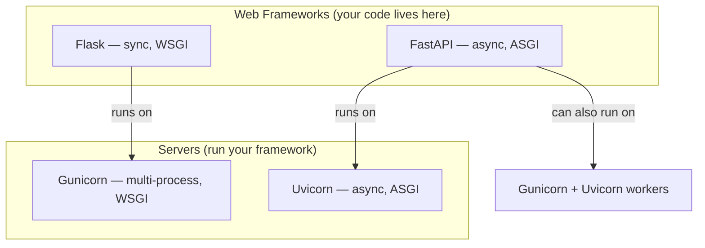

## The four components explained

| Component | What it is | Protocol | Concurrency model |
|-----------|-----------|----------|-------------------|
| **Flask** | Web framework | WSGI (synchronous) | One request per thread |
| **FastAPI** | Web framework | ASGI (asynchronous) | Many requests per thread (event loop) |
| **Gunicorn** | Server/process manager | WSGI | Multiple worker processes |
| **Uvicorn** | Server | ASGI | Single process, async event loop |

## Analogy

Think of a restaurant:
- **Flask/FastAPI** = the chef (handles the cooking/logic)
- **Uvicorn/Gunicorn** = the restaurant building (receives customers, routes them to the chef)
- **WSGI/ASGI** = the communication protocol between the building and the chef

## Why FastAPI + Uvicorn for ML APIs

```python
# Flask (sync) — while waiting for model inference, this thread is BLOCKED
# No other request can be processed by this thread
@app.route("/predict", methods=["POST"])
def predict():
    features = fetch_features_from_db()  # Blocks thread for 50ms
    result = model.predict(features)      # Blocks thread for 200ms
    return jsonify(result)
    # Total: thread occupied for 250ms, doing nothing during I/O waits

# FastAPI (async) — while waiting for I/O, other requests are processed
@app.post("/predict")
async def predict(body: PredictionRequest):
    features = await fetch_features_from_db()  # Yields control during I/O
    result = await asyncio.to_thread(model.predict, features)  # Runs in thread pool
    return result
    # During I/O waits, the event loop handles other requests
```

## Production deployment patterns

```bash
# Development (single process, auto-reload)
uvicorn app.main:app --reload

# Production (multiple worker processes for CPU parallelism)
gunicorn app.main:app -w 4 -k uvicorn.workers.UvicornWorker

# The above means: Gunicorn manages 4 worker processes,
# each running Uvicorn internally for async support
```

| Scenario | Recommended setup |
|----------|------------------|
| Local development | `uvicorn --reload` |
| Production (CPU model) | `gunicorn -w 4 -k uvicorn.workers.UvicornWorker` |
| Production (GPU model) | `uvicorn` (single process — GPU can't be shared across processes easily) |
| Production (multiple GPUs) | Multiple containers, one per GPU |

---

# 4. What is the advantage of using a Makefile?

## What

A Makefile is a file that defines **named shortcuts** for shell commands. When you type `make test`, it runs whatever command is defined under the `test` target.

## Why

Without a Makefile, every developer needs to remember (or look up) exact commands:

```bash
# Without Makefile — tribal knowledge
uv run uvicorn app.main:app --reload --host 0.0.0.0 --port 8000
uv run pytest -v --cov=app --cov-report=term-missing
uv run ruff check . && uv run ruff format --check .
docker build -f docker/Dockerfile -t ml-api-template:$(git rev-parse --short HEAD) .
```

With a Makefile:

```bash
# With Makefile — discoverable, consistent
make run
make test-cov
make lint
make docker-build
```

## What problems it solves

1. **Discoverability** — new team member types `make` + Tab, sees all available commands
2. **Consistency** — everyone runs the exact same commands (no "works on my machine")
3. **Documentation** — the Makefile IS the documentation of your workflows
4. **Composability** — CI/CD pipelines just call `make lint && make test && make docker-build`
5. **Abstraction** — if you switch from `uv` to `poetry`, you change the Makefile once, not every developer's muscle memory

## Scenario

```
New developer joins team:
  Day 1 without Makefile:
    "How do I run this?" → Slack → wait → wrong command → debug → 2 hours lost
  
  Day 1 with Makefile:
    "make install-dev && make run" → working in 2 minutes
```

## Key advantage for ML teams

ML projects have complex workflows (train, evaluate, export, serve, benchmark). A Makefile standardizes all of them:

```makefile
train:
	uv run python -m training.train experiment=baseline

evaluate:
	uv run python -m training.evaluate checkpoint=latest

export-onnx:
	uv run python scripts/export_model.py --format onnx

benchmark:
	uv run python scripts/benchmark.py --endpoint http://localhost:8000/v1/predict
```

---

# 5. What is tracing with OpenTelemetry? What is distributed tracing?

## What is tracing?

Tracing records the **journey of a single request** through your system — every function it calls, every service it touches, how long each step took.

A **trace** is made up of **spans**. Each span represents one unit of work:

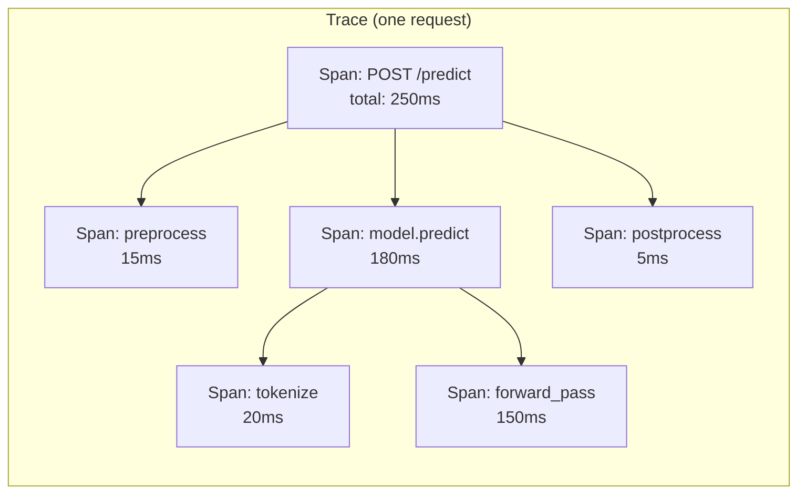

## What is distributed tracing?

When a single user request passes through **multiple services**, distributed tracing connects all the spans across services into one unified trace:

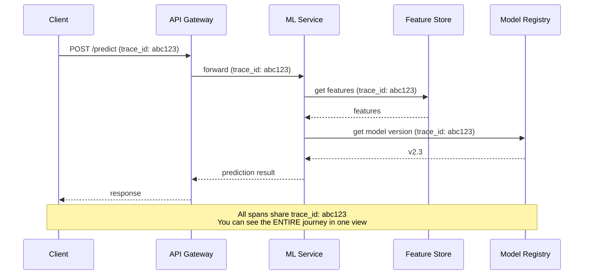

Without distributed tracing, when latency spikes, you'd check each service's logs independently and try to correlate timestamps manually. With tracing, you open one trace and see exactly where time was spent.

## How OpenTelemetry works

OpenTelemetry (OTel) is the **vendor-neutral standard** for tracing. It doesn't lock you into Datadog, Jaeger, or any specific backend.

```python
from opentelemetry import trace

tracer = trace.get_tracer("app.services.prediction")

async def predict(self, text: str):
    with tracer.start_as_current_span("prediction") as span:
        span.set_attribute("input.length", len(text))
        
        with tracer.start_as_current_span("preprocess"):
            features = self.preprocess(text)
        
        with tracer.start_as_current_span("inference"):
            result = await self.engine.predict(features)
            span.set_attribute("model.confidence", result["confidence"])
        
        return result
```

## What you see in the tracing UI (Jaeger, Tempo, Datadog)

```
POST /v1/predict ─────────────────────────────── 250ms
  ├── middleware.request_context ──── 0.1ms
  ├── middleware.logging ──────────── 0.1ms
  ├── prediction_service.predict ──── 245ms
  │     ├── preprocess ──────────── 15ms
  │     ├── feature_store.get ───── 50ms  ← network call!
  │     └── engine.forward_pass ─── 180ms ← GPU inference
  └── response_serialization ──────── 2ms
```

Now you instantly know: "180ms is spent in the model forward pass, 50ms waiting for the feature store."

---

# 6. How is testing done for API endpoints with transport, service, inference, and infra layers?

## The testing pyramid for a layered ML API

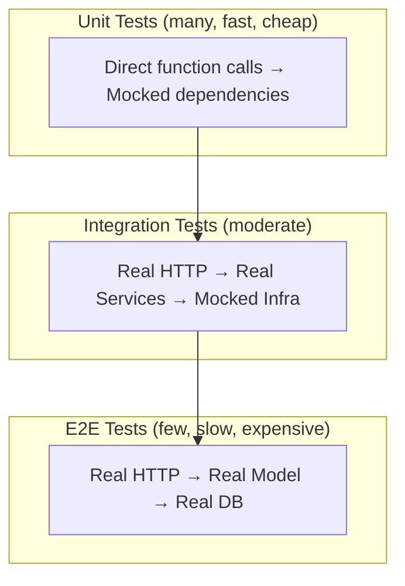

## What each layer tests

### Unit Tests — test business logic in isolation

```python
# tests/unit/test_prediction_service.py
# Tests the SERVICE layer — no HTTP, no real model, no real DB

import pytest
from unittest.mock import AsyncMock
from app.services.prediction_service import PredictionService

@pytest.mark.asyncio
async def test_predict_returns_top_k_results():
    """Service correctly sorts and limits results."""
    mock_engine = AsyncMock()
    mock_engine.predict.return_value = [
        {"label": "cat", "confidence": 0.9},
        {"label": "dog", "confidence": 0.7},
        {"label": "bird", "confidence": 0.3},
    ]
    
    service = PredictionService(engine=mock_engine, model_name="test")
    results = await service.predict("photo of a cat", top_k=2)
    
    assert len(results) == 2
    assert results[0]["label"] == "cat"  # Highest confidence first

@pytest.mark.asyncio
async def test_predict_raises_on_engine_failure():
    """Service translates engine errors into domain exceptions."""
    mock_engine = AsyncMock()
    mock_engine.predict.side_effect = RuntimeError("CUDA OOM")
    
    service = PredictionService(engine=mock_engine, model_name="test")
    
    with pytest.raises(ModelInferenceError):
        await service.predict("some text")
```

### Integration Tests — test HTTP flow with mocked externals

```python
# tests/integration/test_predict_api.py
# Tests the TRANSPORT layer — real HTTP, real routing, mocked model

import pytest
from httpx import AsyncClient, ASGITransport
from unittest.mock import AsyncMock
from app.main import create_app

@pytest.fixture
def app():
    application = create_app()
    mock_engine = AsyncMock()
    mock_engine.is_ready = True
    mock_engine.predict.return_value = [{"label": "positive", "confidence": 0.95}]
    application.state.inference_engine = mock_engine
    application.state.prediction_service = PredictionService(engine=mock_engine)
    return application

@pytest.fixture
async def client(app):
    transport = ASGITransport(app=app)
    async with AsyncClient(transport=transport, base_url="http://test") as ac:
        yield ac

@pytest.mark.asyncio
async def test_predict_returns_200(client):
    """Full HTTP flow: request → validation → service → response."""
    response = await client.post("/v1/predict", json={"text": "hello", "top_k": 3})
    assert response.status_code == 200
    assert "predictions" in response.json()

@pytest.mark.asyncio
async def test_predict_validates_input(client):
    """Pydantic rejects invalid input before it reaches the service."""
    response = await client.post("/v1/predict", json={"text": "", "top_k": 0})
    assert response.status_code == 422  # Validation error
```

### E2E Tests — test with real model (rare, CI/staging only)

```python
# tests/e2e/test_real_inference.py
# Only runs in staging with a real model loaded

@pytest.mark.e2e
@pytest.mark.asyncio
async def test_real_model_prediction():
    """Smoke test against a running service with real model."""
    async with httpx.AsyncClient(base_url="http://staging:8000") as client:
        response = await client.post("/v1/predict", json={"text": "test input"})
        assert response.status_code == 200
        assert response.json()["predictions"][0]["confidence"] > 0
```

## Summary: what each test level mocks

| Test level | Transport | Service | Inference | Infra (DB/Redis) |
|-----------|-----------|---------|-----------|------------------|
| Unit | ❌ skipped | ✅ real | 🔶 mocked | 🔶 mocked |
| Integration | ✅ real HTTP | ✅ real | 🔶 mocked | 🔶 mocked |
| E2E | ✅ real HTTP | ✅ real | ✅ real model | ✅ real |

---

# 7. What are health endpoints? Why `/health/live` and `/health/ready`?

## What

Health endpoints are HTTP endpoints that report whether your service is functioning. They exist for **infrastructure** to query — not for humans or business logic.

## Why two separate endpoints?

They answer different questions:

| Endpoint | Question it answers | Who asks |
|----------|-------------------|----------|
| `/health/live` | "Is the process alive and not deadlocked?" | Kubernetes liveness probe, load balancer |
| `/health/ready` | "Is the service ready to handle real traffic?" | Kubernetes readiness probe, deployment rollout |

## When each one matters

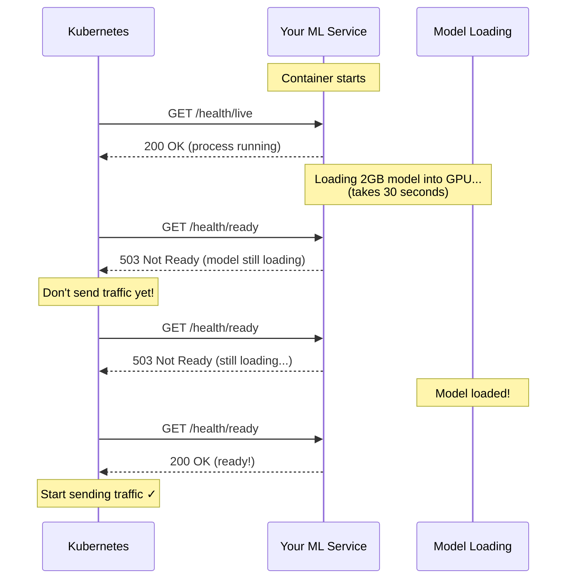

## What happens without them

**Without `/health/live`:**
- Your process deadlocks (infinite loop, stuck thread)
- Kubernetes doesn't know → keeps sending traffic → users get timeouts
- With liveness probe: Kubernetes detects deadlock → restarts the pod

**Without `/health/ready`:**
- Your model takes 30 seconds to load
- Kubernetes immediately sends traffic after container starts
- First 30 seconds of requests all fail with 500 (model not loaded)
- With readiness probe: Kubernetes waits until model is loaded before routing traffic

## Implementation

```python
@router.get("/health/live")
async def liveness():
    """Always returns 200 if the process is running.
    NEVER check external dependencies here — that's readiness."""
    return {"status": "alive"}

@router.get("/health/ready")
async def readiness(request: Request):
    """Returns 200 only when ALL critical dependencies are ready."""
    engine = request.app.state.inference_engine
    checks = {
        "model_loaded": engine.is_ready,
        # "database": await check_db_connection(),
        # "redis": await check_redis_connection(),
    }
    if all(checks.values()):
        return {"status": "ready", "checks": checks}
    return JSONResponse(status_code=503, content={"status": "not_ready", "checks": checks})
```

## Key rule

- `/health/live` → **never** checks external dependencies. If the process runs, return 200.
- `/health/ready` → checks everything the service needs to function (model loaded, DB connected, cache warm).

This applies to every service — web server, ML inference, batch processor, anything that receives traffic.


---

# 8. Do all core modules (config, logging, lifespan) need to be imported in main.py?

## Short answer

No — not all of them are imported directly in `main.py`. Each has a different import pattern:

| Module | Imported in `main.py`? | Where it's actually used |
|--------|----------------------|--------------------------|
| `lifespan.py` | ✅ Yes — passed to `FastAPI(lifespan=lifespan)` | Only in main.py |
| `config.py` | ❌ Not directly | Imported wherever settings are needed |
| `logging.py` | ❌ Not directly | `setup_logging()` called inside lifespan; `get_logger()` imported everywhere |

## How each one flows

```python
# app/main.py — only imports lifespan
from app.core.lifespan import lifespan

def create_app() -> FastAPI:
    app = FastAPI(lifespan=lifespan)  # ← lifespan is passed here
    return app
```

```python
# app/core/lifespan.py — imports config and logging
from app.core.config import settings       # ← uses settings
from app.core.logging import setup_logging, get_logger  # ← calls setup_logging()

@asynccontextmanager
async def lifespan(app: FastAPI):
    setup_logging()  # ← logging initialized here
    logger.info("starting", env=settings.environment)  # ← config used here
    yield
```

```python
# app/services/prediction_service.py — imports config and logging directly
from app.core.config import settings
from app.core.logging import get_logger

logger = get_logger(__name__)
```

## The pattern

- **`lifespan`** → imported once in `main.py`, nowhere else
- **`settings`** → imported in any file that needs configuration values
- **`get_logger`** → imported in any file that needs to log

`main.py` stays thin — it only wires things together. The actual initialization logic lives in `lifespan.py`.

---

# 9. What is `optional-dependencies` in pyproject.toml? Can I mix and match?

## What

`optional-dependencies` lets you define **groups of packages** that aren't always needed. You install only the groups relevant to your current task.

```toml
[project]
dependencies = [
    "fastapi>=0.115.0",    # Always installed (core app needs this)
    "uvicorn>=0.30.0",     # Always installed
    "pydantic>=2.0.0",     # Always installed
]

[project.optional-dependencies]
dev = [                     # Only for development
    "pytest>=8.0",
    "ruff>=0.5.0",
    "mypy>=1.10",
]
ml = [                      # Only for ML workloads
    "torch>=2.0",
    "transformers>=4.40",
    "numpy>=1.26",
]
gpu = [                     # Only on GPU machines
    "triton>=2.0",
    "flash-attn>=2.5",
]
```

## Why this exists

**Problem:** Not every environment needs every package.

- Your **production Docker image** needs `fastapi + torch` but NOT `pytest` or `ruff`
- Your **CI linting job** needs `ruff + mypy` but NOT `torch` (saves 2GB+ download)
- Your **local dev machine** needs everything
- A **CPU-only server** doesn't need `flash-attn` or `triton`

## Can you mix and match? Yes!

```bash
# Install only core dependencies (production minimal)
uv sync

# Install core + dev tools (for development)
uv sync --extra dev

# Install core + dev + ML libraries (full local setup)
uv sync --extra dev --extra ml

# Install core + ML + GPU-specific (production GPU server)
uv sync --extra ml --extra gpu
```

## Do you need separate environments? No!

This is a common misconception. You have **one virtual environment** per project. Optional dependencies just control **which packages are installed** in that single environment.

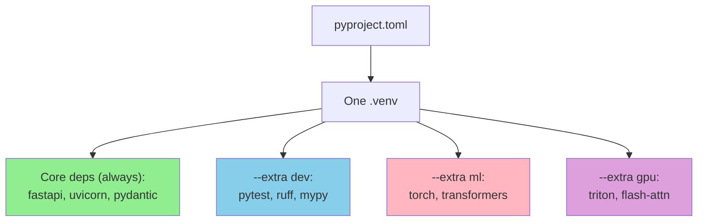

## Flexibility

You can freely add/remove extras at any time:

```bash
# Started with just dev, now need ML too
uv sync --extra dev --extra ml

# Don't need GPU stuff locally
uv sync --extra dev --extra ml  # (just don't include --extra gpu)
```

The environment updates in-place. No need to recreate anything.

---

# 10. What does `uv sync --extra dev --extra ml` do?

## What it does step by step

1. Reads `pyproject.toml` to find all dependencies
2. Includes the **core** `dependencies` list (always)
3. Includes the **dev** group from `optional-dependencies`
4. Includes the **ml** group from `optional-dependencies`
5. Resolves all versions (respecting `uv.lock` if it exists)
6. Installs everything into `.venv/`

## Concrete example

Given this `pyproject.toml`:

```toml
dependencies = ["fastapi>=0.115.0", "uvicorn>=0.30.0"]

[project.optional-dependencies]
dev = ["pytest>=8.0", "ruff>=0.5.0"]
ml = ["torch>=2.0", "numpy>=1.26"]
```

| Command | What gets installed |
|---------|-------------------|
| `uv sync` | fastapi, uvicorn |
| `uv sync --extra dev` | fastapi, uvicorn, pytest, ruff |
| `uv sync --extra ml` | fastapi, uvicorn, torch, numpy |
| `uv sync --extra dev --extra ml` | fastapi, uvicorn, pytest, ruff, torch, numpy |
| `uv sync --all-extras` | Everything from all groups |

## How it helps

- **New developer onboarding:** `uv sync --extra dev --extra ml` → ready to code and test in one command
- **CI lint job:** `uv sync --extra dev` → only installs what's needed for linting (fast, no torch download)
- **Production Docker:** `uv sync` → minimal image, only runtime deps
- **GPU server:** `uv sync --extra ml --extra gpu` → includes CUDA-specific packages

---

# 11. What does `uv run uvicorn app.main:app --reload` mean?

## Breaking it down

```
uv run          → Execute the following command inside the project's virtual environment
uvicorn         → The ASGI server binary
app.main:app    → Python import path to the FastAPI application object
--reload        → Watch for file changes and auto-restart
```

## The `app.main:app` part

This follows the pattern `<module_path>:<variable_name>`:

```
app.main:app
│   │     │
│   │     └── The variable name inside the file (the FastAPI instance)
│   └── The Python module (file) name
└── The package (folder) name
```

It expects this structure:

```
project_root/           ← you run the command from here
└── app/
    └── main.py         ← contains: app = create_app()
```

```python
# app/main.py
from fastapi import FastAPI

def create_app() -> FastAPI:
    return FastAPI(...)

app = create_app()  # ← This is what "app.main:app" points to
```

## Does it expect a certain folder structure?

Yes — the Python import path must be valid from where you run the command. If your file is at `app/main.py` and contains a variable called `app`, then `app.main:app` works.

If you restructured to `src/server/application.py` with variable `server`:
```bash
uv run uvicorn src.server.application:server --reload
```

## Can I change uvicorn to another server?

Yes. Any ASGI server works with FastAPI:

```bash
# Uvicorn (most common for FastAPI)
uv run uvicorn app.main:app --reload

# Hypercorn (HTTP/2 support, alternative async server)
uv run hypercorn app.main:app --reload

# Daphne (Django's ASGI server — works with FastAPI too)
uv run daphne app.main:app
```

For WSGI frameworks (Flask), you'd use gunicorn or waitress instead.

## The `--reload` flag

Only for development. It watches your source files and restarts the server when you save changes. **Never use in production** — it adds overhead and can cause brief downtime during reloads.

---

# 12. Is `uv.lock` the same as any other lockfile?

## Yes — same concept, different ecosystem

| Ecosystem | Lockfile | Package manager |
|-----------|----------|-----------------|
| Python (uv) | `uv.lock` | uv |
| Python (poetry) | `poetry.lock` | poetry |
| JavaScript | `package-lock.json` | npm |
| JavaScript | `yarn.lock` | yarn |
| Rust | `Cargo.lock` | cargo |
| Ruby | `Gemfile.lock` | bundler |

They all solve the same problem: **pin exact versions so every machine gets identical dependencies.**

## What's inside `uv.lock`

```toml
# Simplified view of uv.lock
[[package]]
name = "fastapi"
version = "0.115.6"
source = { registry = "https://pypi.org/simple" }
dependencies = [
    { name = "starlette", version = "0.41.2" },
    { name = "pydantic", version = "2.9.2" },
]

[[package]]
name = "starlette"
version = "0.41.2"
source = { registry = "https://pypi.org/simple" }
# ... checksums for integrity verification
```

## Key properties (same as all lockfiles)

1. **Auto-generated** — never edit manually
2. **Deterministic** — same lockfile → same environment, always
3. **Committed to git** — shared across the team
4. **Contains checksums** — detects tampered packages
5. **Includes transitive deps** — not just what you asked for, but everything those packages need

---

# 13. If I change `requires-python`, will uv handle dependency versions automatically?

## Short answer

**Partially.** When you change `requires-python` and re-lock, uv will resolve dependencies that are compatible with the new Python version. But it won't magically find working versions if they don't exist.

## What happens step by step

```toml
# Before
requires-python = ">=3.11"

# After (you change it to)
requires-python = ">=3.9"
```

Now run:
```bash
uv lock
```

uv will:
1. ✅ Re-resolve all dependencies
2. ✅ Pick versions that support Python 3.9+
3. ✅ Reject packages that require Python 3.10+ (if you asked for 3.9 support)
4. ❌ NOT automatically install a different Python version on your machine

## What you need to take care of

```bash
# 1. Change pyproject.toml
requires-python = ">=3.10"

# 2. Re-lock (resolves compatible versions)
uv lock

# 3. If you need that Python version locally:
uv python install 3.10
uv python pin 3.10

# 4. Re-sync (installs into .venv with correct Python)
uv sync
```

## When it fails

If you set `requires-python = ">=3.13"` but a dependency only supports up to 3.12, `uv lock` will **error** — telling you the constraint is unsatisfiable. You'd need to either:
- Lower your Python requirement
- Find an alternative package
- Wait for the package to add 3.13 support

---

# 14. What is the `[project]` section in pyproject.toml?

## What

The `[project]` section is your project's **identity card**. It tells package managers and build tools: what is this project, what does it need, and who made it.

```toml
[project]
name = "ml-api-template"          # Package name (used in imports, PyPI, Docker tags)
version = "0.1.0"                  # Semantic version
description = "Production ML API"  # One-line summary
requires-python = ">=3.11"         # Minimum Python version
authors = [
    { name = "Your Name", email = "you@company.com" }
]

dependencies = [                   # Runtime dependencies
    "fastapi>=0.115.0",
    "uvicorn[standard]>=0.30.0",
]
```

## What each field does

| Field | Purpose | Who uses it |
|-------|---------|-------------|
| `name` | Unique identifier for the package | pip, uv, PyPI, Docker |
| `version` | Current version (semver) | Deployment tags, API docs, changelogs |
| `description` | What this project does | PyPI listing, `pip show` |
| `requires-python` | Minimum Python version | uv/pip refuse to install on older Python |
| `authors` | Who maintains this | Package metadata |
| `dependencies` | What must be installed to run | uv sync, pip install, Docker builds |

## Why it matters

1. **`name`** — When you `uv sync`, this becomes the installed package name. It's how Python knows `import app` refers to your code.

2. **`version`** — Used in Docker image tags (`ml-api-template:0.1.0`), API docs (`/docs` shows version), and deployment tracking.

3. **`requires-python`** — If someone tries to install on Python 3.8 but you require 3.11, the installer **refuses** immediately instead of failing with cryptic syntax errors later.

4. **`dependencies`** — The list of packages that MUST be present for your code to run. This is what gets installed in production Docker images.


---

# 15. When I add or remove a library with uv, does uv.lock get updated?

## Yes — always, automatically.

Every command that changes dependencies updates both `pyproject.toml` AND `uv.lock`:

```bash
# Adding a package
uv add httpx
# → pyproject.toml: adds "httpx>=0.27.0" to dependencies
# → uv.lock: re-resolves, pins httpx==0.27.2 + all its transitive deps

# Removing a package
uv remove httpx
# → pyproject.toml: removes "httpx>=0.27.0"
# → uv.lock: re-resolves, removes httpx and any deps no longer needed

# Upgrading all packages
uv lock --upgrade
# → uv.lock: re-resolves everything to latest compatible versions
# → pyproject.toml: unchanged (constraints stay the same)

# Upgrading one package
uv lock --upgrade-package httpx
# → uv.lock: only httpx gets upgraded to latest compatible version
```

## The workflow

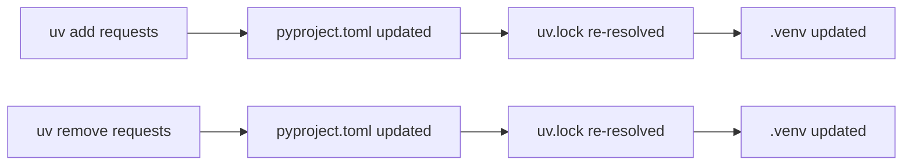

You never need to manually touch `uv.lock`. If you edit `pyproject.toml` by hand (adding a dependency manually), run `uv lock` to update the lockfile, then `uv sync` to install.

---

# 16. What does `.PHONY` do in a Makefile?

## What

```makefile
.PHONY: install run lint test docker-build clean
```

This line tells `make`: "These target names are NOT files. Always run the commands, even if a file with that name exists."

## Why it's needed

`make` was originally designed for compiling code. It checks: "Does a file named `install` exist? If yes, and it's newer than its dependencies, skip the command."

**Without `.PHONY`:**
```bash
# If someone accidentally creates a file called "test" in the project root:
touch test

make test
# → make says: "'test' is up to date" and does NOTHING
# → Your tests never run!
```

**With `.PHONY`:**
```bash
touch test

make test
# → Runs pytest regardless of whether a file called "test" exists
```

## When it matters

It matters when your Makefile target names could collide with actual file/directory names:

| Target | Could collide with... |
|--------|----------------------|
| `test` | `test/` directory or `test` file |
| `build` | `build/` directory |
| `clean` | `clean` file |
| `install` | Less likely, but possible |
| `docker-build` | Very unlikely — safe even without .PHONY |

## Rule of thumb

Just declare ALL your targets as `.PHONY` unless they actually produce a file. In our Makefile, none of the targets produce files — they all run commands. So everything is `.PHONY`.

---

# 17. Can I run uvicorn on any IP and port?

## Yes — fully configurable:

```bash
# Default (localhost only, port 8000)
uv run uvicorn app.main:app --reload

# Custom host and port
uv run uvicorn app.main:app --reload --host 192.168.1.100 --port 9000

# Listen on all interfaces (accessible from other machines on network)
uv run uvicorn app.main:app --reload --host 0.0.0.0 --port 8080
```

## What `--host` controls

| Value | Meaning | Accessible from |
|-------|---------|-----------------|
| `127.0.0.1` (default) | Localhost only | Only your machine |
| `0.0.0.0` | All network interfaces | Any machine on your network |
| `192.168.1.100` | Specific interface | Machines that can reach that IP |

## What `--port` controls

Any available port number (1-65535). Common choices:
- `8000` — uvicorn default
- `8080` — common alternative
- `80` — standard HTTP (requires root/sudo)
- `443` — standard HTTPS (requires root/sudo + TLS cert)

## Practical scenarios

```bash
# Local development (only you can access)
--host 127.0.0.1 --port 8000

# Share with teammate on same network (for testing)
--host 0.0.0.0 --port 8000

# Run multiple services locally (different ports)
uv run uvicorn app.main:app --port 8000      # ML service
uv run uvicorn gateway.main:app --port 8001  # Gateway
```

## Important note

`--host 0.0.0.0` in production Docker containers is **required** — otherwise the container can't receive traffic from outside. That's why our Dockerfile uses:

```dockerfile
CMD ["uvicorn", "app.main:app", "--host", "0.0.0.0", "--port", "8000"]
```

---

# 18. Why is `logging.basicConfig()` in `setup_logging()` but not added to structlog?

## What's happening

```python
def setup_logging() -> None:
    # Part 1: Configure structlog (for YOUR code)
    structlog.configure(
        processors=[...],
        wrapper_class=structlog.stdlib.BoundLogger,
        logger_factory=structlog.stdlib.LoggerFactory(),
    )

    # Part 2: Configure stdlib logging (for THIRD-PARTY code)
    logging.basicConfig(
        format="%(message)s",
        level=getattr(logging, settings.log_level.upper()),
        handlers=[logging.StreamHandler()],
    )
```

## Why both exist — they serve different purposes

**structlog** is what YOUR code uses:
```python
from app.core.logging import get_logger
logger = get_logger(__name__)
logger.info("prediction_complete", latency_ms=45)
```

**stdlib logging** is what THIRD-PARTY libraries use:
```python
# Inside uvicorn's source code:
import logging
logger = logging.getLogger("uvicorn")
logger.info("Started server process")

# Inside httpx's source code:
import logging
logger = logging.getLogger("httpx")
logger.debug("HTTP Request: GET https://...")
```

You can't control how uvicorn, httpx, sqlalchemy, or torch log internally — they all use Python's built-in `logging` module.

## How they connect

`structlog.stdlib.LoggerFactory()` makes structlog use stdlib logging as its **backend**. So the flow is:

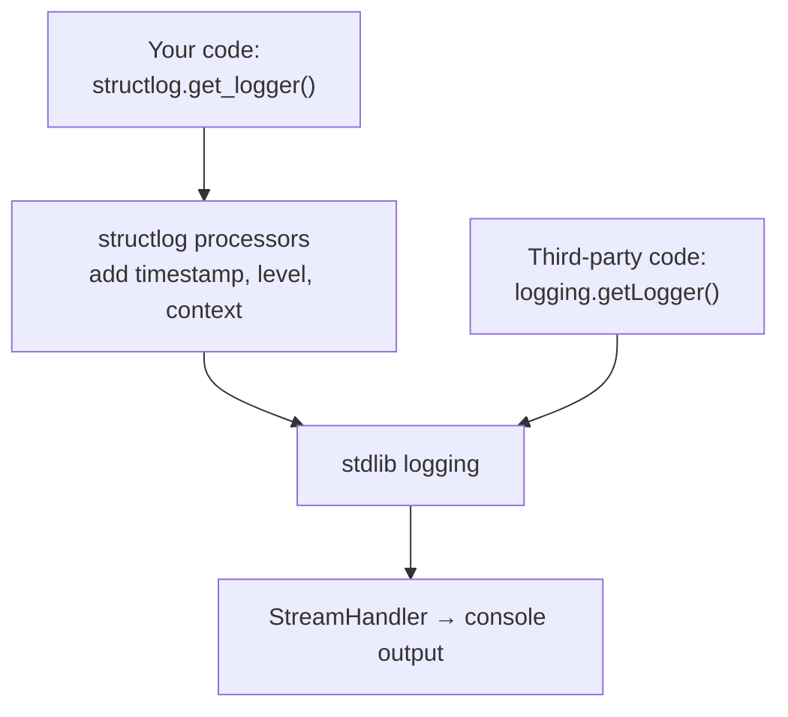

Both paths end up going through stdlib logging's handlers. `logging.basicConfig()` configures:
- **What level** to show (DEBUG, INFO, WARNING)
- **Where** to output (StreamHandler = console)
- **What format** to use for raw stdlib messages

## Is this correct?

Yes. This is the standard pattern. Without `logging.basicConfig()`:
- Third-party library logs would be silently swallowed (no handler configured)
- You'd miss important warnings from uvicorn, database drivers, etc.

---

# 19. What is `class Config` inside Pydantic models? What about ORM mode?

## `class Config` (Pydantic v1) → `model_config` (Pydantic v2)

This is where you configure **how the Pydantic model behaves** — not what data it holds, but how it validates, serializes, and interacts with other systems.

### Pydantic v1 style (older, still seen in many codebases):

```python
class UserResponse(BaseModel):
    id: int
    name: str
    email: str

    class Config:
        orm_mode = True          # Allow creating from ORM objects
        from_attributes = True   # Same as orm_mode in v2
```

### Pydantic v2 style (current, what we use):

```python
from pydantic import BaseModel, ConfigDict

class UserResponse(BaseModel):
    model_config = ConfigDict(
        from_attributes=True,    # Allow creating from ORM objects
        str_strip_whitespace=True,  # Auto-strip whitespace from strings
        strict=False,            # Allow type coercion (e.g., "123" → 123)
    )

    id: int
    name: str
    email: str
```

## What `from_attributes` (ORM mode) does

Normally, Pydantic expects a dictionary:

```python
# This works by default:
user = UserResponse(**{"id": 1, "name": "Alice", "email": "a@b.com"})
```

But ORM objects (SQLAlchemy, Tortoise) use **attributes**, not dictionaries:

```python
# SQLAlchemy returns objects like this:
class UserRow:
    id = 1
    name = "Alice"
    email = "a@b.com"

# Without from_attributes=True:
UserResponse(**user_row)  # ❌ Error — can't unpack an object

# With from_attributes=True:
UserResponse.model_validate(user_row)  # ✅ Reads user_row.id, user_row.name, etc.
```

## When you need it

| Scenario | Need `from_attributes`? |
|----------|------------------------|
| Pure API (no database) | No |
| Reading from SQLAlchemy models | Yes |
| Reading from dataclasses | Yes |
| Reading from named tuples | Yes |
| Reading from plain dicts | No (default behavior) |

## Common Config options

```python
model_config = ConfigDict(
    from_attributes=True,       # Create from ORM objects
    str_strip_whitespace=True,  # " hello " → "hello"
    str_min_length=1,           # No empty strings allowed (globally)
    strict=True,                # No type coercion ("1" won't become int)
    extra="forbid",             # Reject unknown fields in input
    json_schema_extra={         # Add examples to OpenAPI docs
        "example": {"text": "Hello world", "top_k": 3}
    },
)
```

## For our ML API template

We typically don't need `from_attributes` because we're not using an ORM. Our schemas validate JSON request bodies and format JSON responses — no database objects involved.

---

# 20. What does `@asynccontextmanager` do? Why is it needed?

## What

`@asynccontextmanager` is a decorator that lets you write **async setup/teardown logic** using a simple `yield` pattern instead of implementing a full class with `__aenter__` and `__aexit__` methods.

## The problem it solves

FastAPI's lifespan needs something that:
1. Runs setup code (before `yield`)
2. Hands control to the application (at `yield`)
3. Runs cleanup code (after `yield`)
4. Works with `async/await`

Without `@asynccontextmanager`, you'd need a class:

```python
# WITHOUT asynccontextmanager — verbose, boilerplate-heavy
class Lifespan:
    def __init__(self, app: FastAPI):
        self.app = app
    
    async def __aenter__(self):
        # Startup logic
        self.app.state.model = await load_model()
        return self.app
    
    async def __aexit__(self, exc_type, exc_val, exc_tb):
        # Shutdown logic
        await self.app.state.model.unload()
```

With `@asynccontextmanager`:

```python
# WITH asynccontextmanager — clean, readable
from contextlib import asynccontextmanager

@asynccontextmanager
async def lifespan(app: FastAPI):
    # Startup (everything before yield)
    app.state.model = await load_model()
    
    yield  # App is running
    
    # Shutdown (everything after yield)
    await app.state.model.unload()
```

## How it works

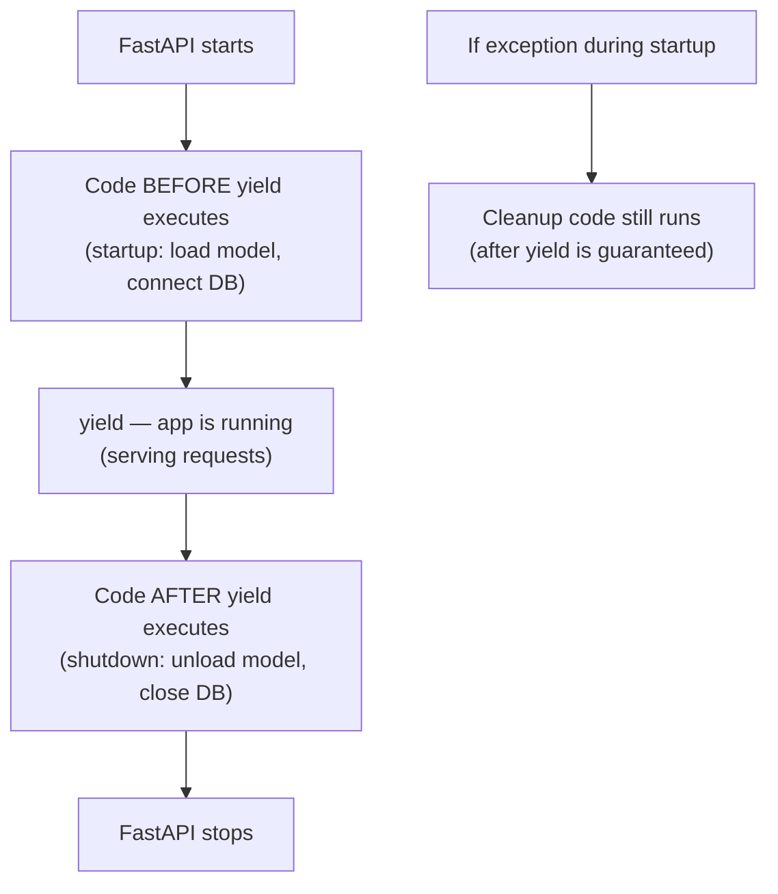

## What if we don't use it?

Without `@asynccontextmanager`, you can't use the `yield`-based lifespan pattern that FastAPI expects. You'd have to either:

1. Use the deprecated `@app.on_event("startup")` / `@app.on_event("shutdown")` decorators (removed in future FastAPI versions)
2. Write a full async context manager class (more boilerplate)

The `yield` pattern is the **recommended** approach in modern FastAPI.

## Key insight

The `yield` is what separates "startup" from "shutdown". Everything above it runs once when the app starts. Everything below it runs once when the app stops. The app serves requests during the `yield`.

---

# 21. What is FastAPI's `app.state`? Why do we use it?

## What

`app.state` is a simple **attribute container** attached to the FastAPI application instance. It's a place to store objects that need to be shared across the entire application — accessible from any route handler, middleware, or dependency.

```python
# Store anything on app.state
app.state.model = loaded_model
app.state.redis = redis_connection
app.state.prediction_service = PredictionService(...)

# Access from any route via request.app.state
@router.post("/predict")
async def predict(request: Request):
    model = request.app.state.model
```

## Why it exists — what problem it solves

**Problem 1: How do routes access shared resources (models, DB pools)?**

Bad approaches:
```python
# ❌ Global variable — untestable, no lifecycle management
model = load_model()  # Loads at import time!

@app.post("/predict")
async def predict():
    return model.predict(...)

# ❌ Load per request — slow, wastes memory
@app.post("/predict")
async def predict():
    model = load_model()  # 30 seconds every request!
    return model.predict(...)
```

Good approach:
```python
# ✅ app.state — loaded once in lifespan, accessible everywhere
@asynccontextmanager
async def lifespan(app: FastAPI):
    app.state.model = await load_model()  # Once, at startup
    yield
    await app.state.model.unload()        # Once, at shutdown

@app.post("/predict")
async def predict(request: Request):
    return request.app.state.model.predict(...)  # Fast, shared
```

**Problem 2: How do you test with different resources?**

```python
# In tests — just override app.state
app = create_app()
app.state.model = MockModel()  # No real GPU needed in tests
```

**Problem 3: How do you ensure cleanup?**

Because `app.state` is populated in the lifespan, cleanup is guaranteed:
- Model loaded in startup → unloaded in shutdown
- DB pool created in startup → closed in shutdown
- No resource leaks

## What to store on `app.state`

| Store on app.state | Don't store on app.state |
|-------------------|--------------------------|
| ML model instances | Request-specific data |
| Database connection pools | User sessions |
| Redis connections | Temporary computation results |
| Service instances | Configuration (use settings singleton) |
| HTTP client pools | |

## How it flows through the system

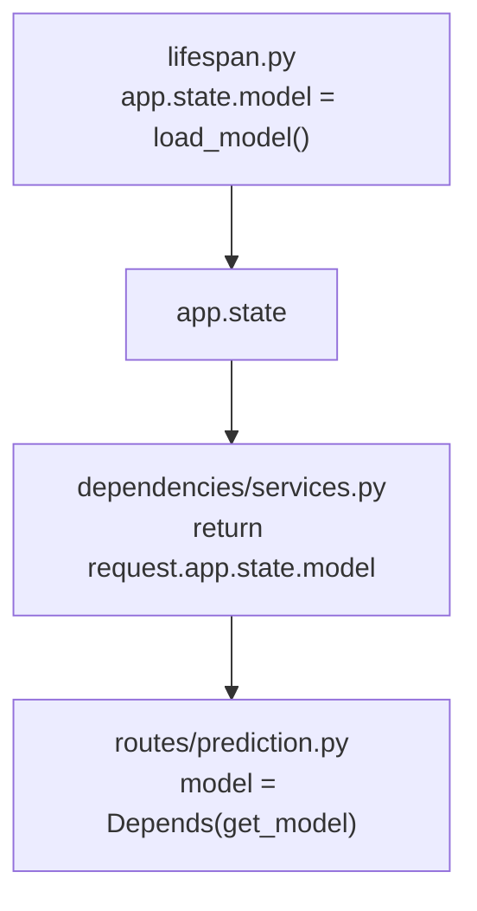


---

# 22. Should config/settings be initialized in the lifespan function?

## Short answer

**No.** The `Settings` class is instantiated as a module-level singleton. It does NOT go in the lifespan.

## Why not in lifespan?

The `settings` object is needed **before** lifespan runs — other modules import it at module load time:

```python
# app/core/config.py
from pydantic_settings import BaseSettings

class Settings(BaseSettings):
    app_name: str = "ml-api-template"
    model_path: str = "./models/model.pt"
    log_level: str = "INFO"
    # ...

# Instantiated at module level — available immediately on import
settings = Settings()
```

```python
# app/core/lifespan.py — USES settings, doesn't create it
from app.core.config import settings

@asynccontextmanager
async def lifespan(app: FastAPI):
    setup_logging()  # ← uses settings.log_level internally
    engine = PyTorchEngine(model_path=settings.model_path)  # ← uses settings
    await engine.load()
    yield
```

## The recommended approach

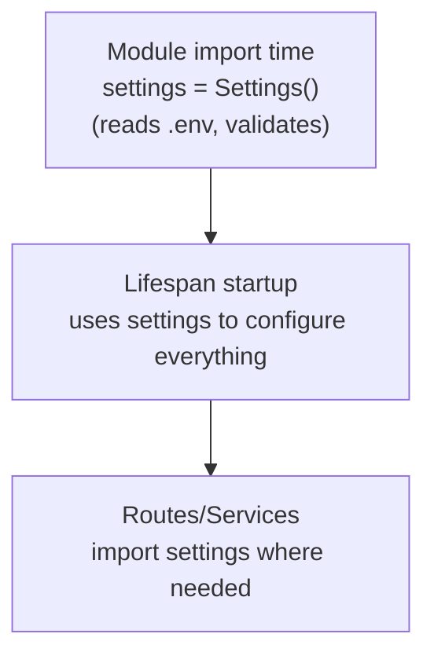

| What | When it happens | Where |
|------|----------------|-------|
| `settings = Settings()` | At import time (before app starts) | `app/core/config.py` |
| `setup_logging()` | In lifespan startup | `app/core/lifespan.py` |
| Model loading | In lifespan startup | `app/core/lifespan.py` |
| DB connection | In lifespan startup | `app/core/lifespan.py` |

## What if .env is missing or has invalid values?

Pydantic-settings validates at instantiation time. If a required field is missing or has the wrong type, the app **crashes immediately at import** — before any request is served. This is good: fail fast, fail loud.

```bash
$ uv run uvicorn app.main:app
# pydantic_settings.ValidationError: 1 validation error for Settings
# MODEL_PATH: field required
```

---

# 23. How is middleware used for authentication and authorization?

## First: Authentication vs Authorization

| Concept | Question it answers | Example |
|---------|-------------------|---------|
| **Authentication** (AuthN) | "Who are you?" | Validate JWT token, API key |
| **Authorization** (AuthZ) | "Are you allowed to do this?" | Check roles, permissions |

## Should auth be in middleware?

**It depends on the granularity:**

| Approach | Use when | Example |
|----------|----------|---------|
| **Middleware** | ALL endpoints need the same auth | Internal service with one API key |
| **Dependency (`Depends()`)** | Different endpoints need different auth | Public + admin endpoints in same service |

## Middleware approach (global auth)

```python
# app/middleware/auth_middleware.py
from starlette.middleware.base import BaseHTTPMiddleware
from starlette.requests import Request
from starlette.responses import JSONResponse
from app.core.config import settings

# Paths that don't require authentication
PUBLIC_PATHS = {"/health/live", "/health/ready", "/docs", "/openapi.json"}


class AuthMiddleware(BaseHTTPMiddleware):
    """Validates API key on every request (except public paths)."""

    async def dispatch(self, request: Request, call_next):
        if request.url.path in PUBLIC_PATHS:
            return await call_next(request)

        api_key = request.headers.get("X-API-Key")
        if not api_key or api_key != settings.api_key:
            return JSONResponse(
                status_code=401,
                content={"error": "UNAUTHORIZED", "message": "Invalid or missing API key"},
            )

        # Optionally attach user info to request state
        request.state.authenticated = True
        return await call_next(request)
```

## Dependency approach (per-route auth) — RECOMMENDED for most cases

```python
# app/api/dependencies/auth.py
from fastapi import Header, HTTPException, Depends
from app.core.config import settings


async def verify_api_key(x_api_key: str = Header(...)) -> str:
    """Basic API key auth."""
    if x_api_key != settings.api_key:
        raise HTTPException(status_code=401, detail="Invalid API key")
    return x_api_key


async def verify_admin(x_api_key: str = Header(...)) -> str:
    """Admin-level auth."""
    if x_api_key != settings.admin_key:
        raise HTTPException(status_code=403, detail="Admin access required")
    return x_api_key


# Usage in routes:
@router.post("/predict", dependencies=[Depends(verify_api_key)])
async def predict(body: PredictionRequest):
    ...

@router.post("/admin/reload", dependencies=[Depends(verify_admin)])
async def reload_model():
    ...
```

## Why `Depends()` is usually better than middleware for auth

1. **Granularity** — different routes can have different auth requirements
2. **Testability** — override with `app.dependency_overrides` in tests
3. **Visibility** — looking at a route, you immediately see what auth it needs
4. **Type safety** — the dependency can return user info with proper types
5. **OpenAPI docs** — FastAPI auto-documents the security requirement

## When middleware IS appropriate for auth

- Every single endpoint needs the same auth (internal microservice)
- You need to reject requests before they reach any route logic
- You're implementing rate limiting (which is auth-adjacent)

---

# 24. Should middleware logic be tested? How?

## Yes — middleware is critical infrastructure. Bugs here affect EVERY request.

## What to test

| Middleware | Test that... |
|-----------|-------------|
| RequestContext | request_id is generated, bound to logs, returned in header |
| Logging | Every request is logged with method, path, status, latency |
| Auth | Unauthorized requests get 401, valid requests pass through |

## These are integration tests

Middleware only runs during HTTP request processing. You can't unit-test it in isolation (it needs the full ASGI stack). Use the test client:

```python
# tests/integration/test_middleware.py
import pytest
from httpx import AsyncClient, ASGITransport
from app.main import create_app


@pytest.fixture
async def client():
    app = create_app()
    # Mock the model so the app starts
    app.state.inference_engine = MockEngine()
    transport = ASGITransport(app=app)
    async with AsyncClient(transport=transport, base_url="http://test") as ac:
        yield ac


class TestRequestContextMiddleware:
    @pytest.mark.asyncio
    async def test_generates_request_id(self, client):
        """If no X-Request-ID header sent, one is generated."""
        response = await client.get("/health/live")
        assert "x-request-id" in response.headers
        # UUID format check
        request_id = response.headers["x-request-id"]
        assert len(request_id) == 36  # UUID length

    @pytest.mark.asyncio
    async def test_preserves_caller_request_id(self, client):
        """If caller sends X-Request-ID, it's preserved."""
        response = await client.get(
            "/health/live",
            headers={"X-Request-ID": "my-custom-id-123"},
        )
        assert response.headers["x-request-id"] == "my-custom-id-123"


class TestLoggingMiddleware:
    @pytest.mark.asyncio
    async def test_logs_request(self, client, caplog):
        """Every request produces a log entry."""
        response = await client.get("/health/live")
        assert response.status_code == 200
        # Verify log was emitted (check structured log output)


class TestAuthMiddleware:
    @pytest.mark.asyncio
    async def test_rejects_missing_api_key(self, client):
        response = await client.post("/v1/predict", json={"text": "hello"})
        assert response.status_code == 401

    @pytest.mark.asyncio
    async def test_allows_valid_api_key(self, client):
        response = await client.post(
            "/v1/predict",
            json={"text": "hello"},
            headers={"X-API-Key": "valid-key"},
        )
        assert response.status_code != 401
```

## Summary

- Middleware tests are **integration tests** (they need the HTTP stack)
- Test the **behavior** (correct headers, correct status codes), not internals
- Put them in `tests/integration/test_middleware.py`

---

# 25. Should lifespan logic be tested? How?

## Yes — but carefully. Lifespan tests verify that startup/shutdown work correctly.

## What to test

| Concern | Test that... |
|---------|-------------|
| Startup | Model loads, services are created, app.state is populated |
| Shutdown | Resources are cleaned up (no leaks) |
| Failure | If model fails to load, app doesn't start |

## These are integration tests

Lifespan runs as part of the app lifecycle. Test it by creating the app and verifying state:

```python
# tests/integration/test_lifespan.py
import pytest
from httpx import AsyncClient, ASGITransport
from unittest.mock import AsyncMock, patch
from app.main import create_app


@pytest.mark.asyncio
async def test_startup_populates_app_state():
    """After startup, app.state has all required services."""
    app = create_app()

    # Use the test client (triggers lifespan)
    transport = ASGITransport(app=app)
    async with AsyncClient(transport=transport, base_url="http://test") as client:
        # If we get here, startup succeeded
        # Verify state was populated
        assert hasattr(app.state, "inference_engine")
        assert hasattr(app.state, "prediction_service")
        assert app.state.inference_engine.is_ready

    # After exiting the context, shutdown has run
    # Verify cleanup happened (if testable)


@pytest.mark.asyncio
async def test_health_ready_after_startup():
    """After startup completes, /health/ready returns 200."""
    app = create_app()
    transport = ASGITransport(app=app)
    async with AsyncClient(transport=transport, base_url="http://test") as client:
        response = await client.get("/health/ready")
        assert response.status_code == 200
        assert response.json()["status"] == "ready"


@pytest.mark.asyncio
async def test_startup_fails_if_model_missing():
    """If model file doesn't exist, app refuses to start."""
    with patch("app.core.config.settings.model_path", "/nonexistent/model.pt"):
        app = create_app()
        transport = ASGITransport(app=app)
        with pytest.raises(Exception):  # FileNotFoundError or similar
            async with AsyncClient(transport=transport, base_url="http://test"):
                pass
```

## Practical approach

For most teams, testing lifespan indirectly is sufficient:
- If `/health/ready` returns 200, startup worked
- If the test client can make requests, the app is alive
- Explicit lifespan tests are for complex startup sequences (multiple models, migrations)

---

# 26. What are `redoc_url` and `openapi_url` in FastAPI?

## What

These are parameters to `FastAPI()` that control **auto-generated API documentation**:

```python
app = FastAPI(
    title="ML Prediction Service",
    version="1.0.0",
    docs_url="/docs",              # Swagger UI (interactive)
    redoc_url="/redoc",            # ReDoc (read-only, prettier)
    openapi_url="/openapi.json",   # Raw OpenAPI spec (JSON)
)
```

## What each one provides

| URL | What it is | Use case |
|-----|-----------|----------|
| `/docs` | **Swagger UI** — interactive API explorer | Developers testing endpoints in browser |
| `/redoc` | **ReDoc** — beautiful read-only documentation | Sharing API docs with consumers/stakeholders |
| `/openapi.json` | **Raw OpenAPI spec** — machine-readable JSON | Code generation, Postman import, CI validation |

## What you see

**`/docs` (Swagger UI):**
- Interactive — you can fill in parameters and click "Execute"
- Shows request/response schemas (from Pydantic models)
- Shows all endpoints grouped by tags
- Lets you try API calls directly from the browser

**`/redoc` (ReDoc):**
- Read-only — no "try it" button
- Cleaner layout for documentation
- Better for sharing with non-developers
- Three-panel layout: navigation, description, examples

**`/openapi.json`:**
- Raw JSON specification
- Import into Postman, Insomnia, or any API tool
- Use to auto-generate client SDKs (Python, TypeScript, etc.)
- Use in CI to detect breaking API changes

## Disabling in production

Some teams disable docs in production for security:

```python
app = FastAPI(
    docs_url="/docs" if settings.environment != "prod" else None,
    redoc_url="/redoc" if settings.environment != "prod" else None,
    openapi_url="/openapi.json" if settings.environment != "prod" else None,
)
```

---

# 27. What is CORSMiddleware?

## What

CORS (Cross-Origin Resource Sharing) middleware handles browser security restrictions when a frontend on one domain calls your API on a different domain.

## The problem it solves

Browsers enforce a security rule: JavaScript on `https://frontend.com` **cannot** make requests to `https://api.company.com` unless the API explicitly says "I allow requests from frontend.com."

Without CORS middleware:
```
Browser (frontend.com) → POST https://api.company.com/predict
Browser: "BLOCKED — CORS policy: No 'Access-Control-Allow-Origin' header"
```

With CORS middleware:
```
Browser (frontend.com) → POST https://api.company.com/predict
API responds with header: Access-Control-Allow-Origin: https://frontend.com
Browser: "OK, allowed" → shows response to JavaScript
```

## Implementation

```python
from fastapi.middleware.cors import CORSMiddleware

app.add_middleware(
    CORSMiddleware,
    allow_origins=["https://frontend.company.com"],  # Who can call you
    allow_methods=["GET", "POST"],                    # Which HTTP methods
    allow_headers=["*"],                              # Which headers
    allow_credentials=True,                           # Allow cookies/auth headers
)
```

## When you need it

| Scenario | Need CORS? |
|----------|-----------|
| Frontend (React/Vue) calls your ML API | ✅ Yes |
| Backend service calls your ML API | ❌ No (CORS is browser-only) |
| Mobile app calls your ML API | ❌ No (CORS is browser-only) |
| Postman/curl calls your ML API | ❌ No |
| API Gateway proxies to your ML API | ❌ No (same-origin from browser's perspective) |

## Common configurations

```python
# Development — allow everything (NEVER in production)
allow_origins=["*"]

# Production — only your frontend
allow_origins=["https://app.company.com", "https://admin.company.com"]

# If behind API Gateway — you might not need CORS at all
# (the gateway handles it)
```

## For ML APIs specifically

Most ML APIs are called by **other backend services**, not directly by browsers. In that case, you don't need CORS at all. Only add it if you have a frontend that directly calls your inference endpoint.

---

# 28. How is docker-compose handled in production? What if one service fails?

## The short answer

**docker-compose is NOT used in production** in most organizations. It's a development/testing tool.

## What docker-compose is for

| Environment | Tool | Why |
|-------------|------|-----|
| Local development | docker-compose | Simple, single-machine, all services together |
| CI/CD testing | docker-compose | Spin up dependencies for integration tests |
| Production | Kubernetes / ECS / Cloud Run | Orchestration, scaling, self-healing |

## The problem you described

```yaml
# docker-compose.yaml
services:
  prediction-service:
    image: ml-api:latest
    ports: ["8000:8000"]
  redis:
    image: redis:7
  prometheus:
    image: prom/prometheus
```

If `prediction-service` fails and you run `docker compose up` again — yes, it recreates everything. This is fine for development but unacceptable in production.

## How production handles this

### Kubernetes (most common for ML services)

```yaml
# k8s deployment — Kubernetes handles failures automatically
apiVersion: apps/v1
kind: Deployment
metadata:
  name: prediction-service
spec:
  replicas: 3                    # Run 3 copies
  strategy:
    type: RollingUpdate          # Zero-downtime updates
  template:
    spec:
      containers:
        - name: prediction
          image: ml-api:v2.3.1   # Specific version, not "latest"
          resources:
            limits:
              nvidia.com/gpu: 1  # GPU allocation
          livenessProbe:
            httpGet:
              path: /health/live
          readinessProbe:
            httpGet:
              path: /health/ready
```

What Kubernetes does that docker-compose doesn't:
- **Auto-restart** — if a container crashes, K8s restarts it automatically
- **Rolling updates** — deploy new image without downtime
- **Scaling** — run 3 replicas, scale to 10 under load
- **Health checks** — remove unhealthy pods from load balancer
- **Resource limits** — prevent one service from consuming all memory
- **Independent lifecycle** — update prediction-service without touching Redis

### How to update just one service

**In docker-compose (development):**
```bash
# Rebuild and restart only the prediction service
docker compose up -d --build prediction-service
# Other services (redis, prometheus) are untouched
```

Note: `docker compose up` is smart — it only recreates containers whose configuration or image changed. It doesn't destroy everything.

**In Kubernetes (production):**
```bash
# Update just the prediction service image
kubectl set image deployment/prediction-service prediction=ml-api:v2.4.0
# K8s does a rolling update — old pods serve traffic until new ones are ready
```

## The recommended approach for your team

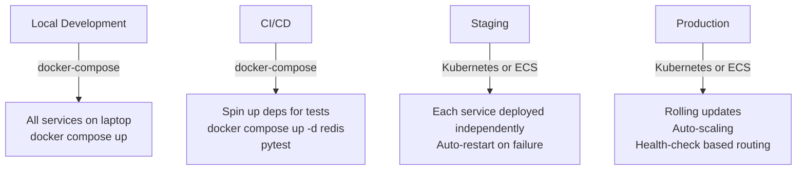

## docker-compose tips for development

```bash
# Start everything
docker compose up -d

# Rebuild only one service (after code change)
docker compose up -d --build prediction-service

# View logs of one service
docker compose logs -f prediction-service

# Restart one service (without rebuilding)
docker compose restart prediction-service

# Scale one service (for load testing)
docker compose up -d --scale prediction-service=3
```

The key insight: **docker-compose is your local development environment**. Production uses orchestrators (Kubernetes, ECS, Cloud Run) that handle failures, scaling, and updates independently per service.

---

## Curiosity Questions

Based on everything covered above, here are follow-up questions to deepen your understanding:

1. **How does Kubernetes decide when to restart a pod vs when to just remove it from the load balancer?** (Hint: liveness vs readiness probes have different failure consequences)

2. **If structlog uses stdlib logging as its backend, what happens when you set `log_level=WARNING` in basicConfig but log an INFO event through structlog?** Does it get suppressed?

3. **In the dynamic batching pattern (Question 6 in ONBOARDING), how do you handle the case where one request in the batch fails but others succeed?** Do you fail the entire batch?

4. **If `settings = Settings()` runs at import time and reads `.env`, what happens in Docker where `.env` doesn't exist but environment variables are injected via `docker run -e`?** Does pydantic-settings handle both?

5. **In the concurrency semaphore pattern, what happens to requests that can't acquire the semaphore?** Do they queue indefinitely, or should there be a timeout + 503 response?

Would you like me to answer any of these?

---

# Follow-up: Does stdlib log_level suppress structlog INFO events?

## Short answer

**Yes — the INFO event gets suppressed.** The stdlib logging level acts as a gate that structlog's output must pass through.

## How the pipeline works

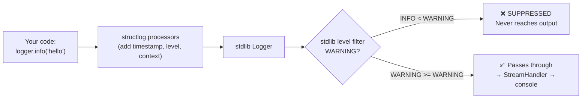

## Concrete example

```python
# setup_logging() configured with:
logging.basicConfig(level=logging.WARNING)  # Only WARNING and above pass

# Your code:
logger = get_logger(__name__)
logger.info("model_loaded", latency_ms=1200)    # ❌ Suppressed (INFO < WARNING)
logger.warning("high_latency", latency_ms=5000) # ✅ Printed
logger.error("model_failed", error="OOM")       # ✅ Printed
```

## Why this matters

Your `settings.log_level` controls what actually appears in output:

```python
# In setup_logging():
logging.basicConfig(
    level=getattr(logging, settings.log_level.upper()),  # ← This is the gate
)
```

| `LOG_LEVEL` env var | What you see |
|---------------------|-------------|
| `DEBUG` | Everything (debug, info, warning, error) |
| `INFO` | info, warning, error |
| `WARNING` | warning, error only |
| `ERROR` | error only |

## The correct setup for our template

```python
# .env for local development
LOG_LEVEL=DEBUG    # See everything

# .env for production
LOG_LEVEL=INFO     # Skip debug noise, keep info/warning/error
```

The structlog processors still **run** on every log call (adding timestamp, context, etc.), but the final output is gated by stdlib's level. This means there's minimal overhead for suppressed logs — the expensive part (I/O) is skipped.

---

# Follow-up: What happens in Docker when `.env` doesn't exist?

## Short answer

**pydantic-settings handles both.** It checks multiple sources in priority order. If `.env` doesn't exist, it silently skips it and reads from actual environment variables instead.

## The priority order (highest wins)

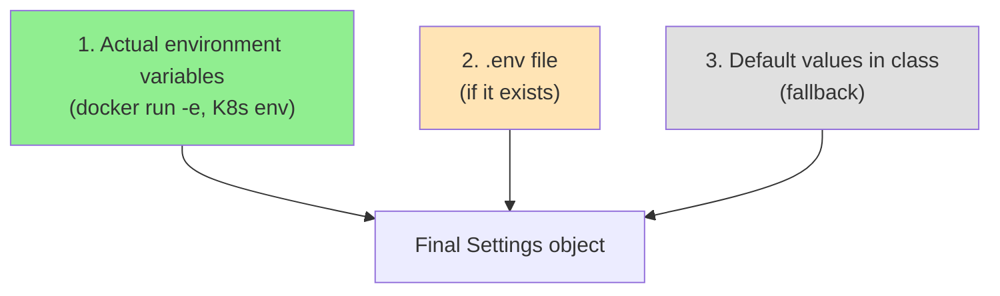

**Priority: Environment variables > .env file > class defaults**

## Concrete example

```python
class Settings(BaseSettings):
    model_config = SettingsConfigDict(env_file=".env")

    app_name: str = "ml-api-template"   # Default: "ml-api-template"
    model_path: str = "./models/model.pt"
    log_level: str = "INFO"
```

### Scenario 1: Local development (`.env` exists)

```bash
# .env file contains:
MODEL_PATH=./models/local_model.pt
LOG_LEVEL=DEBUG
```

Result: `settings.model_path` = `"./models/local_model.pt"`, `settings.log_level` = `"DEBUG"`

### Scenario 2: Docker (no `.env`, env vars injected)

```bash
docker run -e MODEL_PATH=/app/models/prod_model.pt -e LOG_LEVEL=WARNING ml-api:latest
```

Result: `settings.model_path` = `"/app/models/prod_model.pt"`, `settings.log_level` = `"WARNING"`

No `.env` file needed. pydantic-settings sees `env_file=".env"`, checks if it exists, finds it doesn't, moves on to environment variables.

### Scenario 3: Both exist (env var overrides .env)

```bash
# .env has: LOG_LEVEL=DEBUG
# But you also run: docker run -e LOG_LEVEL=ERROR ...
```

Result: `settings.log_level` = `"ERROR"` — actual environment variable wins over `.env` file.

### Scenario 4: Neither exists, no default defined

```python
class Settings(BaseSettings):
    database_url: str  # No default! Required field.
```

```bash
docker run ml-api:latest  # No DATABASE_URL env var, no .env
# ❌ Crashes immediately:
# pydantic_settings.ValidationError: database_url field required
```

This is **good** — fail fast at startup, not at the first database query 10 minutes later.

## What this means for your Dockerfile

```dockerfile
# No .env file in the Docker image — that's correct
# Environment variables are injected at runtime:

# Via docker run:
docker run -e MODEL_PATH=/models/v2.pt -e LOG_LEVEL=INFO ml-api:latest

# Via docker-compose:
services:
  app:
    environment:
      - MODEL_PATH=/models/v2.pt
      - LOG_LEVEL=INFO

# Via Kubernetes:
env:
  - name: MODEL_PATH
    value: /models/v2.pt
  - name: LOG_LEVEL
    valueFrom:
      configMapKeyRef:
        name: app-config
        key: log_level
```

## Summary

| Environment | How config is provided | .env needed? |
|-------------|----------------------|--------------|
| Local dev | `.env` file | ✅ Yes |
| Docker | `docker run -e` or compose `environment:` | ❌ No |
| Kubernetes | Pod `env:` or ConfigMap/Secret | ❌ No |
| CI/CD | Pipeline environment variables | ❌ No |

pydantic-settings handles all of these transparently. Your code just accesses `settings.model_path` — it doesn't know or care where the value came from.


