# Table of Contents

1. [Does installing FastAPI/Flask automatically install Uvicorn/Gunicorn?](#does-installing-fastapiflask-automatically-install-uvicorngunicorn)
2. [Does Flask run on a single process with a single thread handling one request at a time?](#does-flask-run-on-a-single-process-with-a-single-thread-handling-one-request-at-a-time)
3. [Does FastAPI run on a single process with a single thread handling multiple requests via async?](#does-fastapi-run-on-a-single-process-with-a-single-thread-handling-multiple-requests-via-async)
4. [How does Gunicorn handle multiple workers if Python is single-threaded?](#how-does-gunicorn-handle-multiple-workers-if-python-is-single-threaded)
5. [How can FastAPI run on both Gunicorn and Uvicorn?](#how-can-fastapi-run-on-both-gunicorn-and-uvicorn)
6. [What exactly is a web server?](#what-exactly-is-a-web-server)
7. [How web servers evolved to WSGI and ASGI](#how-web-servers-evolved-to-wsgi-and-asgi)
8. [Why does Python need ASGI/WSGI?](#why-does-python-need-asgiwsgi)
9. [Why can't Nginx communicate directly with FastAPI/Flask? Why do we need Uvicorn/Gunicorn?](#why-cant-nginx-communicate-directly-with-fastapiflask-why-do-we-need-uvicorngunicorn)
10. [Does ASGI/WSGI exist just for Python?](#does-asgiwsgi-exist-just-for-python)
11. [Will WSGI with multiple workers/threads give real advantages despite Python's GIL?](#will-wsgi-with-multiple-workersthreads-give-real-advantages-despite-pythons-gil)
12. [How does communication between ASGI and FastAPI work? Does FastAPI auto-start the ASGI server?](#how-does-communication-between-asgi-and-fastapi-work-does-fastapi-auto-start-the-asgi-server)
13. [Can I start multiple FastAPI processes with multiple worker threads? Do I need multiple ASGI servers?](#can-i-start-multiple-fastapi-processes-with-multiple-worker-threads-do-i-need-multiple-asgi-servers)
14. [Is there any situation where you need to use WSGI over ASGI?](#is-there-any-situation-where-you-need-to-use-wsgi-over-asgi)
15. [What is the "async sandwich" problem?](#what-is-the-async-sandwich-problem)
16. [How does the GIL change in Python 3.13+? How will it affect Gunicorn/Uvicorn?](#how-does-the-gil-change-in-python-313-how-will-it-affect-gunicornuvicorn)
17. [What exactly happens during a graceful restart in Gunicorn?](#what-exactly-happens-during-a-graceful-restart-in-gunicorn)
18. [How does Nginx decide which worker to forward a request to?](#how-does-nginx-decide-which-worker-to-forward-a-request-to)
19. [What are the tradeoffs between more workers vs. more threads vs. more async concurrency?](#what-are-the-tradeoffs-between-more-workers-vs-more-threads-vs-more-async-concurrency)
20. [What is the "thundering herd" problem?](#what-is-the-thundering-herd-problem)
21. [How does copy-on-write (COW) reduce memory with forked workers?](#how-does-copy-on-write-cow-reduce-memory-with-forked-workers)

---

# Does installing FastAPI/Flask automatically install Uvicorn/Gunicorn?

## Short Answer

No. Installing FastAPI does **not** automatically install Uvicorn or Gunicorn. Installing Flask does **not** automatically install Gunicorn. They are separate packages that you install independently.

## How it works

- `pip install fastapi` → installs only FastAPI (the framework). You must separately run `pip install uvicorn` to get a server that can run it.
- `pip install flask` → installs only Flask. You must separately run `pip install gunicorn` to get a production server.

FastAPI does offer a convenience install: `pip install "fastapi[standard]"` which bundles uvicorn and other common dependencies. But the base install does not include a server.

## Why they're separate

The framework (FastAPI/Flask) defines **how you write your application logic** — routes, request handling, responses.

The server (Uvicorn/Gunicorn) defines **how incoming HTTP connections are managed** — listening on a port, accepting connections, forwarding requests to your app.

They are decoupled by design so you can mix and match:
- FastAPI + Uvicorn (most common)
- FastAPI + Gunicorn with Uvicorn workers
- Flask + Gunicorn (most common for production)
- Flask + Waitress (Windows-friendly alternative)

## Code Example

```python
# Install separately:
# pip install fastapi
# pip install uvicorn

# app.py
from fastapi import FastAPI

app = FastAPI()

@app.get("/")
async def root():
    return {"message": "hello"}

# Run with: uvicorn app:app --host 0.0.0.0 --port 8000
```

---

# Does Flask run on a single process with a single thread handling one request at a time?

## Short Answer

Almost right, but with a nuance. Flask's **built-in development server** runs a single process with a single thread by default — yes, one request at a time. But in production with Gunicorn, Flask runs across multiple worker processes, each handling requests independently.

## The Development Server (Werkzeug)

When you do `flask run` or `app.run()`, Flask uses Werkzeug's development server:

```python
# Default: single process, single thread
app.run()  # handles ONE request at a time

# You can enable threading on the dev server:
app.run(threaded=True)  # now each request gets its own thread
```

With the default (no threading), if Request A takes 5 seconds, Request B waits 5 seconds before it even starts being processed.

## Production with Gunicorn

In production, nobody runs Flask's dev server. You use Gunicorn:

```bash
gunicorn app:app --workers 4 --threads 2
```

This gives you 4 processes × 2 threads = 8 concurrent requests.

## So what does "one request per thread" mean?

It means Flask uses **synchronous handling** — each thread is occupied for the entire duration of a request. The thread cannot do anything else until that request completes. This is different from async frameworks where a single thread can juggle multiple requests by switching between them while waiting for I/O.

```
Flask (sync):
Thread 1: [====Request A====]                    [====Request C====]
Thread 2:        [====Request B====]

FastAPI (async):
Thread 1: [=Req A=]..wait..[=Req A=]..wait..[=Req B=]..wait..[=Req A done=][=Req B done=]
```

---

# Does FastAPI run on a single process with a single thread handling multiple requests via async?

## Short Answer

Yes, you're essentially correct. FastAPI (running on Uvicorn) uses a single process with a single main thread that runs an **event loop**. That event loop can handle many requests concurrently by switching between them during I/O waits.

## How it works

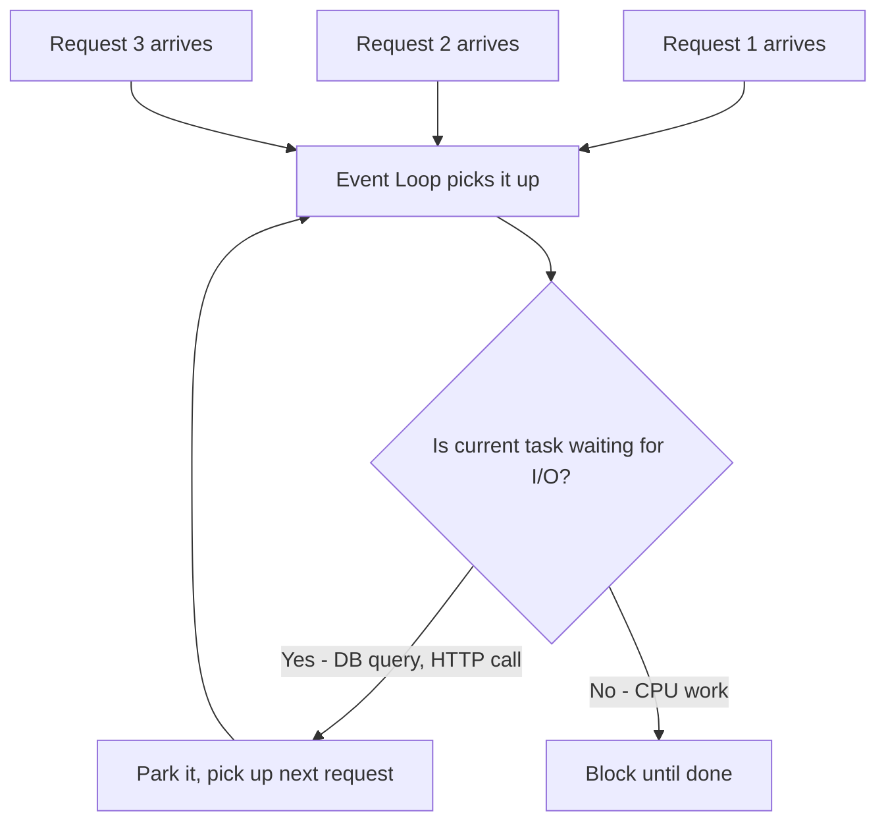

When you write:

```python
@app.get("/users")
async def get_users():
    users = await db.fetch_all("SELECT * FROM users")  # <-- yields control here
    return users
```

At the `await` point, the event loop says: "This request is waiting for the database. Let me handle other requests in the meantime." When the DB responds, the event loop resumes that request.

## Important caveat

This only works for `async def` endpoints. If you write a regular `def` endpoint in FastAPI:

```python
@app.get("/sync")
def sync_endpoint():
    time.sleep(5)  # blocks a thread from a threadpool, NOT the event loop
    return {"done": True}
```

FastAPI runs sync endpoints in a **threadpool** to avoid blocking the event loop. So it's not purely single-threaded — there's a threadpool for sync code.

## The limitation

If your async code does CPU-heavy work (not I/O), it blocks the event loop and all other requests wait:

```python
@app.get("/heavy")
async def heavy():
    # BAD: this blocks the event loop for 10 seconds
    result = compute_fibonacci(1000000)
    return {"result": result}
```

For CPU-bound work, you need multiple processes (workers).

---

# How does Gunicorn handle multiple workers if Python is single-threaded?

## Short Answer

Gunicorn uses **multiple processes**, not threads, as its primary concurrency model. Each worker is a completely separate OS process with its own Python interpreter and its own GIL. Python's "single-threaded" limitation (the GIL) applies per-process, so multiple processes bypass it entirely.

## Clarifying the misconception

Python is NOT single-threaded. Python **can** run multiple threads. The limitation is the **GIL (Global Interpreter Lock)** which means only one thread can execute Python bytecode at a time within a single process. But:

- Multiple **processes** = multiple GILs = true parallelism ✓
- Multiple **threads** within one process = concurrent I/O but not parallel CPU work

## How Gunicorn works

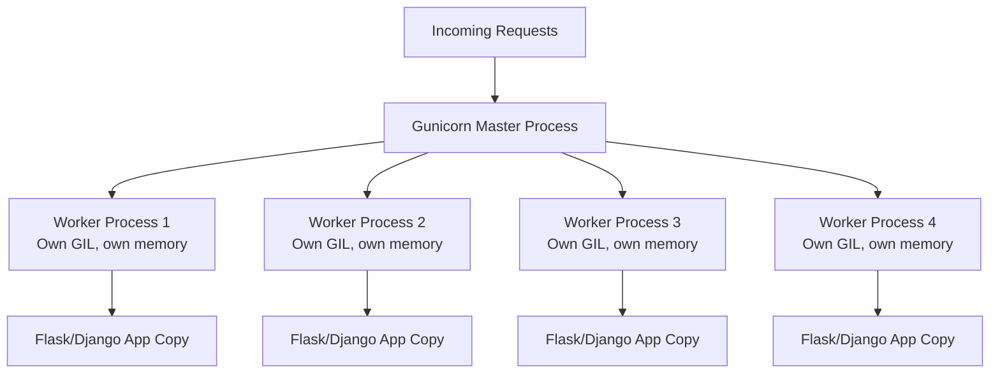

- **Master process**: Does NOT handle requests. It manages worker lifecycle — spawns them, monitors health, restarts crashed workers.
- **Worker processes**: Each is a full OS process (forked). Each loads your app independently. Each handles requests on its own.

## Gunicorn does NOT have an event loop by default

Gunicorn's default worker type is `sync` — each worker handles one request at a time, blocking until complete. But Gunicorn supports different worker types:

```bash
# Sync workers (default) — 1 request per worker at a time
gunicorn app:app --workers 4 --worker-class sync

# Threaded workers — multiple threads per worker
gunicorn app:app --workers 4 --threads 4

# Async workers (gevent) — event loop inside each worker
gunicorn app:app --workers 4 --worker-class gevent

# Uvicorn workers — for ASGI apps like FastAPI
gunicorn app:app --workers 4 --worker-class uvicorn.workers.UvicornWorker
```

## Why multiple processes work despite the GIL

```
Process 1: [GIL] → Thread executes Python code
Process 2: [GIL] → Thread executes Python code (simultaneously!)
Process 3: [GIL] → Thread executes Python code (simultaneously!)
```

Each process has its own GIL, its own memory space, its own Python interpreter. The OS schedules them across CPU cores. This is true parallelism.

---

# How can FastAPI run on both Gunicorn and Uvicorn?

## Short Answer

- **Uvicorn alone**: Runs FastAPI directly. Single process, event loop, handles async requests.
- **Gunicorn + Uvicorn workers**: Gunicorn acts as a process manager that spawns multiple Uvicorn worker processes. You get the best of both — multiple processes (Gunicorn) each running an async event loop (Uvicorn).

## Configuration

### Option 1: Uvicorn only (simple, good for development or light loads)

```bash
pip install uvicorn
uvicorn app:app --host 0.0.0.0 --port 8000
```

Single process, single event loop. Fine for development or low-traffic services.

### Option 2: Gunicorn + Uvicorn workers (production)

```bash
pip install gunicorn uvicorn
gunicorn app:app --workers 4 --worker-class uvicorn.workers.UvicornWorker --bind 0.0.0.0:8000
```

This tells Gunicorn: "Spawn 4 worker processes, but instead of your default sync worker, use Uvicorn's worker class." Each worker runs a full async event loop.

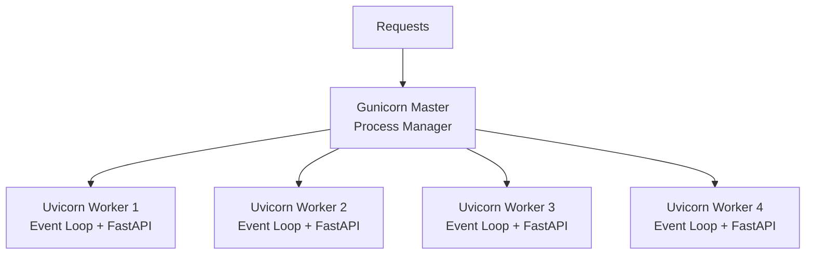

### Option 3: Uvicorn with multiple workers (simpler alternative)

```bash
uvicorn app:app --workers 4 --host 0.0.0.0 --port 8000
```

Uvicorn itself can spawn multiple processes. However, Gunicorn offers more mature process management (graceful restarts, configurable timeouts, better monitoring).

## Why use Gunicorn at all with FastAPI?

| Feature | Uvicorn alone | Gunicorn + Uvicorn workers |
|---------|--------------|---------------------------|
| Process management | Basic | Battle-tested, mature |
| Graceful restarts | Limited | Built-in |
| Worker timeout/health | Basic | Configurable |
| Multi-process | `--workers` flag | Native design |
| Production-ready | Acceptable | Recommended |

---

# What exactly is a web server?

## Simple Definition

A web server is a program that **listens for incoming requests on a network port** and **sends back responses**. That's it at its core.

Think of it like a restaurant host:
- Stands at the door (listens on port 80/443)
- Receives guests (incoming HTTP requests)
- Routes them to the right table (forwards to the right handler)
- Ensures they get served (sends back the response)

## Example Scenarios

### Scenario 1: Serving a static website

You have HTML/CSS/JS files. A web server (like Nginx) listens on port 80. When a browser requests `GET /index.html`, the server finds that file on disk and sends it back. No application logic needed.

```
Browser → "GET /index.html" → Nginx → reads file from disk → sends HTML back → Browser renders page
```

### Scenario 2: Serving a dynamic application

You have a Python app that generates responses based on database queries. The web server receives the request, passes it to your Python app, gets the response, and sends it back to the client.

```
Browser → "GET /users/42" → Nginx → Gunicorn → Flask app → queries DB → returns JSON → Browser
```

### Scenario 3: Reverse proxy

A web server sits in front of multiple backend services, routing requests to the right one:

```
Browser → Nginx (port 443)
    /api/*    → Gunicorn (port 8000) → Flask app
    /static/* → serves files directly from disk
    /ws/*     → Uvicorn (port 8001) → FastAPI WebSocket app
```

## Types of web servers

| Type | Examples | What they do |
|------|----------|-------------|
| General-purpose HTTP server | Nginx, Apache | Serve static files, reverse proxy, TLS termination, load balancing |
| Application server (WSGI) | Gunicorn, uWSGI | Run Python sync apps, manage worker processes |
| Application server (ASGI) | Uvicorn, Daphne, Hypercorn | Run Python async apps, handle WebSockets |
| Built-in dev servers | Flask's Werkzeug, `uvicorn` in dev mode | Quick testing, NOT for production |

---

# How web servers evolved to WSGI and ASGI

## The Evolution

### Era 1: Static file servers (early 1990s)

The first web servers (CERN httpd, Apache) just served files from disk. You put HTML files in a folder, the server sent them to browsers. No dynamic content.

**Problem**: Websites needed to be dynamic — show different content per user, process forms, talk to databases.

### Era 2: CGI — Common Gateway Interface (mid 1990s)

**Solution**: CGI let the web server run an external program for each request. The server would spawn a new process (Perl, Python, C), pass it the request data via environment variables, and capture its stdout as the response.

```
Browser → Apache → fork() → python script.py → print HTML → Apache → Browser
```

**Problem**: Spawning a new process for EVERY request is extremely slow and resource-heavy. 100 concurrent users = 100 processes.

### Era 3: mod_php / mod_python / embedded interpreters (late 1990s)

**Solution**: Embed the language interpreter directly inside the web server. Apache's `mod_python` kept Python loaded in memory — no fork per request.

**Problem**: Tightly coupled to Apache. If you wanted to switch web servers, your app broke. No standard interface between server and application.

### Era 4: WSGI — Web Server Gateway Interface (2003, PEP 3333)

**Solution**: Define a **standard interface** between any Python web app and any web server. As long as both sides speak WSGI, they work together.

```python
# The WSGI interface is dead simple:
def application(environ, start_response):
    # environ = dict with request info (method, path, headers)
    # start_response = callable to set status + headers
    start_response('200 OK', [('Content-Type', 'text/plain')])
    return [b'Hello World']
```

Now ANY WSGI server (Gunicorn, uWSGI, Waitress) can run ANY WSGI app (Flask, Django, Pyramid). Decoupled.

**Problem**: WSGI is synchronous. One request per thread. Cannot handle WebSockets, long-polling, or Server-Sent Events efficiently. In the age of real-time apps, this became a bottleneck.

### Era 5: ASGI — Asynchronous Server Gateway Interface (2016+)

**Solution**: A new standard that supports async/await, WebSockets, HTTP/2, and long-lived connections.

```python
# The ASGI interface:
async def application(scope, receive, send):
    # scope = dict with connection info (type, path, headers)
    # receive = async callable to get request body/messages
    # send = async callable to send response
    await send({
        'type': 'http.response.start',
        'status': 200,
        'headers': [[b'content-type', b'text/plain']],
    })
    await send({
        'type': 'http.response.body',
        'body': b'Hello World',
    })
```


## Summary of problems solved

| Era | Problem Solved | New Problem Created |
|-----|---------------|-------------------|
| Static servers | Serve files over HTTP | No dynamic content |
| CGI | Dynamic content | Process per request = slow |
| mod_python | No fork overhead | Coupled to Apache |
| WSGI | Standard interface, server-agnostic | Sync only, no WebSockets |
| ASGI | Async, WebSockets, HTTP/2 | More complex, newer ecosystem |

---

# Why does Python need ASGI/WSGI?

## Short Answer

Python needs WSGI/ASGI because without a standard interface, every web server would need custom code to talk to every framework. It's a **contract** that lets servers and frameworks evolve independently.

## The Problem Without a Standard

Imagine no WSGI/ASGI exists:

```
Gunicorn needs to know how to call Flask internals
Gunicorn needs to know how to call Django internals
Gunicorn needs to know how to call Pyramid internals
uWSGI needs to know how to call Flask internals
uWSGI needs to know how to call Django internals
... (N servers × M frameworks = N×M integrations)
```

With WSGI/ASGI:

```
Gunicorn speaks WSGI ←→ Flask speaks WSGI     ✓
Gunicorn speaks WSGI ←→ Django speaks WSGI    ✓
Uvicorn speaks ASGI  ←→ FastAPI speaks ASGI   ✓
Any WSGI server      ←→ Any WSGI framework    ✓
```

N servers + M frameworks = N+M implementations. Much simpler.

## Why Python specifically?

Other languages have similar concepts but often don't need a separate spec because:

- **Go**: The standard library (`net/http`) IS the server. Your app and server are compiled into one binary.
- **Java**: Has the Servlet specification (similar concept to WSGI).
- **Node.js**: The runtime has a built-in HTTP server (`http.createServer`). Your app IS the server.

Python's situation is unique because:
1. Python apps are **not** compiled into standalone servers
2. Python has many competing web servers and frameworks
3. Python's interpreted nature means you need something to bridge "raw TCP connections" to "Python function calls"

## What WSGI/ASGI actually standardize

They define: "If you give me a request in THIS format, I'll give you a response in THAT format."

```python
# WSGI says: your app must be a callable that accepts (environ, start_response)
# ASGI says: your app must be an async callable that accepts (scope, receive, send)
```

This is the handshake. The server handles TCP, HTTP parsing, connection management. Your app handles business logic. The spec defines how they talk.

---

# Why can't Nginx communicate directly with FastAPI/Flask? Why do we need Uvicorn/Gunicorn?

## Short Answer

Nginx speaks **HTTP**. Your Flask/FastAPI app speaks **Python function calls**. Someone needs to translate between them. That translator is Gunicorn/Uvicorn.

## The Language Barrier


Nginx can forward HTTP requests to another HTTP endpoint (reverse proxy). But your Python app isn't listening on a port by itself — it's just a Python function sitting in memory. Something needs to:

1. **Listen on a port** and accept TCP connections
2. **Parse HTTP** from raw bytes into structured data
3. **Call your Python function** with that structured data (following WSGI/ASGI spec)
4. **Take your Python return value** and convert it back to HTTP bytes
5. **Send the response** back over the network

That "something" is Gunicorn/Uvicorn.

## Why not build this into Nginx?

Nginx is written in C. It cannot execute Python code. You'd need to embed a Python interpreter inside Nginx (like the old mod_python in Apache). This was tried and abandoned because:

- Crashes in Python code crash the entire web server
- Upgrading Python means recompiling Nginx
- Memory leaks in your app affect the web server
- Tight coupling = maintenance nightmare

## The actual production architecture

```
Internet → Nginx (port 443)
              ↓ reverse proxy (HTTP)
           Gunicorn (port 8000)
              ↓ WSGI/ASGI protocol (Python function call)
           Your Flask/FastAPI app
```

**Nginx's job**: TLS termination, static file serving, rate limiting, load balancing, caching, compression. It's excellent at handling raw network traffic efficiently.

**Gunicorn/Uvicorn's job**: Manage Python processes/threads, translate HTTP to Python function calls, handle worker lifecycle.

**Your app's job**: Business logic only.

## Can you skip Nginx?

Yes! For internal services or simple deployments:

```bash
# Uvicorn directly exposed (no Nginx)
uvicorn app:app --host 0.0.0.0 --port 8000
```

This works. But you lose Nginx's benefits (TLS, static files, rate limiting, etc.). For production internet-facing apps, the Nginx + Gunicorn/Uvicorn combo is standard.

---

# Does ASGI/WSGI exist just for Python?

## Short Answer

Yes. WSGI and ASGI are **Python-specific** specifications. They were created by the Python community, for Python web applications.

## Other languages have their own equivalents

| Language | Equivalent | How it works |
|----------|-----------|-------------|
| Python | WSGI / ASGI | Separate spec between server and app |
| Java | Servlet API / Jakarta EE | Standard interface, app servers like Tomcat |
| Ruby | Rack | Very similar to WSGI — standard interface between server (Puma) and app (Rails) |
| Perl | PSGI / Plack | Directly inspired by WSGI |
| Go | None needed | `net/http` in stdlib IS the server |
| Node.js | None needed | Runtime has built-in HTTP server |
| Rust | None needed | Frameworks like Actix/Axum include the server |

## Why some languages don't need this

Languages like Go, Rust, and Node.js compile/run your application as a standalone HTTP server. Your app **is** the server. There's no separation to bridge.

```javascript
// Node.js — your app IS the server
const http = require('http');
http.createServer((req, res) => {
    res.end('Hello');
}).listen(8000);
```

```go
// Go — your app IS the server
http.HandleFunc("/", handler)
http.ListenAndServe(":8000", nil)
```

In Python, your app is just a function. It can't listen on ports or handle TCP by itself. It needs a server to do that part, and WSGI/ASGI defines how they communicate.

---

# Will WSGI with multiple workers/threads give real advantages despite Python's GIL?

## Short Answer

**Yes, absolutely** — for I/O-bound workloads (which most web apps are). The GIL only limits CPU-bound parallelism within a single process. Multiple workers (processes) bypass the GIL entirely.

## Understanding what the GIL actually limits

The GIL prevents multiple threads from executing **Python bytecode** simultaneously in one process. But:

- **I/O operations release the GIL**. When a thread is waiting for a database query, network response, or file read, it releases the GIL and other threads can run.
- **Multiple processes each have their own GIL**. 4 Gunicorn workers = 4 independent GILs = true parallelism.

## Scenario: Web app making database queries

```python
@app.route("/users")
def get_users():
    # This is I/O-bound — waiting for database
    users = db.query("SELECT * FROM users")  # GIL released during wait!
    return jsonify(users)
```

With 4 threads in one process:
```
Thread 1: [Python code][---waiting for DB (GIL released)---][Python code]
Thread 2:    [Python code][---waiting for DB (GIL released)---][Python code]
Thread 3:       [Python code][---waiting for DB---][Python code]
Thread 4:          [Python code][---waiting for DB---][Python code]
```

All 4 threads make progress because they spend most time in I/O (GIL released), not executing Python code.

## When the GIL DOES hurt

```python
@app.route("/compute")
def heavy_compute():
    # CPU-bound — GIL is held the entire time
    result = sum(i * i for i in range(10_000_000))
    return jsonify(result=result)
```

Here, threads don't help within one process. But multiple **processes** (Gunicorn workers) still give you parallelism because each has its own GIL.

## The real-world answer

| Workload type | Threads help? | Processes help? |
|--------------|--------------|----------------|
| I/O-bound (DB, HTTP calls, file reads) | ✅ Yes (GIL released during I/O) | ✅ Yes |
| CPU-bound (computation, data processing) | ❌ No (GIL blocks parallelism) | ✅ Yes |
| Mixed | Partially | ✅ Yes |

Most web applications are **heavily I/O-bound** (waiting for databases, APIs, caches). So yes, multiple threads and workers give massive real-world benefits even with the GIL.

```bash
# Typical production setup — works great despite GIL
gunicorn app:app --workers 4 --threads 4
# = 4 processes × 4 threads = 16 concurrent requests
```

---

# How does communication between ASGI and FastAPI work? Does FastAPI auto-start the ASGI server?

## Short Answer

No, FastAPI does **not** automatically start an ASGI server. YOU start the ASGI server (Uvicorn), and you tell it where your FastAPI app is. The ASGI server then calls your FastAPI app for every incoming request.

## The Complete Flow

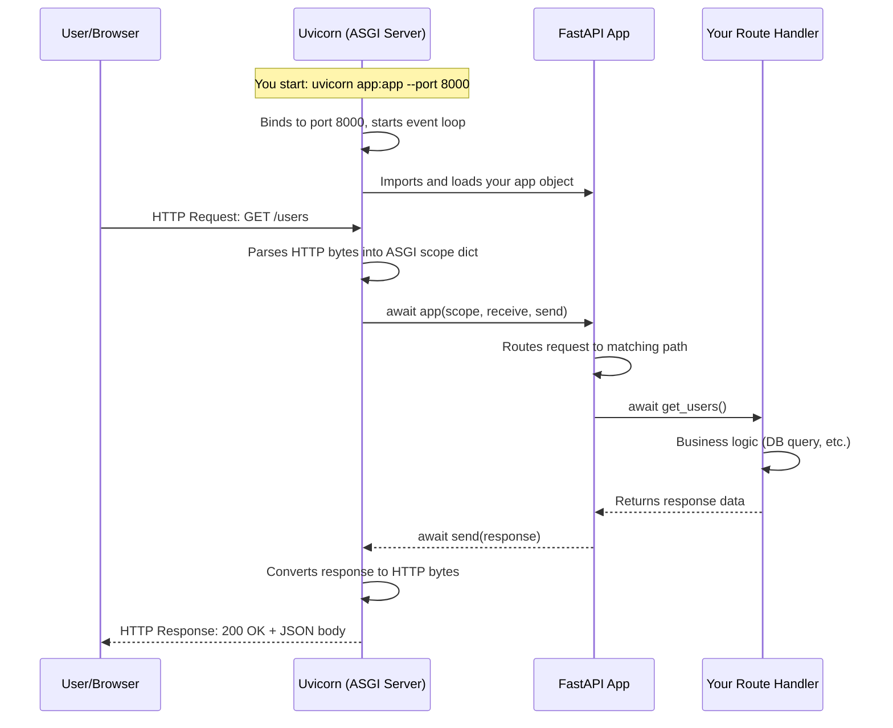

## Step by step: What happens when you run `uvicorn app:app`

```bash
uvicorn app:app --host 0.0.0.0 --port 8000
```

1. **Uvicorn starts**: Creates a socket, binds to port 8000, starts the asyncio event loop
2. **Uvicorn imports your app**: It interprets `app:app` as "from module `app`, import the object `app`" — which is your FastAPI instance
3. **Uvicorn listens**: Waits for incoming TCP connections
4. **Request arrives**: Uvicorn reads raw bytes from the socket, parses HTTP
5. **ASGI handoff**: Uvicorn creates a `scope` dict and calls `await your_app(scope, receive, send)`
6. **FastAPI processes**: Routes the request, runs middleware, calls your handler
7. **Response flows back**: FastAPI calls `await send(...)` which Uvicorn converts to HTTP bytes and writes to the socket

## What the ASGI interface looks like internally

```python
# This is what FastAPI looks like to Uvicorn (simplified):
class FastAPI:
    async def __call__(self, scope, receive, send):
        # scope = {"type": "http", "method": "GET", "path": "/users", "headers": [...]}
        # receive = async function to get request body
        # send = async function to send response

        if scope["type"] == "http":
            # Route matching, middleware, call your handler
            response = await self.route(scope, receive)
            await send({"type": "http.response.start", "status": 200, ...})
            await send({"type": "http.response.body", "body": response_bytes})
```

## Can you auto-start Uvicorn from code?

Yes, but it's not "automatic" — you explicitly call it:

```python
# app.py
from fastapi import FastAPI
import uvicorn

app = FastAPI()

@app.get("/")
async def root():
    return {"hello": "world"}

if __name__ == "__main__":
    uvicorn.run(app, host="0.0.0.0", port=8000)
```

```bash
python app.py  # This starts Uvicorn programmatically
```

This is just a convenience — it's still YOU starting the server, just from within the same file.

---

# Can I start multiple FastAPI processes with multiple worker threads? Do I need multiple ASGI servers?

## Short Answer

Yes, you can run multiple FastAPI processes. No, you don't need multiple ASGI servers — a single Uvicorn/Gunicorn setup manages all the processes for you. One command, multiple workers.

## How it works

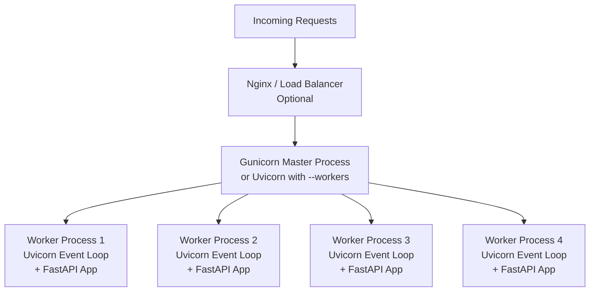

## Configuration

```bash
# Option 1: Gunicorn with Uvicorn workers (recommended for production)
gunicorn app:app \
    --workers 4 \
    --worker-class uvicorn.workers.UvicornWorker \
    --bind 0.0.0.0:8000

# Option 2: Uvicorn with multiple workers
uvicorn app:app --workers 4 --host 0.0.0.0 --port 8000
```

Both commands:
- Start a **single master process** that listens on port 8000
- Fork **4 worker processes**, each running its own event loop + FastAPI app
- The master distributes incoming connections across workers
- Each worker handles many concurrent requests (async)

## You do NOT need multiple ASGI servers

A single Gunicorn/Uvicorn instance manages everything:

```
ONE command → ONE port → ONE master process → MANY worker processes
                                                  ↓
                                          Each worker has:
                                          - Its own event loop
                                          - Its own FastAPI app instance
                                          - Handles many concurrent requests
```

## Scaling further: Multiple machines

If one machine isn't enough, you run the same setup on multiple machines and put a load balancer in front:

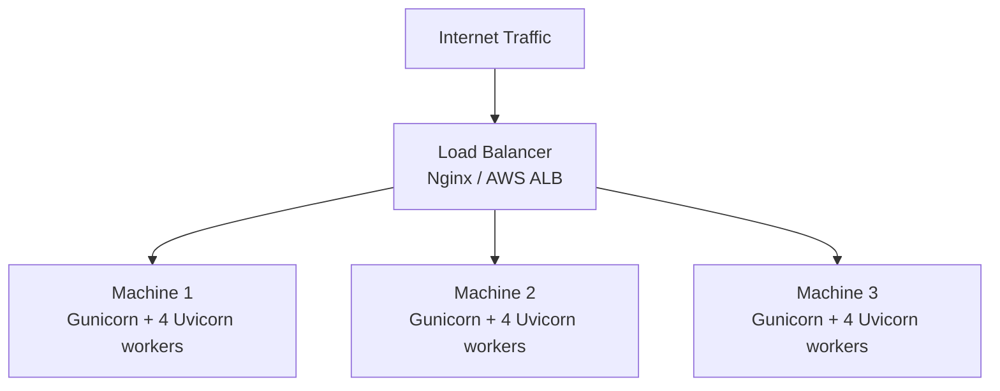

Each machine runs its own ASGI server (Gunicorn+Uvicorn). The load balancer distributes traffic across machines.

## Concurrency math

```
1 machine × 4 workers × ~1000 concurrent async requests per worker = ~4000 concurrent requests

3 machines × 4 workers × ~1000 concurrent requests = ~12000 concurrent requests
```

The exact number depends on your workload, but async FastAPI can handle far more concurrent connections per worker than sync Flask.

---

# Is there any situation where you need to use WSGI over ASGI?

## Short Answer

Yes, there are legitimate reasons to choose WSGI over ASGI:

## When WSGI is the better choice

### 1. Your app is entirely synchronous and CPU-bound

If your app does heavy computation (ML inference, image processing, data crunching) with no I/O waits, async gives you zero benefit. WSGI with multiple worker processes is simpler and equally effective.

```python
# This gains nothing from async — it's pure CPU work
@app.route("/predict")
def predict():
    result = model.predict(data)  # CPU-bound, no I/O
    return jsonify(result)
```

### 2. You're using libraries that aren't async-compatible

Many older Python libraries are synchronous only — they block. Using them in an async app requires wrapping in threadpool executors, which adds complexity without benefit.

```python
# These are sync-only — no async versions exist
import cx_Oracle        # Oracle DB driver (sync only)
import paramiko         # SSH library (sync only)
import some_legacy_lib  # Internal company library
```

If your entire stack is sync libraries, WSGI is simpler and avoids the "async sandwich" problem (mixing sync and async code awkwardly).

### 3. You're maintaining an existing Flask/Django app

Migrating a large WSGI app to ASGI is significant work. If the app performs well and doesn't need WebSockets or high concurrency, there's no reason to migrate.

### 4. Team familiarity and debugging simplicity

WSGI's execution model is straightforward: one request, one thread, top-to-bottom execution. Async code introduces:
- Harder debugging (stack traces across await points)
- Subtle bugs (forgetting to await, blocking the event loop)
- More complex testing

For teams unfamiliar with async Python, WSGI is more maintainable.

### 5. You need maximum compatibility

WSGI has been around since 2003. Every Python hosting platform, every deployment tool, every monitoring system supports it. ASGI support is newer and occasionally has gaps.

## When you MUST use ASGI

- WebSockets
- Server-Sent Events (SSE)
- HTTP/2 server push
- Long-polling with thousands of connections
- High-concurrency I/O-bound workloads

## Decision flowchart

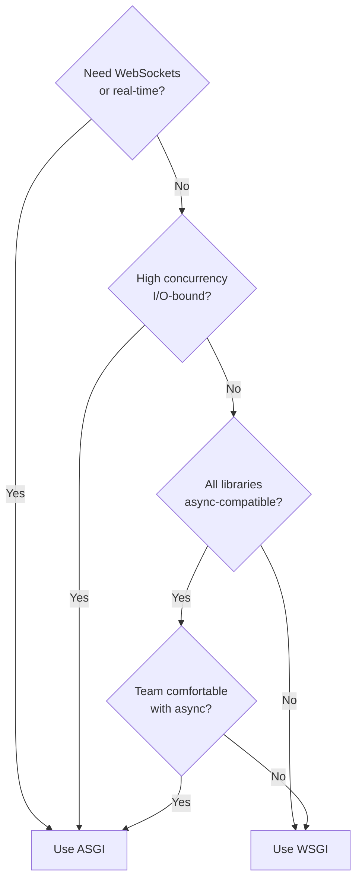

---

## Curiosity Questions

1. **What is the "async sandwich" problem?** — When you mix sync and async code, what pitfalls arise and how do you handle sync database drivers inside an async FastAPI app?

2. **How does the GIL change in Python 3.13+?** — Python is introducing a "free-threaded" mode (no-GIL). How will this affect the Gunicorn/Uvicorn story?

3. **What exactly happens during a graceful restart?** — When Gunicorn restarts workers, how does it ensure in-flight requests aren't dropped?

4. **How does Nginx decide which worker to forward a request to?** — What load balancing algorithms exist between Nginx and upstream Gunicorn workers?

5. **What are the tradeoffs between more workers vs. more threads vs. more async concurrency?** — Given a fixed amount of RAM and CPU, how do you tune the ratio of workers to threads for your specific workload?

---

# What is the "async sandwich" problem?

## What

The async sandwich problem occurs when you have async code calling sync code calling async code — creating a "sandwich" where the sync layer in the middle blocks the event loop and defeats the purpose of async.

```
async layer (FastAPI handler)
    ↓ calls
sync layer (blocking library)     ← THIS blocks the event loop
    ↓ wants to call
async layer (async DB driver)     ← Can't await from sync context!
```

## Why it's a problem

In an async application, the event loop runs on a single thread. If ANY code in that thread blocks (does sync I/O, sleeps, waits), ALL other concurrent requests are frozen until it finishes.

```python
# BAD: This blocks the entire event loop
@app.get("/users")
async def get_users():
    # requests library is synchronous — blocks the event loop!
    response = requests.get("http://other-service/data")  # 💀 All other requests freeze
    return response.json()
```

## The sandwich in action

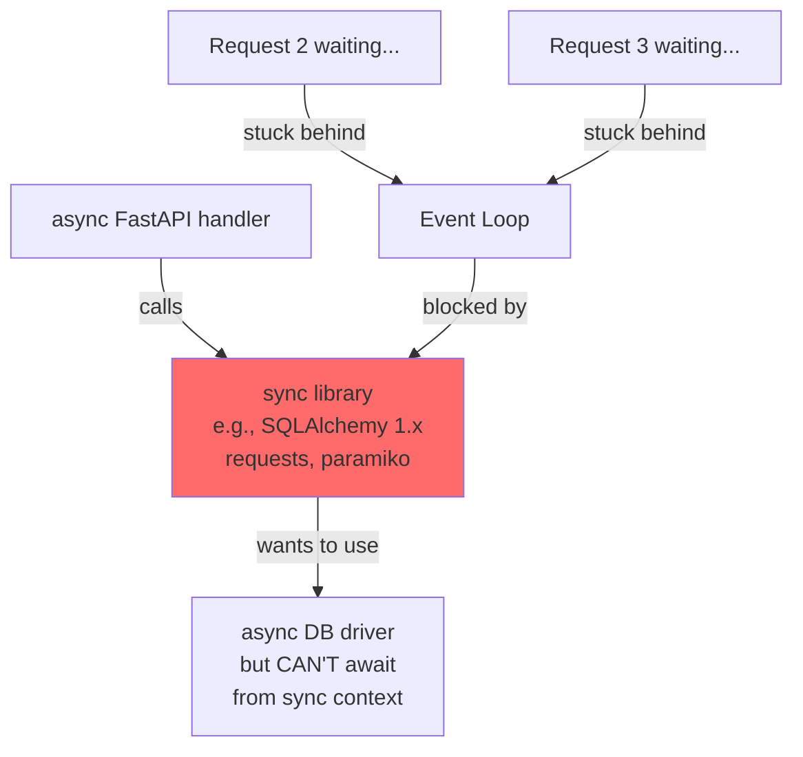

## How to handle it

### Solution 1: Use async-native libraries

Replace sync libraries with async equivalents:

```python
# Instead of: requests (sync)
# Use: httpx (async)
import httpx

@app.get("/users")
async def get_users():
    async with httpx.AsyncClient() as client:
        response = await client.get("http://other-service/data")  # ✅ Non-blocking
    return response.json()

# Instead of: psycopg2 (sync)
# Use: asyncpg (async)
import asyncpg

@app.get("/data")
async def get_data():
    conn = await asyncpg.connect(DATABASE_URL)
    rows = await conn.fetch("SELECT * FROM users")  # ✅ Non-blocking
    return rows
```

### Solution 2: Run sync code in a threadpool

When you MUST use a sync library, offload it to a thread so it doesn't block the event loop:

```python
import asyncio
from functools import partial

@app.get("/legacy")
async def call_legacy():
    # Run sync function in a threadpool — event loop stays free
    loop = asyncio.get_event_loop()
    result = await loop.run_in_executor(None, sync_legacy_function, arg1, arg2)
    return result
```

FastAPI does this automatically for `def` (non-async) endpoints:

```python
# FastAPI auto-runs this in a threadpool — safe!
@app.get("/sync-endpoint")
def sync_endpoint():
    result = some_blocking_library.call()  # Runs in threadpool, not event loop
    return result
```

### Solution 3: Use `def` instead of `async def` for sync work

```python
# If your handler only uses sync libraries, just use def:
@app.get("/report")
def generate_report():
    # FastAPI runs this in a threadpool automatically
    data = sync_db.query("SELECT ...")
    pdf = sync_pdf_library.generate(data)
    return FileResponse(pdf)
```

## The key rule

- `async def` → runs ON the event loop. Never block here.
- `def` → runs IN a threadpool. Blocking is fine here.

If you use `async def`, every I/O operation inside MUST be `await`-ed on an async library. If you can't do that, use plain `def`.

---

# How does the GIL change in Python 3.13+? How will it affect Gunicorn/Uvicorn?

## What's changing

Python 3.13 introduced an experimental **free-threaded mode** (PEP 703) — you can run Python without the GIL. This means multiple threads can execute Python bytecode truly in parallel for the first time.

```bash
# Python 3.13+ with free-threading enabled
python3.13t -X gil=0 my_app.py
```

## What this means for web servers

### Before (with GIL)

```
Process 1, Thread A: [===executing===]
Process 1, Thread B:                   [===executing===]  ← must wait for A
```

Threads in the same process take turns. For CPU-bound work, threads don't help. You NEED multiple processes (Gunicorn workers) for true parallelism.

### After (no GIL)

```
Process 1, Thread A: [===executing===]
Process 1, Thread B: [===executing===]  ← runs simultaneously!
```

Threads in the same process run truly in parallel. A single process with multiple threads can now utilize multiple CPU cores.

## Impact on the Gunicorn/Uvicorn story

### Gunicorn (WSGI)

| Aspect | With GIL | Without GIL |
|--------|----------|-------------|
| Workers needed for parallelism | Many (1 per core) | Fewer (threads parallelize) |
| Memory usage | High (each process copies app) | Lower (threads share memory) |
| Typical config | `--workers 8` | `--workers 2 --threads 8` |

Without the GIL, you could run fewer processes with more threads, saving significant memory (each process duplicates your app's memory footprint).

### Uvicorn (ASGI)

The impact on async code is **less dramatic** because:
- Async already achieves concurrency on a single thread via the event loop
- The bottleneck for async apps is usually I/O, not CPU

But for CPU-bound work within an async app, no-GIL helps:

```python
@app.get("/compute")
async def compute():
    # With GIL: this blocks the event loop, other requests wait
    # Without GIL: could potentially run in parallel threads without blocking
    loop = asyncio.get_event_loop()
    result = await loop.run_in_executor(thread_pool, heavy_cpu_work)
    return result
```

## What won't change

- You'll still need Gunicorn/Uvicorn — they manage processes, handle signals, do graceful restarts
- Nginx in front is still valuable for TLS, static files, rate limiting
- WSGI/ASGI specs remain the same
- The architecture stays the same, just the tuning changes

## Current status (as of 2026)

- Free-threaded mode is **experimental** in 3.13, more stable in 3.14+
- Many C extensions need updates to be thread-safe without the GIL
- Libraries like NumPy, SQLAlchemy are gradually adding support
- It's not yet the default — you opt in explicitly

## The future

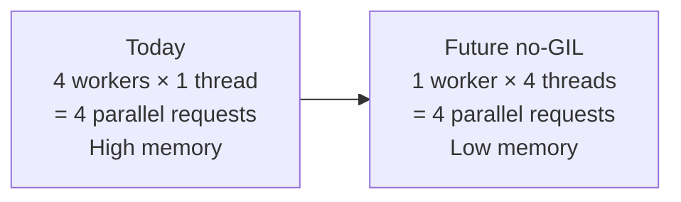

The biggest win: **same parallelism, fraction of the memory**. A server running 8 Gunicorn workers might use 2GB RAM (each worker loads the app). With no-GIL, 1-2 workers with 8 threads could achieve the same throughput at 500MB.

---

# What exactly happens during a graceful restart in Gunicorn?

## What is a graceful restart?

When you deploy new code, you need to restart workers to pick up changes. A **graceful restart** ensures in-flight requests complete before old workers die, so no user sees a dropped connection or error.

## The sequence

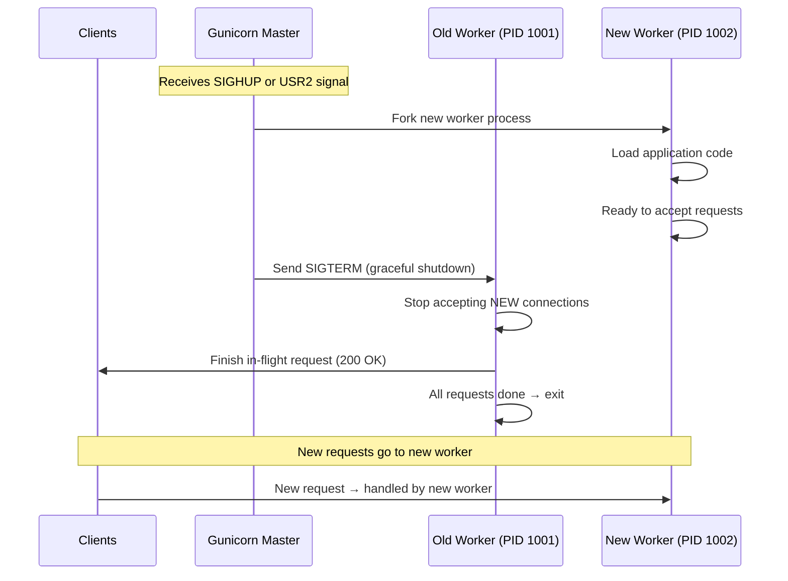

## Step by step

### 1. Signal received

```bash
# Trigger graceful restart
kill -HUP $(cat gunicorn.pid)    # SIGHUP = reload config + restart workers
# or
kill -USR2 $(cat gunicorn.pid)   # USR2 = full binary upgrade
```

### 2. Master spawns new workers

The master process forks new worker processes that load the **new** application code. These new workers start accepting connections once ready.

### 3. Old workers get SIGTERM

The master sends SIGTERM to old workers. Each old worker:
- **Stops accepting new connections** (removes itself from the listening socket)
- **Continues processing in-flight requests** until they complete
- **Exits** once all current requests are done

### 4. Timeout safety net

If an old worker doesn't exit within `graceful_timeout` seconds (default 30s), the master sends SIGKILL (force kill). This prevents hung workers from living forever.

```python
# gunicorn.conf.py
graceful_timeout = 30  # seconds to wait before force-killing old workers
timeout = 120          # max time for a single request
```

## Why no requests are dropped

```
Timeline:
─────────────────────────────────────────────────────────
Old Worker:  [accepting] [finishing requests] [exit]
New Worker:       [starting]  [accepting new requests...]
─────────────────────────────────────────────────────────
                  ↑ overlap period — both workers exist
```

During the overlap, the old worker finishes existing work while the new worker handles new connections. The listening socket is shared — the OS kernel queues incoming connections and distributes them to available workers.

## What CAN go wrong

- **Long-running requests**: If a request takes longer than `graceful_timeout`, it gets killed mid-response
- **WebSocket connections**: Long-lived connections need special handling (they'll be terminated at graceful_timeout)
- **Startup time**: If your app takes 30 seconds to load (ML models, etc.), there's a gap where fewer workers are available

---

# How does Nginx decide which worker to forward a request to?

## The short answer

Nginx doesn't forward to individual Gunicorn workers directly. Nginx forwards to Gunicorn's **listening port**, and the OS kernel + Gunicorn master distribute connections to workers. But when Nginx load-balances across multiple **backend servers**, it uses configurable algorithms.

## Two levels of distribution

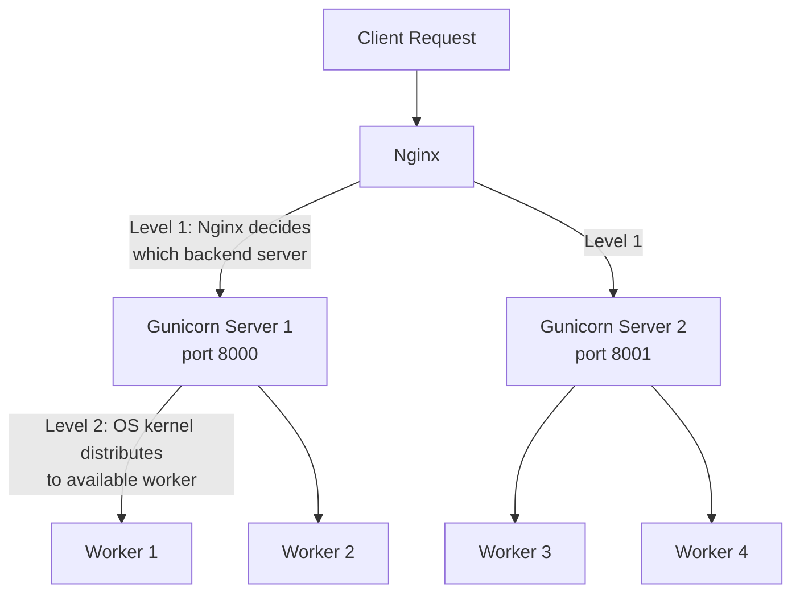

## Level 1: Nginx load balancing algorithms

```nginx
# Round Robin (default) — requests distributed evenly in order
upstream backend {
    server 127.0.0.1:8000;
    server 127.0.0.1:8001;
    server 127.0.0.1:8002;
}

# Least Connections — send to server with fewest active connections
upstream backend {
    least_conn;
    server 127.0.0.1:8000;
    server 127.0.0.1:8001;
    server 127.0.0.1:8002;
}

# IP Hash — same client IP always goes to same server (sticky sessions)
upstream backend {
    ip_hash;
    server 127.0.0.1:8000;
    server 127.0.0.1:8001;
    server 127.0.0.1:8002;
}

# Weighted — some servers get more traffic
upstream backend {
    server 127.0.0.1:8000 weight=3;  # gets 3x traffic
    server 127.0.0.1:8001 weight=1;
    server 127.0.0.1:8002 weight=1;
}
```

| Algorithm | Best for | Downside |
|-----------|----------|----------|
| Round Robin | Equal servers, stateless apps | Ignores server load |
| Least Connections | Varying request durations | Slightly more overhead |
| IP Hash | Stateful apps needing sticky sessions | Uneven distribution if some IPs are heavy |
| Weighted | Mixed hardware (some servers stronger) | Manual tuning needed |

## Level 2: How Gunicorn distributes to workers

Within a single Gunicorn instance, workers compete for connections from a shared socket:

1. All workers listen on the same socket (via `SO_REUSEPORT` or inherited file descriptor)
2. When a connection arrives, the OS kernel wakes one worker
3. That worker accepts the connection and handles the request
4. Other workers remain available for the next connection

This is essentially the OS kernel doing the load balancing at this level — it's not Gunicorn's master process routing requests.

---

# What are the tradeoffs between more workers vs. more threads vs. more async concurrency?

## The three knobs

```bash
# Workers (processes)
gunicorn app:app --workers 8

# Threads (per worker)
gunicorn app:app --workers 4 --threads 4

# Async concurrency (event loop handles many)
uvicorn app:app --workers 4  # each worker handles 1000s of concurrent requests
```

## Comparison table

| Dimension | More Workers (processes) | More Threads | More Async Concurrency |
|-----------|------------------------|--------------|----------------------|
| Memory | High (each copies app) | Medium (shared memory) | Low (single thread) |
| CPU parallelism | ✅ True (bypasses GIL) | ❌ Limited by GIL | ❌ Single thread |
| I/O concurrency | 1 per worker (sync) | Good for I/O-bound | Excellent (thousands) |
| Complexity | Simple | Medium | Higher (async code) |
| Failure isolation | ✅ Crash affects 1 worker | ❌ Thread crash = process crash | ❌ Exception can affect loop |
| Best for | CPU-bound work | I/O-bound sync code | I/O-bound async code |

## Memory impact (the biggest practical difference)

```python
# Assume your app uses 200MB when loaded (models, caches, etc.)

# 8 workers × 200MB = 1.6 GB RAM
gunicorn app:app --workers 8

# 2 workers × 4 threads × 200MB = 400 MB RAM (threads share memory)
gunicorn app:app --workers 2 --threads 4

# 2 workers × async = 400 MB RAM (event loop handles thousands)
gunicorn app:app --workers 2 --worker-class uvicorn.workers.UvicornWorker
```

## Decision framework

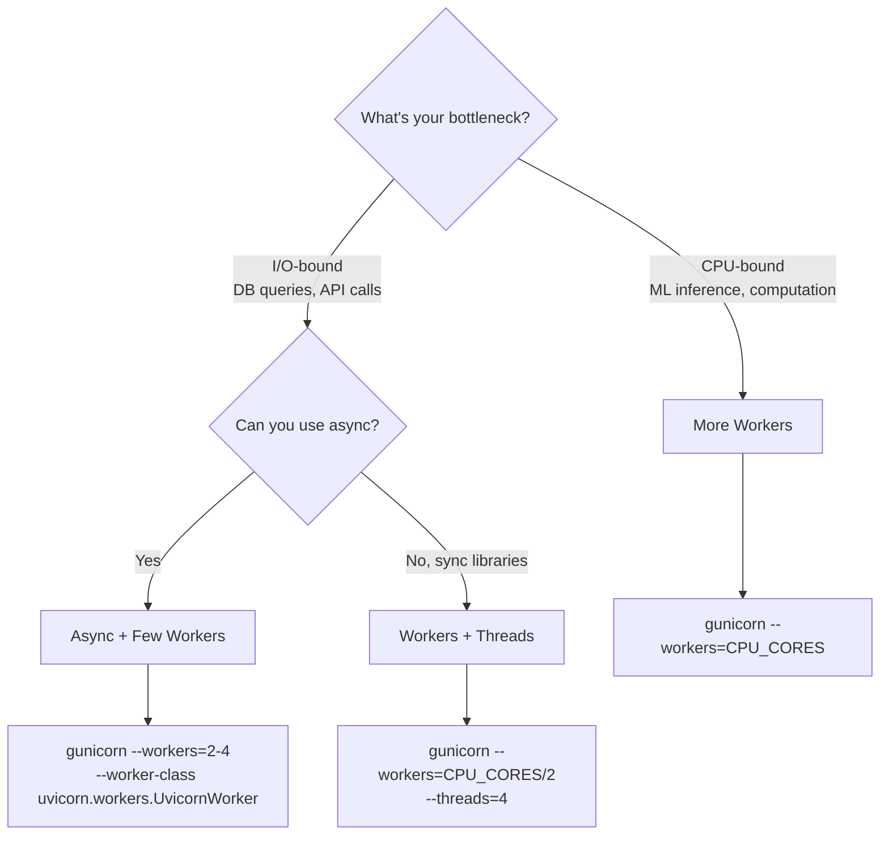

## Rules of thumb for tuning

```bash
# CPU-bound apps (ML, image processing):
# workers = number of CPU cores (or cores + 1)
gunicorn app:app --workers $(nproc)

# I/O-bound sync apps (Flask + database):
# workers = 2-4 × CPU cores (they spend most time waiting)
# threads = 2-4 per worker
gunicorn app:app --workers $(($(nproc) * 2)) --threads 4

# I/O-bound async apps (FastAPI):
# workers = CPU cores (each handles thousands of concurrent requests)
gunicorn app:app --workers $(nproc) --worker-class uvicorn.workers.UvicornWorker
```

## The tradeoff triangle

```
                    Throughput
                       /\
                      /  \
                     /    \
                    /      \
                   /________\
          Memory              Complexity
          Usage               of Code

Workers:     High throughput, high memory, simple code
Threads:     Medium throughput, medium memory, simple code  
Async:       High throughput, low memory, complex code
```

## Real-world example

A FastAPI app serving an ML model (200MB) on a 4-core, 8GB RAM machine:

```bash
# Option A: Pure workers
gunicorn app:app --workers 4
# Memory: 4 × 200MB = 800MB. Handles 4 concurrent requests.

# Option B: Workers + Uvicorn (recommended)
gunicorn app:app --workers 4 --worker-class uvicorn.workers.UvicornWorker
# Memory: 4 × 200MB = 800MB. Handles thousands of concurrent I/O requests.
# CPU-bound inference still limited to 4 parallel (one per worker).

# Option C: Fewer workers, save memory for model
gunicorn app:app --workers 2 --worker-class uvicorn.workers.UvicornWorker
# Memory: 2 × 200MB = 400MB. Leaves more RAM for model/data caching.
# Trade: only 2 parallel CPU tasks, but async handles I/O concurrency.
```

The right answer depends on your specific workload profile — measure, don't guess.

---

## Curiosity Questions (Round 2)

1. **How does `SO_REUSEPORT` work at the kernel level?** — How does the Linux kernel decide which process gets an incoming connection when multiple processes listen on the same port?

2. **What is backpressure in async systems?** — When your async app can accept thousands of connections but your database can only handle 50, what happens and how do you manage it?

3. **How do you profile and identify whether your app is CPU-bound or I/O-bound?** — What tools and techniques reveal where your Python web app actually spends its time?

4. **What is the "thundering herd" problem?** — When a Gunicorn master wakes workers to accept connections, can all workers wake up for one connection? How is this solved?

5. **How does copy-on-write (COW) reduce memory usage with forked workers?** — Gunicorn forks workers from the master. Does each worker really use a full copy of memory, or does the OS optimize this?

---

# What is the "thundering herd" problem?

## What

The thundering herd problem occurs when multiple processes/threads are all sleeping, waiting for the same event (e.g., a new connection on a socket). When the event happens, the OS wakes up ALL of them, but only ONE can actually handle it. The rest wake up, find there's nothing to do, and go back to sleep — wasting CPU cycles.

## Analogy

Imagine 20 taxi drivers sleeping at an airport taxi stand. One passenger arrives. All 20 drivers wake up, rush to the passenger, but only one gets the fare. The other 19 wasted energy waking up and walking over for nothing.

## How it happens in Gunicorn

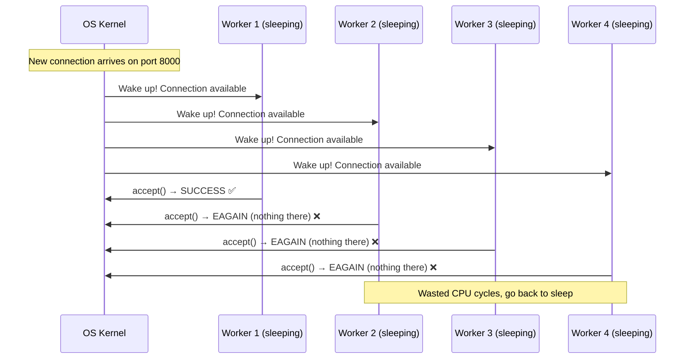

## Why it matters

With 4 workers, the waste is minimal. But at scale:
- 64 workers all waking up for 1 connection = 63 wasted context switches
- Under high load with many rapid connections, this creates a storm of useless wake-ups
- CPU spikes, increased latency, cache thrashing

## How it's solved

### Solution 1: `EPOLLEXCLUSIVE` (Linux 4.5+)

The kernel only wakes ONE process waiting on the socket, not all of them.

```c
// Kernel-level fix — only one worker gets woken
epoll_ctl(epfd, EPOLL_CTL_ADD, listen_fd, &event);
event.events = EPOLLIN | EPOLLEXCLUSIVE;  // ← only wake one
```

### Solution 2: `SO_REUSEPORT` (Linux 3.9+)

Each worker gets its own separate listening socket on the same port. The kernel distributes incoming connections across sockets — no competition.

```
Without SO_REUSEPORT:          With SO_REUSEPORT:
                               
  [Shared Socket]              [Socket 1] [Socket 2] [Socket 3]
   ↓  ↓  ↓  ↓                     ↓          ↓          ↓
  W1  W2  W3  W4              Worker 1   Worker 2   Worker 3
  (all compete)               (no competition — kernel routes directly)
```

### Solution 3: Accept mutex (Gunicorn's approach)

Gunicorn uses a file-based lock. Only the worker holding the lock can call `accept()`:

```python
# Simplified Gunicorn worker loop
while True:
    self.lock.acquire()        # Only one worker can hold this
    connection = socket.accept()  # Only this worker tries to accept
    self.lock.release()        # Release for others
    handle_request(connection)
```

This serializes accept calls — no thundering herd, but adds slight overhead from lock contention.

### Solution 4: Nginx's approach

Nginx uses an `accept_mutex` directive (similar concept):

```nginx
events {
    accept_mutex on;    # Only one worker accepts at a time (prevents thundering herd)
    accept_mutex_delay 500ms;  # How long to wait before retrying the lock
}
```

Modern Nginx with `EPOLLEXCLUSIVE` support can disable the mutex and let the kernel handle it more efficiently.

## Summary

| Solution | How it works | Tradeoff |
|----------|-------------|----------|
| `EPOLLEXCLUSIVE` | Kernel wakes only 1 process | Requires Linux 4.5+ |
| `SO_REUSEPORT` | Each worker has own socket | Kernel distributes, slight imbalance possible |
| Accept mutex | Lock-based, one worker accepts at a time | Lock contention under high load |
| Do nothing | Let all workers compete | Wastes CPU at scale |

---

# How does copy-on-write (COW) reduce memory with forked workers?

## What

When Gunicorn's master process forks worker processes, the OS does NOT immediately copy all memory. Instead, parent and children **share the same physical memory pages**. A copy is only made when a process tries to **write** (modify) a page. This is copy-on-write.

## How it works

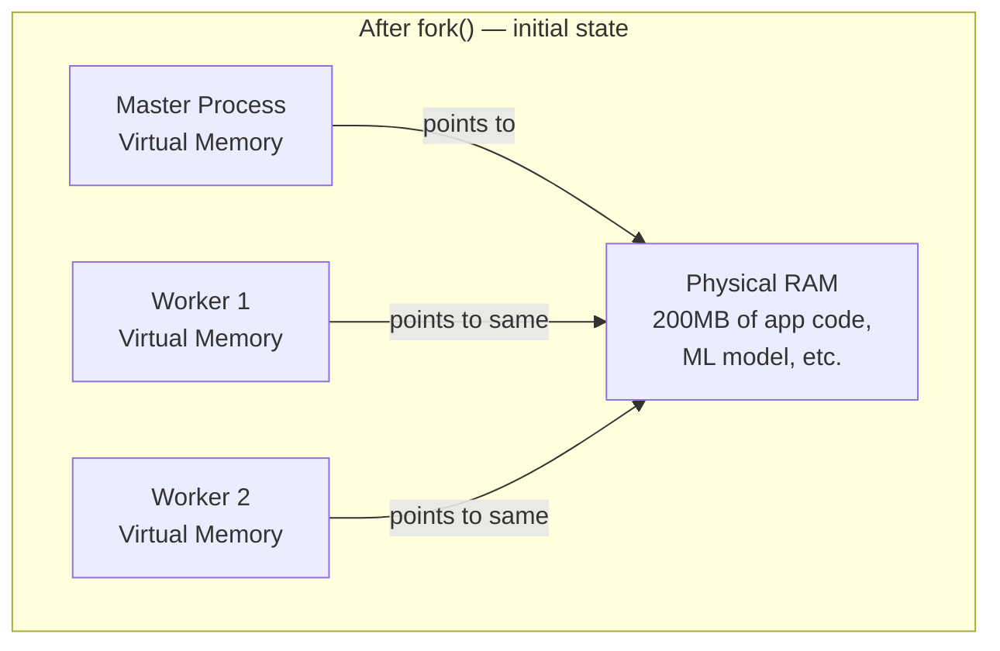

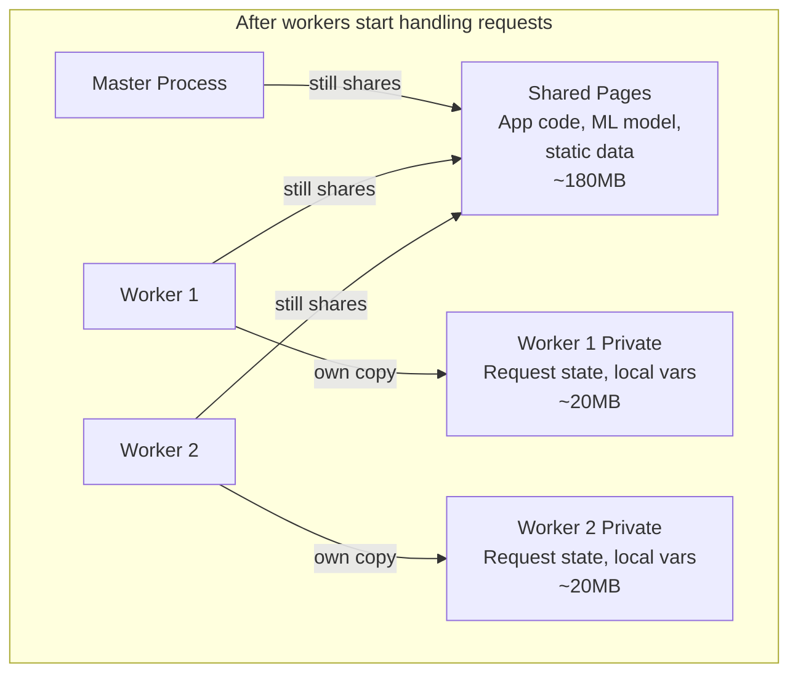

## Step by step

### 1. Master loads the application

```python
# Master process loads everything into memory
# - Application code: 50MB
# - ML model: 150MB  
# - Libraries: 50MB
# Total: 250MB in physical RAM
```

### 2. Fork creates workers

```bash
# fork() is called — OS creates new process
# BUT: no memory is copied yet!
# Worker's page table just points to the same physical pages
# Physical RAM used: still 250MB (not 250 × 4 = 1000MB)
```

### 3. Workers start modifying memory

```python
# Worker handles a request:
request_data = parse_request()  # New variable → new memory page needed
cache[key] = value              # Modifying shared dict → page copied

# Only the MODIFIED pages get copied
# Unmodified pages (app code, model weights) stay shared
```

## The memory savings

```
Without COW (hypothetical):
Master:   250MB
Worker 1: 250MB (full copy)
Worker 2: 250MB (full copy)
Worker 3: 250MB (full copy)
Worker 4: 250MB (full copy)
Total:    1250MB

With COW (reality):
Shared pages (code, model, read-only data): 200MB  ← shared by all
Master private pages: 10MB
Worker 1 private pages: 20MB
Worker 2 private pages: 20MB
Worker 3 private pages: 20MB
Worker 4 private pages: 20MB
Total: ~290MB  (instead of 1250MB!)
```

## What triggers a copy (breaks sharing)

| Action | Copies page? | Why |
|--------|-------------|-----|
| Reading app code | ❌ No | Read-only, stays shared |
| Reading ML model weights | ❌ No | Read-only, stays shared |
| Importing libraries | ❌ No | Code is read-only |
| Creating new variables | ✅ Yes | New data needs new pages |
| Modifying a dict/list | ✅ Yes | Writing to existing page |
| Python's reference counting | ✅ Yes! | Every object access increments refcount |

## The Python-specific problem: reference counting

Python's garbage collector uses reference counting — every time you access an object, its reference count is incremented (a write!). This means even "reading" a shared object can trigger COW:

```python
# This LOOKS read-only but actually writes (increments refcount):
model = shared_ml_model  # refcount of model object += 1 → page copied!
```

This is why Python processes don't benefit from COW as much as C programs. Over time, reference count updates cause most pages to be copied anyway.

## How to maximize COW benefits

### 1. Preload the app in the master (Gunicorn's `preload_app`)

```python
# gunicorn.conf.py
preload_app = True  # Load app BEFORE forking → workers share loaded code
```

Without `preload_app`, each worker loads the app independently — no sharing at all.

### 2. Use memory-mapped files for large read-only data

```python
import numpy as np

# Load model as memory-mapped — shared across forks, no refcount issues
model_weights = np.load("model.npy", mmap_mode='r')  # read-only mmap
```

Memory-mapped files bypass Python's reference counting — the OS shares the mapped pages directly.

### 3. Freeze objects after loading

```python
# Use tuples (immutable) instead of lists where possible
LOOKUP_TABLE = tuple(sorted(load_data()))  # immutable → less likely to trigger COW
```

## Verifying COW in practice

```bash
# Check shared vs private memory per process
# RSS = total memory, PSS = proportional share (accounts for sharing)
cat /proc/<pid>/smaps_rollup

# Or use smem tool
smem -p gunicorn

# PSS (Proportional Set Size) shows the REAL memory cost per worker
# If 4 workers share 200MB, each shows PSS of 50MB for that region
```

---

## Curiosity Questions (Round 3)

1. **How does Python's reference counting interact with multiprocessing?** — If refcounting breaks COW, are there strategies beyond mmap to keep shared memory truly shared?

2. **What is `preload_app` vs lazy loading in Gunicorn?** — What are the tradeoffs of loading the app before vs after forking?

3. **How do container memory limits interact with COW?** — If you run Gunicorn in a Docker container with a 512MB memory limit, does shared COW memory count once or per-process?


