# Table of Contents

## Core Questions
1. [How to test API endpoints in ML/data pipelines across layers](#how-to-test-api-endpoints-in-mldata-pipelines-across-layers)
2. [Fixtures and Monkeypatch in pytest](#fixtures-and-monkeypatch-in-pytest)
3. [Integration testing with database and third-party API calls](#integration-testing-with-database-and-third-party-api-calls)
4. [What kind of tests are required in a machine learning project?](#what-kind-of-tests-are-required-in-a-machine-learning-project)
5. [Mocking, Fixtures, Monkeypatch, and Patching in pytest](#mocking-fixtures-monkeypatch-and-patching-in-pytest)
6. [Regression testing strategy and thinking](#regression-testing-strategy-and-thinking)
7. [Boundary between unit and integration testing](#boundary-between-unit-and-integration-testing)
8. [Testing async code with asyncio](#testing-async-code-with-asyncio)

## Curiosity Questions — Round 1
9. [How do you test background tasks (Celery, FastAPI BackgroundTasks)?](#how-do-you-test-background-tasks-celery-fastapi-backgroundtasks)
10. [What is property-based testing (Hypothesis)?](#what-is-property-based-testing-hypothesis)
11. [How do you test database migrations?](#how-do-you-test-database-migrations)
12. [What is mutation testing?](#what-is-mutation-testing)
13. [How do you structure tests for a CI/CD pipeline?](#how-do-you-structure-tests-for-a-cicd-pipeline)

## Curiosity Questions — Round 2
14. [What is contract testing (Pact)?](#what-is-contract-testing-pact)
15. [How do you handle test data management at scale?](#how-do-you-handle-test-data-management-at-scale)
16. [What is snapshot testing and when is it useful?](#what-is-snapshot-testing-and-when-is-it-useful)
17. [How do you test distributed systems (microservices)?](#how-do-you-test-distributed-systems-microservices)
18. [What is chaos engineering and how does it relate to testing?](#what-is-chaos-engineering-and-how-does-it-relate-to-testing)

## Curiosity Questions — Round 3
19. [How do you test ML model serving under load (load testing)?](#how-do-you-test-ml-model-serving-under-load-load-testing)
20. [What is test-driven development (TDD) for ML?](#what-is-test-driven-development-tdd-for-ml)
21. [How do you test data pipelines (ETL)?](#how-do-you-test-data-pipelines-etl)
22. [What is A/B testing infrastructure?](#what-is-ab-testing-infrastructure)
23. [How do you test observability (logging, metrics, tracing)?](#how-do-you-test-observability-logging-metrics-tracing)

## Curiosity Questions — Round 4
24. [How do you test ML model fairness at scale?](#how-do-you-test-ml-model-fairness-at-scale)
25. [What is canary deployment testing?](#what-is-canary-deployment-testing)
26. [How do you test feature stores?](#how-do-you-test-feature-stores)
27. [What is fuzzing and how does it apply to APIs?](#what-is-fuzzing-and-how-does-it-apply-to-apis)
28. [How do you test ML model versioning and rollback?](#how-do-you-test-ml-model-versioning-and-rollback)

---

# How to test API endpoints in ML/data pipelines across layers

## The Layers in an ML API

A typical ML API has these layers:

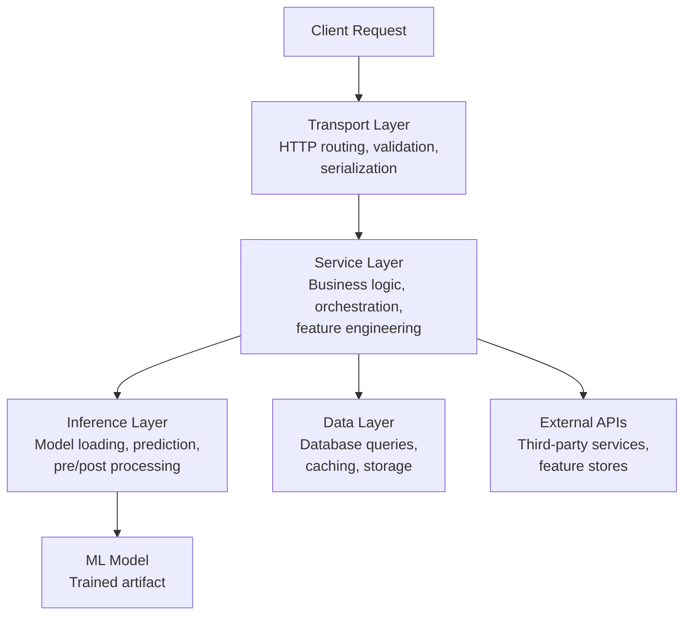

## The Testing Pyramid for ML APIs

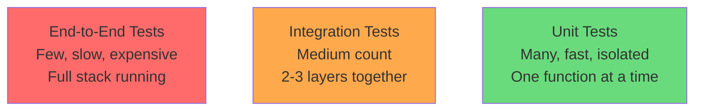

## Example: ML Prediction API

Let's build a concrete example — a sentiment analysis API:

```python
# app/models.py — Pydantic schemas (Transport layer)
from pydantic import BaseModel

class PredictionRequest(BaseModel):
    text: str
    user_id: str

class PredictionResponse(BaseModel):
    sentiment: str
    confidence: float
    request_id: str
```

```python
# app/inference.py — Inference layer
import numpy as np

class SentimentModel:
    def __init__(self, model_path: str):
        self.model = self._load_model(model_path)
    
    def _load_model(self, path: str):
        # Load trained model from disk
        import joblib
        return joblib.load(path)
    
    def predict(self, text: str) -> dict:
        # Preprocess → predict → postprocess
        features = self._preprocess(text)
        raw_output = self.model.predict_proba([features])[0]
        return {
            "sentiment": "positive" if raw_output[1] > 0.5 else "negative",
            "confidence": float(max(raw_output))
        }
    
    def _preprocess(self, text: str) -> str:
        return text.lower().strip()
```

```python
# app/service.py — Service layer
import uuid
from app.inference import SentimentModel
from app.database import PredictionStore

class PredictionService:
    def __init__(self, model: SentimentModel, store: PredictionStore):
        self.model = model
        self.store = store
    
    async def predict(self, text: str, user_id: str) -> dict:
        request_id = str(uuid.uuid4())
        
        # Run inference
        result = self.model.predict(text)
        
        # Store prediction in database
        await self.store.save_prediction(
            request_id=request_id,
            user_id=user_id,
            text=text,
            result=result
        )
        
        return {**result, "request_id": request_id}
```

```python
# app/database.py — Data layer
class PredictionStore:
    def __init__(self, db_connection):
        self.db = db_connection
    
    async def save_prediction(self, request_id, user_id, text, result):
        await self.db.execute(
            "INSERT INTO predictions (id, user_id, text, sentiment, confidence) VALUES ($1, $2, $3, $4, $5)",
            request_id, user_id, text, result["sentiment"], result["confidence"]
        )
    
    async def get_prediction(self, request_id):
        return await self.db.fetchrow(
            "SELECT * FROM predictions WHERE id = $1", request_id
        )
```

```python
# app/routes.py — Transport layer (FastAPI)
from fastapi import FastAPI, Depends
from app.models import PredictionRequest, PredictionResponse
from app.service import PredictionService

app = FastAPI()

@app.post("/predict", response_model=PredictionResponse)
async def predict(request: PredictionRequest, service: PredictionService = Depends(get_service)):
    result = await service.predict(request.text, request.user_id)
    return PredictionResponse(**result)
```

## Unit Tests — Testing each layer in isolation

### Testing the Inference Layer

```python
# tests/unit/test_inference.py
import pytest
from unittest.mock import MagicMock, patch

class TestSentimentModel:
    """Test inference layer in isolation — mock the actual ML model."""
    
    @patch("app.inference.joblib.load")
    def test_predict_positive_sentiment(self, mock_load):
        # Arrange: mock the underlying sklearn model
        mock_sklearn_model = MagicMock()
        mock_sklearn_model.predict_proba.return_value = [[0.1, 0.9]]  # 90% positive
        mock_load.return_value = mock_sklearn_model
        
        # Act
        model = SentimentModel(model_path="fake_path.pkl")
        result = model.predict("I love this product")
        
        # Assert
        assert result["sentiment"] == "positive"
        assert result["confidence"] == 0.9
    
    @patch("app.inference.joblib.load")
    def test_predict_negative_sentiment(self, mock_load):
        mock_sklearn_model = MagicMock()
        mock_sklearn_model.predict_proba.return_value = [[0.8, 0.2]]  # 80% negative
        mock_load.return_value = mock_sklearn_model
        
        model = SentimentModel(model_path="fake_path.pkl")
        result = model.predict("This is terrible")
        
        assert result["sentiment"] == "negative"
        assert result["confidence"] == 0.8
    
    @patch("app.inference.joblib.load")
    def test_preprocess_strips_and_lowercases(self, mock_load):
        mock_sklearn_model = MagicMock()
        mock_sklearn_model.predict_proba.return_value = [[0.1, 0.9]]
        mock_load.return_value = mock_sklearn_model
        
        model = SentimentModel(model_path="fake_path.pkl")
        model.predict("  HELLO WORLD  ")
        
        # Verify the model received preprocessed text
        mock_sklearn_model.predict_proba.assert_called_once_with(["hello world"])
```

### Testing the Service Layer

```python
# tests/unit/test_service.py
import pytest
from unittest.mock import AsyncMock, MagicMock, patch

class TestPredictionService:
    """Test service layer — mock both inference and database."""
    
    @pytest.mark.asyncio
    async def test_predict_returns_result_with_request_id(self):
        # Arrange: mock dependencies
        mock_model = MagicMock()
        mock_model.predict.return_value = {"sentiment": "positive", "confidence": 0.95}
        
        mock_store = AsyncMock()  # AsyncMock for async methods
        
        service = PredictionService(model=mock_model, store=mock_store)
        
        # Act
        result = await service.predict(text="great product", user_id="user123")
        
        # Assert
        assert result["sentiment"] == "positive"
        assert result["confidence"] == 0.95
        assert "request_id" in result  # UUID was generated
        
        # Verify database was called
        mock_store.save_prediction.assert_called_once()
    
    @pytest.mark.asyncio
    async def test_predict_saves_to_database(self):
        mock_model = MagicMock()
        mock_model.predict.return_value = {"sentiment": "negative", "confidence": 0.7}
        
        mock_store = AsyncMock()
        service = PredictionService(model=mock_model, store=mock_store)
        
        await service.predict(text="bad experience", user_id="user456")
        
        # Verify the exact data saved
        call_kwargs = mock_store.save_prediction.call_args[1]
        assert call_kwargs["user_id"] == "user456"
        assert call_kwargs["text"] == "bad experience"
        assert call_kwargs["result"]["sentiment"] == "negative"
```

### Testing the Transport Layer

```python
# tests/unit/test_routes.py
import pytest
from httpx import AsyncClient, ASGITransport
from unittest.mock import AsyncMock, patch

from app.routes import app

class TestPredictEndpoint:
    """Test HTTP layer — mock the service layer."""
    
    @pytest.mark.asyncio
    async def test_predict_returns_200(self):
        mock_service = AsyncMock()
        mock_service.predict.return_value = {
            "sentiment": "positive",
            "confidence": 0.9,
            "request_id": "abc-123"
        }
        
        # Override the dependency
        app.dependency_overrides[get_service] = lambda: mock_service
        
        async with AsyncClient(transport=ASGITransport(app=app), base_url="http://test") as client:
            response = await client.post("/predict", json={
                "text": "I love it",
                "user_id": "user1"
            })
        
        assert response.status_code == 200
        assert response.json()["sentiment"] == "positive"
        
        app.dependency_overrides.clear()
    
    @pytest.mark.asyncio
    async def test_predict_validates_input(self):
        """Missing required field returns 422."""
        async with AsyncClient(transport=ASGITransport(app=app), base_url="http://test") as client:
            response = await client.post("/predict", json={"text": "hello"})
            # Missing user_id
        
        assert response.status_code == 422
```

## Mocking — What, Why, and How

### What is mocking?

Mocking replaces a real dependency with a fake object that you control. The fake records how it was called and returns whatever you tell it to.

### Why mock?

| Without mocking | With mocking |
|----------------|-------------|
| Tests need a real database running | Tests run anywhere, instantly |
| Tests hit real third-party APIs (costs money, rate limits) | Tests use fake responses |
| Tests are slow (network, disk I/O) | Tests are fast (in-memory) |
| Tests are flaky (network failures) | Tests are deterministic |
| Can't test error scenarios easily | Can simulate any error |

### Mocking examples

```python
# tests/unit/test_mocking_examples.py
from unittest.mock import MagicMock, AsyncMock, patch

# 1. MagicMock — replaces any object
def test_mock_database():
    mock_db = MagicMock()
    mock_db.query.return_value = [{"id": 1, "name": "Alice"}]
    
    result = mock_db.query("SELECT * FROM users")
    assert result == [{"id": 1, "name": "Alice"}]
    mock_db.query.assert_called_once_with("SELECT * FROM users")

# 2. AsyncMock — for async functions
@pytest.mark.asyncio
async def test_mock_async_database():
    mock_db = AsyncMock()
    mock_db.fetch.return_value = [{"id": 1}]
    
    result = await mock_db.fetch("SELECT 1")
    assert result == [{"id": 1}]

# 3. patch — temporarily replaces an import
@patch("app.service.requests.get")
def test_mock_external_api(mock_get):
    # Control what the external API "returns"
    mock_get.return_value.status_code = 200
    mock_get.return_value.json.return_value = {"features": [1, 2, 3]}
    
    # Now when your code calls requests.get(), it gets the mock
    service = FeatureService()
    features = service.fetch_features(user_id="123")
    
    assert features == [1, 2, 3]
    mock_get.assert_called_once_with("https://feature-store.com/api/users/123")

# 4. Simulating errors
@patch("app.database.asyncpg.connect")
async def test_database_connection_failure(mock_connect):
    mock_connect.side_effect = ConnectionError("Database unreachable")
    
    with pytest.raises(ConnectionError):
        await PredictionStore.connect()
```

---

# Fixtures and Monkeypatch in pytest

## What are Fixtures?

Fixtures are **reusable setup/teardown functions** that provide test dependencies. Instead of repeating setup code in every test, you define it once as a fixture and pytest injects it automatically.

## Why fixtures exist

Without fixtures:
```python
# Repetitive, error-prone
def test_create_user():
    db = connect_to_test_db()
    db.execute("DELETE FROM users")  # clean state
    result = create_user(db, "Alice")
    assert result.name == "Alice"
    db.close()

def test_get_user():
    db = connect_to_test_db()       # same setup repeated!
    db.execute("DELETE FROM users")  # same cleanup repeated!
    create_user(db, "Bob")
    result = get_user(db, "Bob")
    assert result.name == "Bob"
    db.close()                      # same teardown repeated!
```

With fixtures:
```python
@pytest.fixture
def db():
    """Setup: connect and clean. Teardown: close."""
    connection = connect_to_test_db()
    connection.execute("DELETE FROM users")
    yield connection  # test runs here
    connection.close()  # teardown after test

def test_create_user(db):  # pytest injects the fixture automatically
    result = create_user(db, "Alice")
    assert result.name == "Alice"

def test_get_user(db):  # same fixture, fresh instance
    create_user(db, "Bob")
    result = get_user(db, "Bob")
    assert result.name == "Bob"
```

## Fixture scopes

```python
@pytest.fixture(scope="function")  # Default: new instance per test
def fresh_db(): ...

@pytest.fixture(scope="class")  # One instance shared across all tests in a class
def class_db(): ...

@pytest.fixture(scope="module")  # One instance shared across all tests in a file
def module_db(): ...

@pytest.fixture(scope="session")  # One instance for the entire test run
def session_db(): ...
```

## Real-world ML fixture examples

```python
# tests/conftest.py — shared fixtures across all tests

@pytest.fixture(scope="session")
def ml_model():
    """Load model once for all tests (expensive operation)."""
    model = SentimentModel("models/sentiment_v2.pkl")
    return model

@pytest.fixture
def prediction_service(ml_model):
    """Fresh service per test, but reuses the expensive model."""
    mock_store = AsyncMock()
    return PredictionService(model=ml_model, store=mock_store)

@pytest.fixture
def test_client():
    """FastAPI test client."""
    from app.routes import app
    from httpx import AsyncClient, ASGITransport
    return AsyncClient(transport=ASGITransport(app=app), base_url="http://test")

@pytest.fixture
def sample_texts():
    """Test data fixture."""
    return {
        "positive": ["I love this", "Great product", "Amazing experience"],
        "negative": ["Terrible service", "Worst ever", "Complete waste"],
    }
```

## What is Monkeypatch?

Monkeypatch is a pytest fixture that lets you **temporarily modify objects, dictionaries, or environment variables** during a test. Changes are automatically reverted after the test.

## Why monkeypatch over unittest.mock.patch?

| Feature | monkeypatch | mock.patch |
|---------|-------------|------------|
| Syntax | Simple attribute setting | Decorator/context manager |
| Scope | Automatically reverts after test | Must manage context |
| Best for | Env vars, simple replacements | Complex mock behavior |
| Return values | Set directly | Configure mock object |

## Monkeypatch examples

```python
# tests/unit/test_monkeypatch.py

def test_model_path_from_env(monkeypatch):
    """Test that model loads from environment variable."""
    monkeypatch.setenv("MODEL_PATH", "/tmp/test_model.pkl")
    
    from app.config import get_model_path
    assert get_model_path() == "/tmp/test_model.pkl"

def test_disable_external_api(monkeypatch):
    """Replace a function entirely."""
    def fake_fetch_features(user_id):
        return [0.1, 0.2, 0.3]  # deterministic fake
    
    monkeypatch.setattr("app.service.fetch_features", fake_fetch_features)
    
    service = PredictionService(...)
    result = service.get_features("user123")
    assert result == [0.1, 0.2, 0.3]

def test_override_config(monkeypatch):
    """Modify a module-level variable."""
    monkeypatch.setattr("app.config.MAX_BATCH_SIZE", 2)
    
    from app.config import MAX_BATCH_SIZE
    assert MAX_BATCH_SIZE == 2

def test_remove_env_var(monkeypatch):
    """Test behavior when env var is missing."""
    monkeypatch.delenv("DATABASE_URL", raising=False)
    
    from app.config import get_db_url
    assert get_db_url() == "sqlite:///default.db"  # fallback behavior
```

---

# Integration testing with database and third-party API calls

## What is integration testing?

Integration testing verifies that **two or more components work correctly together**. Unlike unit tests (which mock everything), integration tests use real (or near-real) dependencies to catch issues at the boundaries.

## Objective

- Verify that your code correctly talks to the database (SQL is valid, schemas match)
- Verify that serialization/deserialization works across layers
- Verify that your HTTP client correctly calls third-party APIs
- Catch bugs that unit tests miss: wrong column names, incorrect query logic, mismatched data types

## Where to write integration tests

| Boundary | What to test |
|----------|-------------|
| App → Database | Queries return expected data, inserts work, transactions behave correctly |
| App → External API | Request format is correct, response parsing handles real shapes |
| Transport → Service → DB | Full request flow with a real (test) database |
| Service → Inference → Model | Real model produces valid outputs for known inputs |

## Integration test with a real test database

```python
# tests/integration/conftest.py
import pytest
import asyncpg
import asyncio

@pytest.fixture(scope="session")
def event_loop():
    """Create event loop for async tests."""
    loop = asyncio.new_event_loop()
    yield loop
    loop.close()

@pytest.fixture(scope="session")
async def test_db():
    """Create a real test database, run migrations, tear down after."""
    # Connect to postgres and create test database
    conn = await asyncpg.connect("postgresql://localhost/postgres")
    await conn.execute("DROP DATABASE IF EXISTS test_predictions")
    await conn.execute("CREATE DATABASE test_predictions")
    await conn.close()
    
    # Connect to test database and create schema
    db = await asyncpg.connect("postgresql://localhost/test_predictions")
    await db.execute("""
        CREATE TABLE predictions (
            id TEXT PRIMARY KEY,
            user_id TEXT NOT NULL,
            text TEXT NOT NULL,
            sentiment TEXT NOT NULL,
            confidence FLOAT NOT NULL,
            created_at TIMESTAMP DEFAULT NOW()
        )
    """)
    
    yield db
    
    # Teardown
    await db.close()
    conn = await asyncpg.connect("postgresql://localhost/postgres")
    await conn.execute("DROP DATABASE test_predictions")
    await conn.close()

@pytest.fixture
async def clean_db(test_db):
    """Clean tables before each test (fresh state)."""
    await test_db.execute("DELETE FROM predictions")
    yield test_db
```

```python
# tests/integration/test_database.py
import pytest
from app.database import PredictionStore

class TestPredictionStoreIntegration:
    """Tests with a REAL database — verifies SQL, schema, data types."""
    
    @pytest.mark.asyncio
    async def test_save_and_retrieve_prediction(self, clean_db):
        store = PredictionStore(db_connection=clean_db)
        
        # Save a prediction
        await store.save_prediction(
            request_id="req-001",
            user_id="user-42",
            text="Great product",
            result={"sentiment": "positive", "confidence": 0.95}
        )
        
        # Retrieve it
        row = await store.get_prediction("req-001")
        
        assert row["user_id"] == "user-42"
        assert row["sentiment"] == "positive"
        assert row["confidence"] == 0.95
    
    @pytest.mark.asyncio
    async def test_get_nonexistent_prediction_returns_none(self, clean_db):
        store = PredictionStore(db_connection=clean_db)
        result = await store.get_prediction("does-not-exist")
        assert result is None
    
    @pytest.mark.asyncio
    async def test_duplicate_request_id_raises_error(self, clean_db):
        store = PredictionStore(db_connection=clean_db)
        
        await store.save_prediction(
            request_id="req-dup",
            user_id="user-1",
            text="hello",
            result={"sentiment": "positive", "confidence": 0.8}
        )
        
        with pytest.raises(Exception):  # UniqueViolationError
            await store.save_prediction(
                request_id="req-dup",  # same ID!
                user_id="user-2",
                text="world",
                result={"sentiment": "negative", "confidence": 0.6}
            )
```

## Integration test with third-party APIs (using responses/respx)

For external APIs, you don't hit the real service (costs money, flaky). Instead, use libraries that intercept HTTP calls at the network level:

```python
# tests/integration/test_feature_store.py
import pytest
import respx
import httpx

from app.feature_service import FeatureService

class TestFeatureServiceIntegration:
    """Test that our HTTP client correctly calls and parses the feature store API."""
    
    @pytest.mark.asyncio
    @respx.mock
    async def test_fetch_user_features(self):
        # Mock the external API at the HTTP level
        respx.get("https://feature-store.example.com/v1/users/user-42/features").mock(
            return_value=httpx.Response(200, json={
                "user_id": "user-42",
                "features": {"age_bucket": 3, "purchase_count": 15, "avg_rating": 4.2}
            })
        )
        
        service = FeatureService(base_url="https://feature-store.example.com")
        features = await service.fetch_features("user-42")
        
        assert features["age_bucket"] == 3
        assert features["purchase_count"] == 15
    
    @pytest.mark.asyncio
    @respx.mock
    async def test_feature_store_timeout_raises(self):
        """Test that we handle timeouts gracefully."""
        respx.get("https://feature-store.example.com/v1/users/user-42/features").mock(
            side_effect=httpx.ReadTimeout("Connection timed out")
        )
        
        service = FeatureService(base_url="https://feature-store.example.com")
        
        with pytest.raises(httpx.ReadTimeout):
            await service.fetch_features("user-42")
    
    @pytest.mark.asyncio
    @respx.mock
    async def test_feature_store_500_error(self):
        """Test that we handle server errors."""
        respx.get("https://feature-store.example.com/v1/users/user-42/features").mock(
            return_value=httpx.Response(500, json={"error": "internal"})
        )
        
        service = FeatureService(base_url="https://feature-store.example.com")
        
        with pytest.raises(FeatureStoreError):
            await service.fetch_features("user-42")
```

## Full integration test: Transport → Service → DB

```python
# tests/integration/test_full_flow.py
import pytest
from httpx import AsyncClient, ASGITransport
from unittest.mock import MagicMock

from app.routes import app
from app.dependencies import get_service
from app.service import PredictionService
from app.inference import SentimentModel
from app.database import PredictionStore

class TestFullPredictionFlow:
    """Integration test: real service + real DB, mocked ML model."""
    
    @pytest.mark.asyncio
    async def test_predict_endpoint_saves_to_db(self, clean_db):
        # Real service with real DB, but mock the ML model (expensive to load)
        mock_model = MagicMock()
        mock_model.predict.return_value = {"sentiment": "positive", "confidence": 0.88}
        
        store = PredictionStore(db_connection=clean_db)
        service = PredictionService(model=mock_model, store=store)
        
        app.dependency_overrides[get_service] = lambda: service
        
        async with AsyncClient(transport=ASGITransport(app=app), base_url="http://test") as client:
            response = await client.post("/predict", json={
                "text": "Love this product",
                "user_id": "integration-user"
            })
        
        # Verify HTTP response
        assert response.status_code == 200
        data = response.json()
        assert data["sentiment"] == "positive"
        
        # Verify data actually landed in the database
        row = await store.get_prediction(data["request_id"])
        assert row is not None
        assert row["user_id"] == "integration-user"
        
        app.dependency_overrides.clear()
```

---

# What kind of tests are required in a machine learning project?

## Overview

ML projects need standard software tests PLUS ML-specific tests that verify model behavior, data quality, and pipeline correctness.

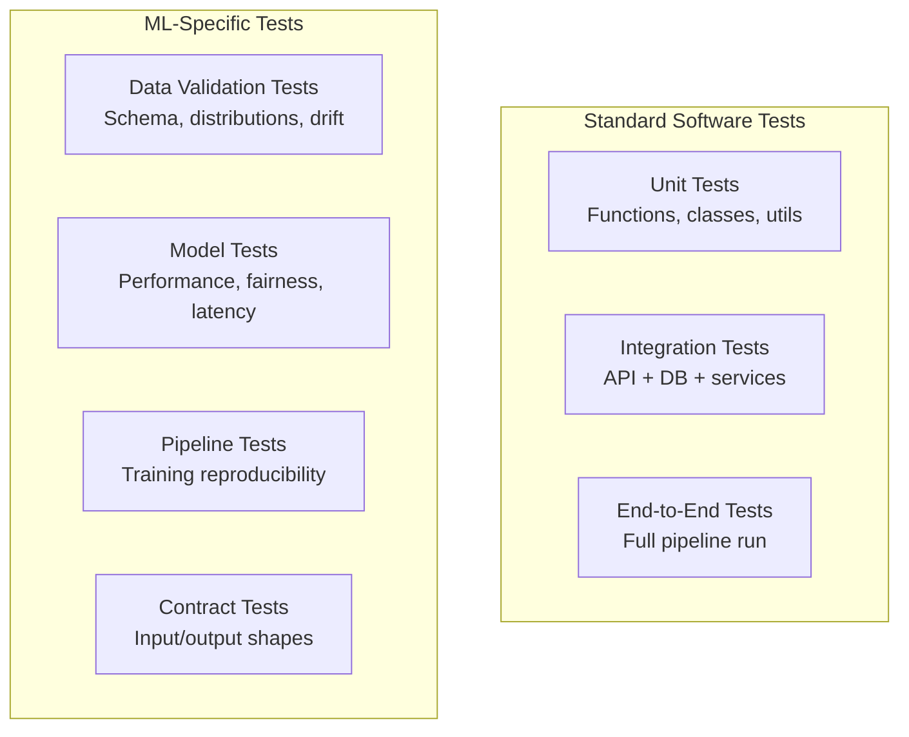

## 1. Data Validation Tests

Verify that input data meets expectations before it reaches the model.

```python
# tests/ml/test_data_validation.py
import pytest
import pandas as pd
import numpy as np

class TestDataValidation:
    
    def test_no_null_values_in_required_columns(self, training_data):
        required_cols = ["text", "label", "user_id"]
        for col in required_cols:
            assert training_data[col].isna().sum() == 0, f"Nulls found in {col}"
    
    def test_labels_are_valid(self, training_data):
        valid_labels = {"positive", "negative", "neutral"}
        actual_labels = set(training_data["label"].unique())
        assert actual_labels.issubset(valid_labels), f"Invalid labels: {actual_labels - valid_labels}"
    
    def test_text_length_within_bounds(self, training_data):
        lengths = training_data["text"].str.len()
        assert lengths.min() > 0, "Empty texts found"
        assert lengths.max() < 10000, "Suspiciously long texts found"
    
    def test_class_distribution_not_severely_imbalanced(self, training_data):
        distribution = training_data["label"].value_counts(normalize=True)
        # No class should be less than 10% of the data
        assert distribution.min() > 0.10, f"Severe imbalance: {distribution.to_dict()}"
    
    def test_no_data_leakage_between_splits(self, train_df, test_df):
        """Ensure no overlap between train and test sets."""
        train_ids = set(train_df["sample_id"])
        test_ids = set(test_df["sample_id"])
        overlap = train_ids & test_ids
        assert len(overlap) == 0, f"Data leakage: {len(overlap)} samples in both splits"
```

## 2. Model Performance Tests

Verify the model meets minimum quality thresholds.

```python
# tests/ml/test_model_performance.py
import pytest
from sklearn.metrics import accuracy_score, f1_score

class TestModelPerformance:
    
    def test_accuracy_above_threshold(self, trained_model, test_data):
        predictions = trained_model.predict(test_data["text"].tolist())
        accuracy = accuracy_score(test_data["label"], predictions)
        assert accuracy > 0.85, f"Accuracy {accuracy:.3f} below threshold 0.85"
    
    def test_f1_score_per_class(self, trained_model, test_data):
        predictions = trained_model.predict(test_data["text"].tolist())
        f1 = f1_score(test_data["label"], predictions, average=None)
        # Each class should have F1 > 0.7
        for i, score in enumerate(f1):
            assert score > 0.7, f"Class {i} F1 score {score:.3f} below 0.7"
    
    def test_model_not_worse_than_baseline(self, trained_model, baseline_model, test_data):
        """New model should not regress below baseline."""
        new_acc = accuracy_score(test_data["label"], trained_model.predict(test_data["text"]))
        base_acc = accuracy_score(test_data["label"], baseline_model.predict(test_data["text"]))
        assert new_acc >= base_acc - 0.02, f"Regression: new={new_acc:.3f}, baseline={base_acc:.3f}"
    
    def test_prediction_latency(self, trained_model):
        """Single prediction should be fast enough for real-time serving."""
        import time
        start = time.perf_counter()
        for _ in range(100):
            trained_model.predict("test input text")
        elapsed = (time.perf_counter() - start) / 100
        assert elapsed < 0.05, f"Avg latency {elapsed:.3f}s exceeds 50ms threshold"
```

## 3. Model Contract Tests (Input/Output shape)

```python
# tests/ml/test_model_contract.py
class TestModelContract:
    
    def test_predict_returns_expected_keys(self, trained_model):
        result = trained_model.predict("some text")
        assert "sentiment" in result
        assert "confidence" in result
    
    def test_confidence_between_0_and_1(self, trained_model):
        result = trained_model.predict("any text here")
        assert 0.0 <= result["confidence"] <= 1.0
    
    def test_sentiment_is_valid_label(self, trained_model):
        result = trained_model.predict("test")
        assert result["sentiment"] in ["positive", "negative", "neutral"]
    
    def test_handles_empty_string(self, trained_model):
        """Model should not crash on edge cases."""
        result = trained_model.predict("")
        assert result["sentiment"] in ["positive", "negative", "neutral"]
    
    def test_handles_very_long_input(self, trained_model):
        result = trained_model.predict("word " * 10000)
        assert result["confidence"] >= 0.0
    
    def test_batch_predict_shape(self, trained_model):
        inputs = ["text1", "text2", "text3"]
        results = trained_model.predict_batch(inputs)
        assert len(results) == 3
```

## 4. Pipeline Reproducibility Tests

```python
# tests/ml/test_pipeline.py
class TestTrainingPipeline:
    
    def test_training_is_deterministic(self, training_data):
        """Same data + same seed = same model."""
        model_1 = train_model(training_data, seed=42)
        model_2 = train_model(training_data, seed=42)
        
        test_input = "test sentence"
        assert model_1.predict(test_input) == model_2.predict(test_input)
    
    def test_pipeline_produces_valid_artifact(self, training_data, tmp_path):
        """Training pipeline saves a loadable model."""
        output_path = tmp_path / "model.pkl"
        train_and_save(training_data, output_path)
        
        # Model file exists and is loadable
        assert output_path.exists()
        loaded = SentimentModel(str(output_path))
        result = loaded.predict("test")
        assert "sentiment" in result
```

## 5. Fairness / Bias Tests

```python
# tests/ml/test_fairness.py
class TestModelFairness:
    
    def test_performance_across_demographics(self, trained_model, test_data):
        """Model should perform similarly across demographic groups."""
        for group in test_data["demographic"].unique():
            subset = test_data[test_data["demographic"] == group]
            acc = accuracy_score(subset["label"], trained_model.predict(subset["text"]))
            assert acc > 0.80, f"Low accuracy ({acc:.3f}) for group: {group}"
    
    def test_no_sentiment_bias_on_names(self, trained_model):
        """Changing a name shouldn't flip sentiment."""
        templates = [
            "{name} did a great job on the project",
            "The work by {name} was excellent",
        ]
        names = ["John", "Maria", "Ahmed", "Wei", "Olga"]
        
        for template in templates:
            sentiments = [trained_model.predict(template.format(name=n))["sentiment"] for n in names]
            # All should be the same sentiment
            assert len(set(sentiments)) == 1, f"Bias detected: {dict(zip(names, sentiments))}"
```

## Summary: Test types for ML projects

| Test Type | What it catches | When to run |
|-----------|----------------|-------------|
| Data validation | Bad data, schema drift, leakage | Before training, on new data |
| Model performance | Accuracy regression, slow inference | After training, before deploy |
| Contract tests | Wrong output format, crashes on edge cases | CI on every commit |
| Pipeline tests | Non-reproducible training, broken saves | After pipeline changes |
| Fairness tests | Bias, demographic performance gaps | Before deploy, periodically |
| Unit tests | Logic bugs in preprocessing, utils | CI on every commit |
| Integration tests | DB issues, API contract mismatches | CI on every commit |

---

# Mocking, Fixtures, Monkeypatch, and Patching in pytest

## The Big Picture

These are all tools for **controlling test dependencies**. Each solves a slightly different problem:

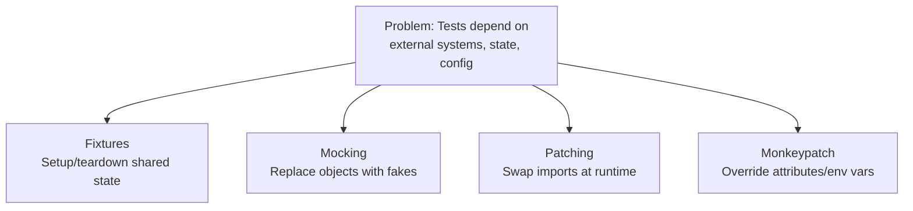

| Tool | What it does | Problem it solves |
|------|-------------|-------------------|
| **Fixture** | Provides reusable setup/teardown | "I need the same test setup in 50 tests" |
| **Mock** | Creates a fake object that records calls | "I need to replace a dependency and verify it was used correctly" |
| **Patch** | Temporarily swaps an import/attribute | "I need to replace something deep in the import chain" |
| **Monkeypatch** | Sets attributes/env vars, auto-reverts | "I need to change config or env for one test" |

## Fixtures — Detailed

### What problem they solve

Without fixtures, you repeat setup code everywhere and risk forgetting cleanup:

```python
# Problem: setup/teardown repeated, easy to forget cleanup
def test_a():
    server = start_server()       # setup
    try:
        result = call_api(server)
        assert result == "ok"
    finally:
        server.shutdown()         # teardown (easy to forget!)

def test_b():
    server = start_server()       # same setup again!
    try:
        result = call_api(server)
        assert result == "ok"
    finally:
        server.shutdown()         # same teardown again!
```

### How fixtures solve it

```python
@pytest.fixture
def server():
    s = start_server()    # setup
    yield s               # provide to test
    s.shutdown()          # teardown (guaranteed to run)

def test_a(server):       # pytest injects automatically
    assert call_api(server) == "ok"

def test_b(server):       # fresh server for each test
    assert call_api(server) == "ok"
```

### Fixture dependency injection (fixtures using other fixtures)

```python
@pytest.fixture
def db_connection():
    conn = create_connection()
    yield conn
    conn.close()

@pytest.fixture
def user_repo(db_connection):  # depends on db_connection fixture
    return UserRepository(db_connection)

@pytest.fixture
def populated_repo(user_repo):  # depends on user_repo fixture
    user_repo.create(User(name="Alice"))
    user_repo.create(User(name="Bob"))
    return user_repo

def test_find_user(populated_repo):  # gets fully set up repo
    user = populated_repo.find_by_name("Alice")
    assert user.name == "Alice"
```

### When to use fixtures

- Database connections (setup + teardown)
- Test data that multiple tests share
- Expensive objects (ML models — load once with `scope="session"`)
- HTTP clients, temporary files, mock servers

## Mocking — Detailed

### What problem it solves

Your code depends on something you can't/shouldn't use in tests:

```python
class PaymentService:
    def charge(self, user_id, amount):
        # You do NOT want this running in tests!
        response = stripe.Charge.create(amount=amount, customer=user_id)
        return response.id
```

### How mocking solves it

```python
from unittest.mock import MagicMock

def test_charge_returns_id():
    # Create a fake Stripe that you control
    mock_stripe = MagicMock()
    mock_stripe.Charge.create.return_value.id = "ch_fake123"
    
    service = PaymentService(stripe_client=mock_stripe)
    result = service.charge("user_1", 5000)
    
    # Verify behavior
    assert result == "ch_fake123"
    mock_stripe.Charge.create.assert_called_once_with(amount=5000, customer="user_1")
```

### Mock capabilities

```python
from unittest.mock import MagicMock, AsyncMock, call

# Return different values on successive calls
mock = MagicMock()
mock.side_effect = [1, 2, 3]
assert mock() == 1
assert mock() == 2
assert mock() == 3

# Raise an exception
mock.side_effect = ValueError("something broke")
with pytest.raises(ValueError):
    mock()

# Track all calls
mock = MagicMock()
mock(1, key="a")
mock(2, key="b")
assert mock.call_args_list == [call(1, key="a"), call(2, key="b")]

# AsyncMock for async functions
async_mock = AsyncMock(return_value={"status": "ok"})
result = await async_mock()
assert result == {"status": "ok"}
```

### When to use mocking

- External APIs (Stripe, AWS, third-party services)
- Databases (when you want fast, isolated unit tests)
- File system operations
- Time-dependent code (`datetime.now()`)
- Anything slow, expensive, or non-deterministic

## Patching — Detailed

### What problem it solves

Your code imports a dependency directly — you can't inject a mock through the constructor:

```python
# app/service.py
import requests  # <-- imported directly, not injected

class WeatherService:
    def get_temperature(self, city):
        response = requests.get(f"https://api.weather.com/{city}")
        return response.json()["temp"]
```

You can't pass a mock `requests` to `WeatherService` — it's imported at module level.

### How patching solves it

```python
from unittest.mock import patch

# patch replaces the import WHERE IT'S USED (not where it's defined)
@patch("app.service.requests.get")  # patch requests.get inside app.service
def test_get_temperature(mock_get):
    mock_get.return_value.json.return_value = {"temp": 22.5}
    
    service = WeatherService()
    temp = service.get_temperature("London")
    
    assert temp == 22.5
    mock_get.assert_called_once_with("https://api.weather.com/London")
```

### Critical rule: patch WHERE IT'S LOOKED UP

```python
# WRONG: patching where requests is defined
@patch("requests.get")  # ❌ This patches the requests module globally

# RIGHT: patching where requests is used
@patch("app.service.requests.get")  # ✅ This patches it in your module's namespace
```

### Patch as context manager

```python
def test_with_context_manager():
    with patch("app.service.requests.get") as mock_get:
        mock_get.return_value.status_code = 500
        
        service = WeatherService()
        with pytest.raises(ServiceError):
            service.get_temperature("London")
    
    # After the `with` block, requests.get is restored to normal
```

### Patch multiple things

```python
@patch("app.service.requests.get")
@patch("app.service.cache.get")
@patch("app.service.logger.info")
def test_with_multiple_patches(mock_logger, mock_cache, mock_requests):
    # Note: decorators apply bottom-up, so arguments are reversed!
    mock_cache.return_value = None  # cache miss
    mock_requests.return_value.json.return_value = {"temp": 20}
    
    service = WeatherService()
    service.get_temperature("Paris")
    
    mock_logger.assert_called()  # verify logging happened
```

## Monkeypatch — Detailed

### What problem it solves

You need to temporarily change environment variables, module attributes, or dictionary values for a single test — and have them automatically revert.

### How it differs from patch

```python
# patch: replaces an import with a Mock object (has .assert_called, .return_value, etc.)
@patch("app.config.API_KEY", "fake-key")

# monkeypatch: sets any attribute to any value (simpler, no Mock features)
def test_something(monkeypatch):
    monkeypatch.setattr("app.config.API_KEY", "fake-key")
```

### All monkeypatch operations

```python
def test_all_monkeypatch_ops(monkeypatch):
    # Set an attribute on a module/object
    monkeypatch.setattr("app.config.DEBUG", True)
    
    # Set an environment variable
    monkeypatch.setenv("API_KEY", "test-key-123")
    
    # Delete an environment variable
    monkeypatch.delenv("PRODUCTION_SECRET", raising=False)
    
    # Modify sys.path
    monkeypatch.syspath_prepend("/custom/path")
    
    # Change working directory
    monkeypatch.chdir("/tmp")
    
    # Replace a dictionary item
    monkeypatch.setitem(app.config.SETTINGS, "timeout", 5)
    
    # Delete a dictionary item
    monkeypatch.delitem(app.config.SETTINGS, "unused_key", raising=False)
    
    # ALL changes revert automatically after this test
```

### Real-world monkeypatch scenario

```python
# app/config.py
import os

def get_model_config():
    return {
        "model_path": os.environ.get("MODEL_PATH", "models/default.pkl"),
        "batch_size": int(os.environ.get("BATCH_SIZE", "32")),
        "device": os.environ.get("DEVICE", "cpu"),
    }

# tests/test_config.py
def test_config_from_env(monkeypatch):
    monkeypatch.setenv("MODEL_PATH", "/custom/model.pkl")
    monkeypatch.setenv("BATCH_SIZE", "64")
    monkeypatch.setenv("DEVICE", "cuda")
    
    config = get_model_config()
    
    assert config["model_path"] == "/custom/model.pkl"
    assert config["batch_size"] == 64
    assert config["device"] == "cuda"

def test_config_defaults(monkeypatch):
    monkeypatch.delenv("MODEL_PATH", raising=False)
    monkeypatch.delenv("BATCH_SIZE", raising=False)
    
    config = get_model_config()
    
    assert config["model_path"] == "models/default.pkl"
    assert config["batch_size"] == 32
```

## Decision guide: Which tool to use when?

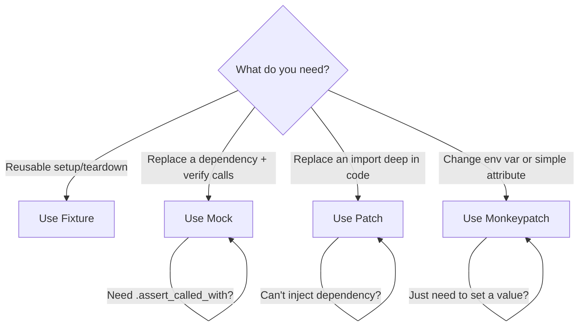

| Scenario | Best tool |
|----------|-----------|
| "I need a test database connection" | Fixture |
| "I need to verify my code called Stripe correctly" | Mock |
| "My code imports `requests` directly, I can't inject it" | Patch |
| "I need to test with `DEBUG=True`" | Monkeypatch |
| "I need a fake Redis that records calls" | Mock (as fixture) |
| "I need to test behavior when env var is missing" | Monkeypatch |

---

# Regression testing strategy and thinking

## What is regression testing?

Regression testing ensures that **changes to code don't break existing functionality**. "Regression" means something that used to work now doesn't.

## The thinking process

### Step 1: Identify what COULD break

Every code change has a blast radius. Ask yourself:

```
"If I change X, what else depends on X?"
```

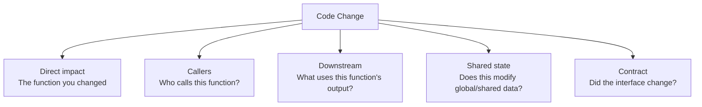

### Step 2: Categorize the risk

| Change type | Risk level | Regression test strategy |
|-------------|-----------|------------------------|
| Bug fix in one function | Low | Test the fix + test callers |
| Refactor (same behavior, new structure) | Medium | Run ALL existing tests (they should pass unchanged) |
| New feature | Medium | New tests + run existing tests |
| Interface change (API contract) | High | Test all consumers of that interface |
| Dependency upgrade | High | Run full test suite + integration tests |
| Database schema change | Very high | Test all queries + data migrations |

### Step 3: Write tests that PREVENT the regression from recurring

```python
# Bug report: "Predictions fail when text contains emoji"
# Fix: update preprocessing to handle unicode

# Regression test: ensures this specific bug never comes back
def test_prediction_handles_emoji():
    """Regression: GitHub issue #142 — emoji in text caused crash."""
    model = SentimentModel("model.pkl")
    # This used to crash — now it should work
    result = model.predict("Great product! 🎉👍")
    assert result["sentiment"] in ["positive", "negative", "neutral"]

def test_prediction_handles_unicode():
    """Regression: related to #142 — various unicode characters."""
    model = SentimentModel("model.pkl")
    test_cases = [
        "Ñoño está feliz",      # Spanish with ñ
        "日本語テスト",           # Japanese
        "emoji 🔥🚀💯",         # Multiple emoji
        "",                      # Empty string
    ]
    for text in test_cases:
        result = model.predict(text)  # Should not crash
        assert "sentiment" in result
```

## Regression testing strategy for ML APIs

### Layer 1: Contract regression tests

"Does the API still return the same shape?"

```python
class TestAPIContractRegression:
    """These tests should NEVER break unless we intentionally change the API."""
    
    @pytest.mark.asyncio
    async def test_predict_response_shape(self, client):
        response = await client.post("/predict", json={"text": "hello", "user_id": "u1"})
        data = response.json()
        
        # These fields must always exist
        assert "sentiment" in data
        assert "confidence" in data
        assert "request_id" in data
        
        # Types must be stable
        assert isinstance(data["sentiment"], str)
        assert isinstance(data["confidence"], float)
    
    @pytest.mark.asyncio
    async def test_error_response_shape(self, client):
        response = await client.post("/predict", json={})
        assert response.status_code == 422
        data = response.json()
        assert "detail" in data  # FastAPI validation error format
```

### Layer 2: Behavior regression tests

"Does the system still behave correctly for known inputs?"

```python
class TestBehaviorRegression:
    """Known input → known output. If these break, something fundamental changed."""
    
    @pytest.mark.parametrize("text,expected_sentiment", [
        ("I absolutely love this product", "positive"),
        ("This is the worst experience ever", "negative"),
        ("The package arrived on Tuesday", "neutral"),
    ])
    def test_known_predictions(self, trained_model, text, expected_sentiment):
        result = trained_model.predict(text)
        assert result["sentiment"] == expected_sentiment
    
    def test_confidence_ordering(self, trained_model):
        """Strong sentiment should have higher confidence than ambiguous text."""
        strong = trained_model.predict("AMAZING! BEST EVER! LOVE IT!")
        weak = trained_model.predict("It was okay I guess")
        assert strong["confidence"] > weak["confidence"]
```

### Layer 3: Performance regression tests

"Is the system still fast enough?"

```python
class TestPerformanceRegression:
    
    def test_single_prediction_latency(self, trained_model):
        import time
        start = time.perf_counter()
        trained_model.predict("test input")
        elapsed = time.perf_counter() - start
        assert elapsed < 0.1, f"Latency regression: {elapsed:.3f}s > 100ms"
    
    def test_batch_throughput(self, trained_model):
        import time
        texts = ["sample text"] * 100
        start = time.perf_counter()
        for t in texts:
            trained_model.predict(t)
        elapsed = time.perf_counter() - start
        assert elapsed < 5.0, f"Throughput regression: 100 predictions took {elapsed:.1f}s"
```

## The regression testing mindset

```
1. Every bug fix gets a test that reproduces the bug FIRST, then verifies the fix
2. Every refactor should pass ALL existing tests without modification
3. If existing tests need changing during a refactor, that's a red flag — you might be changing behavior
4. Run the full test suite before merging ANY change
5. Tag regression tests clearly so you know WHY they exist
```

---

# Boundary between unit and integration testing

## The simple rule

**Unit test**: Tests ONE unit of code with ALL dependencies replaced by fakes.
**Integration test**: Tests MULTIPLE units working together with SOME real dependencies.

## The boundary visualized

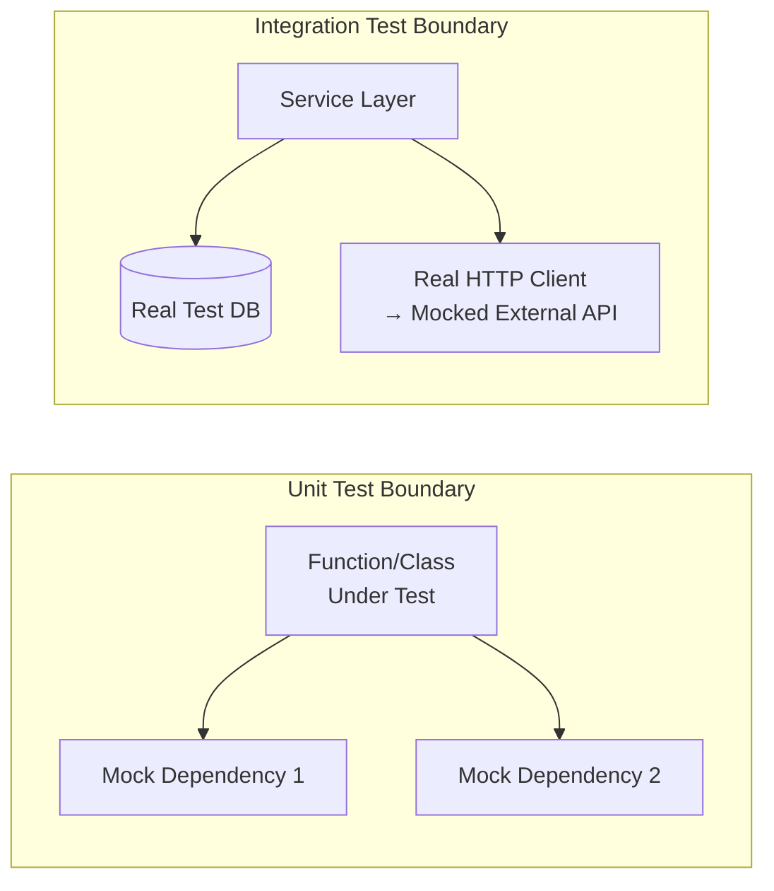

## Example scenarios

### Scenario 1: User registration

```python
# The code
class UserService:
    def __init__(self, db: Database, email_client: EmailClient):
        self.db = db
        self.email_client = email_client
    
    async def register(self, email: str, password: str) -> User:
        if await self.db.user_exists(email):
            raise UserExistsError(f"{email} already registered")
        
        hashed = hash_password(password)
        user = await self.db.create_user(email=email, password_hash=hashed)
        await self.email_client.send_welcome(email)
        return user
```

```python
# UNIT TEST: test the logic, mock everything
class TestUserServiceUnit:
    @pytest.mark.asyncio
    async def test_register_new_user(self):
        mock_db = AsyncMock()
        mock_db.user_exists.return_value = False
        mock_db.create_user.return_value = User(id="1", email="a@b.com")
        mock_email = AsyncMock()
        
        service = UserService(db=mock_db, email_client=mock_email)
        user = await service.register("a@b.com", "pass123")
        
        assert user.email == "a@b.com"
        mock_email.send_welcome.assert_called_once_with("a@b.com")
    
    @pytest.mark.asyncio
    async def test_register_existing_user_raises(self):
        mock_db = AsyncMock()
        mock_db.user_exists.return_value = True  # user already exists
        
        service = UserService(db=mock_db, email_client=AsyncMock())
        
        with pytest.raises(UserExistsError):
            await service.register("existing@b.com", "pass")
```

```python
# INTEGRATION TEST: real database, mock only external services
class TestUserServiceIntegration:
    @pytest.mark.asyncio
    async def test_register_persists_to_database(self, test_db):
        mock_email = AsyncMock()  # still mock email (external service)
        
        service = UserService(db=test_db, email_client=mock_email)
        user = await service.register("new@test.com", "securepass")
        
        # Verify it's actually in the database
        row = await test_db.fetch_user("new@test.com")
        assert row is not None
        assert row["email"] == "new@test.com"
        assert row["password_hash"] != "securepass"  # was hashed
    
    @pytest.mark.asyncio
    async def test_register_duplicate_email_fails(self, test_db):
        mock_email = AsyncMock()
        service = UserService(db=test_db, email_client=mock_email)
        
        await service.register("dup@test.com", "pass1")
        
        with pytest.raises(UserExistsError):
            await service.register("dup@test.com", "pass2")
```

### Scenario 2: ML prediction pipeline

```python
# UNIT TEST boundary: test preprocessing alone
def test_tokenizer_handles_special_chars():
    tokenizer = Tokenizer()
    tokens = tokenizer.tokenize("Hello, world! @user #hashtag")
    assert "hello" in tokens
    assert "@user" not in tokens  # should be removed

# UNIT TEST boundary: test postprocessing alone
def test_label_mapper():
    mapper = LabelMapper(labels=["negative", "neutral", "positive"])
    assert mapper.map(0) == "negative"
    assert mapper.map(2) == "positive"

# INTEGRATION TEST boundary: tokenizer + model + postprocessor together
def test_full_inference_pipeline(real_model):
    pipeline = InferencePipeline(
        tokenizer=Tokenizer(),
        model=real_model,  # real model loaded
        mapper=LabelMapper(labels=["negative", "neutral", "positive"])
    )
    result = pipeline.run("I love this")
    assert result["sentiment"] == "positive"
    assert 0 <= result["confidence"] <= 1
```

## Decision framework

```
Ask: "What am I testing?"

If the answer is: "Does my LOGIC work correctly?"
→ Unit test. Mock everything external.

If the answer is: "Do these components CONNECT correctly?"
→ Integration test. Use real components at the boundary you're testing.

If the answer is: "Does the WHOLE SYSTEM work end-to-end?"
→ E2E test. Real everything (or as close as possible).
```

| What you're verifying | Test type | What's real | What's mocked |
|----------------------|-----------|-------------|---------------|
| "Does my function handle edge cases?" | Unit | Just the function | Everything else |
| "Does my SQL query return correct data?" | Integration | Function + real DB | External APIs |
| "Does my API return correct HTTP responses?" | Integration | HTTP layer + service | DB, external APIs |
| "Can a user sign up and make a prediction?" | E2E | Everything | Nothing (or just payment) |

---

# Testing async code with asyncio

## The challenge

Async code doesn't execute sequentially. When you `await` something, control returns to the event loop which might run other tasks. This creates challenges:

1. **You can't just call an async function** — you need an event loop to run it
2. **Execution order is non-deterministic** — tasks may complete in any order
3. **Concurrency bugs** — race conditions, deadlocks only appear under concurrent execution
4. **Mocking async dependencies** — regular `MagicMock` doesn't work for `await`

## Setting up pytest for async

```bash
pip install pytest-asyncio
```

```ini
# pytest.ini or pyproject.toml
[tool.pytest.ini_options]
asyncio_mode = "auto"  # all async tests run automatically without @pytest.mark.asyncio
```

## Basic async test patterns

### Pattern 1: Testing a simple async function

```python
# app/service.py
async def fetch_user(db, user_id: str):
    row = await db.fetchrow("SELECT * FROM users WHERE id = $1", user_id)
    if not row:
        raise UserNotFoundError(user_id)
    return User(**row)

# tests/test_service.py
import pytest
from unittest.mock import AsyncMock

@pytest.mark.asyncio
async def test_fetch_user_returns_user():
    mock_db = AsyncMock()
    mock_db.fetchrow.return_value = {"id": "u1", "name": "Alice", "email": "a@b.com"}
    
    user = await fetch_user(mock_db, "u1")
    
    assert user.name == "Alice"
    mock_db.fetchrow.assert_awaited_once_with("SELECT * FROM users WHERE id = $1", "u1")

@pytest.mark.asyncio
async def test_fetch_user_not_found():
    mock_db = AsyncMock()
    mock_db.fetchrow.return_value = None
    
    with pytest.raises(UserNotFoundError):
        await fetch_user(mock_db, "nonexistent")
```

### Pattern 2: Testing concurrent tasks

```python
# app/aggregator.py
import asyncio

async def fetch_all_features(user_id: str, feature_store, cache):
    """Fetch features from multiple sources concurrently."""
    demographics, purchases, browsing = await asyncio.gather(
        feature_store.get_demographics(user_id),
        feature_store.get_purchases(user_id),
        cache.get_browsing_history(user_id),
    )
    return {**demographics, **purchases, **browsing}

# tests/test_aggregator.py
@pytest.mark.asyncio
async def test_fetch_all_features_concurrent():
    mock_store = AsyncMock()
    mock_store.get_demographics.return_value = {"age": 30}
    mock_store.get_purchases.return_value = {"total_spent": 500}
    
    mock_cache = AsyncMock()
    mock_cache.get_browsing_history.return_value = {"pages_viewed": 42}
    
    result = await fetch_all_features("user1", mock_store, mock_cache)
    
    assert result == {"age": 30, "total_spent": 500, "pages_viewed": 42}
    # All three were called (concurrently via gather)
    mock_store.get_demographics.assert_awaited_once()
    mock_store.get_purchases.assert_awaited_once()
    mock_cache.get_browsing_history.assert_awaited_once()
```

### Pattern 3: Testing that partial failures are handled

```python
# app/aggregator.py
async def fetch_features_with_fallback(user_id, feature_store, cache):
    """If one source fails, use defaults for that source."""
    tasks = {
        "demographics": feature_store.get_demographics(user_id),
        "purchases": feature_store.get_purchases(user_id),
        "browsing": cache.get_browsing_history(user_id),
    }
    
    results = await asyncio.gather(*tasks.values(), return_exceptions=True)
    
    final = {}
    defaults = {"demographics": {}, "purchases": {}, "browsing": {}}
    
    for key, result in zip(tasks.keys(), results):
        if isinstance(result, Exception):
            final.update(defaults[key])  # use default on failure
        else:
            final.update(result)
    
    return final

# tests/test_aggregator.py
@pytest.mark.asyncio
async def test_partial_failure_uses_defaults():
    mock_store = AsyncMock()
    mock_store.get_demographics.return_value = {"age": 25}
    mock_store.get_purchases.side_effect = TimeoutError("DB timeout")  # This fails!
    
    mock_cache = AsyncMock()
    mock_cache.get_browsing_history.return_value = {"pages": 10}
    
    result = await fetch_features_with_fallback("user1", mock_store, mock_cache)
    
    # Demographics and browsing succeeded, purchases fell back to default
    assert result == {"age": 25, "pages": 10}  # no purchase data, but no crash
```

### Pattern 4: Testing timeouts

```python
# app/service.py
async def predict_with_timeout(model, text, timeout_seconds=5.0):
    try:
        result = await asyncio.wait_for(
            model.predict_async(text),
            timeout=timeout_seconds
        )
        return result
    except asyncio.TimeoutError:
        return {"sentiment": "unknown", "confidence": 0.0, "timed_out": True}

# tests/test_service.py
@pytest.mark.asyncio
async def test_prediction_timeout_returns_default():
    mock_model = AsyncMock()
    # Simulate a slow model that takes forever
    mock_model.predict_async.side_effect = asyncio.TimeoutError()
    
    result = await predict_with_timeout(mock_model, "test", timeout_seconds=1.0)
    
    assert result["timed_out"] is True
    assert result["sentiment"] == "unknown"

@pytest.mark.asyncio
async def test_prediction_completes_within_timeout():
    mock_model = AsyncMock()
    mock_model.predict_async.return_value = {"sentiment": "positive", "confidence": 0.9}
    
    result = await predict_with_timeout(mock_model, "great!", timeout_seconds=5.0)
    
    assert result["sentiment"] == "positive"
    assert "timed_out" not in result
```

### Pattern 5: Testing race conditions

```python
# app/counter.py
class AsyncCounter:
    """A counter that's NOT thread-safe — has a race condition."""
    def __init__(self):
        self.value = 0
    
    async def increment(self):
        current = self.value
        await asyncio.sleep(0)  # yields control — another task can run here!
        self.value = current + 1

# tests/test_counter.py
@pytest.mark.asyncio
async def test_counter_race_condition():
    """Demonstrates that concurrent increments can lose updates."""
    counter = AsyncCounter()
    
    # Run 100 increments concurrently
    await asyncio.gather(*[counter.increment() for _ in range(100)])
    
    # Without proper locking, this will likely be LESS than 100
    # because of the race condition between read and write
    # This test DOCUMENTS the bug:
    assert counter.value < 100  # proves the race condition exists

@pytest.mark.asyncio
async def test_safe_counter_no_race_condition():
    """Fixed version with asyncio.Lock."""
    counter = SafeAsyncCounter()  # uses asyncio.Lock internally
    
    await asyncio.gather(*[counter.increment() for _ in range(100)])
    
    assert counter.value == 100  # lock prevents lost updates
```

### Pattern 6: Testing async generators / streaming

```python
# app/stream.py
async def stream_predictions(model, texts):
    """Yield predictions one at a time (streaming response)."""
    for text in texts:
        result = await model.predict_async(text)
        yield result

# tests/test_stream.py
@pytest.mark.asyncio
async def test_stream_predictions():
    mock_model = AsyncMock()
    mock_model.predict_async.side_effect = [
        {"sentiment": "positive"},
        {"sentiment": "negative"},
        {"sentiment": "neutral"},
    ]
    
    results = []
    async for prediction in stream_predictions(mock_model, ["a", "b", "c"]):
        results.append(prediction)
    
    assert len(results) == 3
    assert results[0]["sentiment"] == "positive"
    assert results[2]["sentiment"] == "neutral"
```

## Async testing fixtures

```python
# tests/conftest.py
import pytest
import asyncio

@pytest.fixture(scope="session")
def event_loop():
    """Override default event loop to be session-scoped."""
    loop = asyncio.new_event_loop()
    yield loop
    loop.close()

@pytest.fixture
async def async_db():
    """Async fixture — pytest-asyncio handles the await."""
    import asyncpg
    conn = await asyncpg.connect("postgresql://localhost/test_db")
    yield conn
    await conn.close()

@pytest.fixture
async def seeded_db(async_db):
    """Depends on another async fixture."""
    await async_db.execute("INSERT INTO users (id, name) VALUES ('u1', 'Alice')")
    yield async_db
    await async_db.execute("DELETE FROM users")
```

## The thinking process for async testing

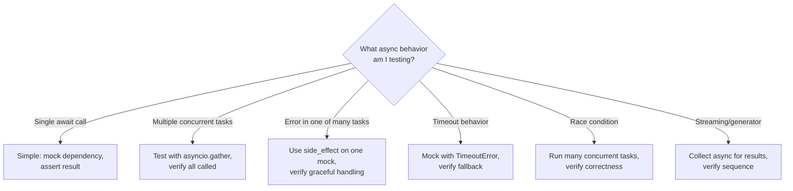

## Key rules for async testing

1. **Use `AsyncMock` not `MagicMock`** for anything you `await`
2. **Use `pytest-asyncio`** — don't manually create event loops
3. **Test both success and failure paths** — async failures can be silent (swallowed by gather)
4. **Test timeout behavior explicitly** — async code should always have timeouts
5. **Test cancellation** — what happens when a task is cancelled mid-execution?
6. **Don't use `time.sleep()` in async tests** — use `asyncio.sleep()` or mock time

---

## Curiosity Questions

1. **How do you test background tasks (e.g., Celery, FastAPI BackgroundTasks)?** — When work happens after the response is sent, how do you verify it completed correctly?

2. **What is property-based testing (Hypothesis)?** — Instead of writing specific test cases, how can you generate thousands of random inputs to find edge cases automatically?

3. **How do you test database migrations?** — When you change a schema, how do you verify the migration works correctly on existing data?

4. **What is mutation testing?** — How do you verify that your tests actually catch bugs, not just achieve code coverage?

5. **How do you structure tests for a CI/CD pipeline?** — Which tests run on every commit vs. nightly vs. before deploy?

---

# How do you test background tasks (Celery, FastAPI BackgroundTasks)?

## The Challenge

Background tasks run **after** the HTTP response is sent. The client gets a 200 OK, but the work (sending emails, updating caches, logging) happens asynchronously. You can't just check the response — you need to verify the side effects.

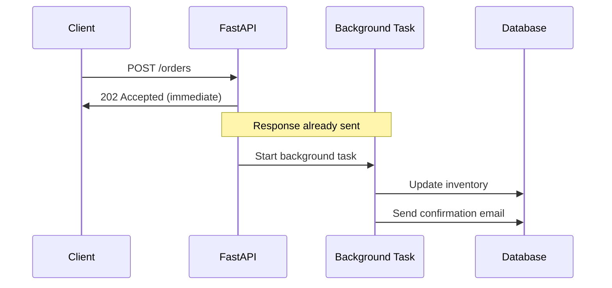

## Testing FastAPI BackgroundTasks

```python
# app/routes.py
from fastapi import BackgroundTasks

async def send_notification(user_id: str, message: str, db):
    await db.execute(
        "INSERT INTO notifications (user_id, message) VALUES ($1, $2)",
        user_id, message
    )

@app.post("/orders", status_code=202)
async def create_order(order: OrderRequest, background_tasks: BackgroundTasks):
    order_id = await save_order(order)
    background_tasks.add_task(send_notification, order.user_id, f"Order {order_id} confirmed", db)
    return {"order_id": order_id}
```

### Strategy 1: Test the background function directly (unit test)

```python
# tests/unit/test_notifications.py
@pytest.mark.asyncio
async def test_send_notification_inserts_to_db():
    mock_db = AsyncMock()
    
    await send_notification("user-1", "Order confirmed", mock_db)
    
    mock_db.execute.assert_awaited_once_with(
        "INSERT INTO notifications (user_id, message) VALUES ($1, $2)",
        "user-1", "Order confirmed"
    )
```

### Strategy 2: Test that the task was scheduled (transport test)

```python
# tests/unit/test_routes.py
from unittest.mock import patch, MagicMock

@pytest.mark.asyncio
async def test_create_order_schedules_notification():
    mock_bg = MagicMock()  # BackgroundTasks is sync, not async
    
    with patch("app.routes.BackgroundTasks", return_value=mock_bg):
        async with AsyncClient(transport=ASGITransport(app=app), base_url="http://test") as client:
            response = await client.post("/orders", json={"user_id": "u1", "item": "widget"})
    
    assert response.status_code == 202
    # In FastAPI test client, background tasks run synchronously during testing!
    # So you can check side effects directly.
```

### Strategy 3: FastAPI test client runs background tasks synchronously

This is the key insight — **FastAPI's TestClient/AsyncClient actually executes background tasks before returning**, so you can verify side effects:

```python
@pytest.mark.asyncio
async def test_background_task_actually_runs(clean_db):
    """FastAPI test client waits for background tasks to complete."""
    app.dependency_overrides[get_db] = lambda: clean_db
    
    async with AsyncClient(transport=ASGITransport(app=app), base_url="http://test") as client:
        response = await client.post("/orders", json={"user_id": "u1", "item": "widget"})
    
    # Background task has already run by this point in tests!
    row = await clean_db.fetchrow("SELECT * FROM notifications WHERE user_id = 'u1'")
    assert row is not None
    assert "confirmed" in row["message"]
```

## Testing Celery Tasks

Celery tasks run in a separate worker process. Testing strategy is different:

```python
# app/tasks.py
from celery import Celery

celery_app = Celery("tasks", broker="redis://localhost:6379")

@celery_app.task
def process_ml_batch(batch_id: str):
    batch = load_batch(batch_id)
    results = model.predict_batch(batch.texts)
    save_results(batch_id, results)
    return {"processed": len(results)}
```

### Strategy 1: Test task logic directly (bypass Celery)

```python
# tests/unit/test_tasks.py
from unittest.mock import patch

@patch("app.tasks.save_results")
@patch("app.tasks.model")
@patch("app.tasks.load_batch")
def test_process_ml_batch(mock_load, mock_model, mock_save):
    mock_load.return_value.texts = ["hello", "world"]
    mock_model.predict_batch.return_value = [{"sentiment": "positive"}] * 2
    
    result = process_ml_batch("batch-001")
    
    assert result == {"processed": 2}
    mock_save.assert_called_once_with("batch-001", [{"sentiment": "positive"}] * 2)
```

### Strategy 2: Use Celery's `task_always_eager` for integration tests

```python
# tests/conftest.py
@pytest.fixture
def celery_config():
    """Run tasks synchronously in tests (no worker needed)."""
    return {
        "task_always_eager": True,      # execute immediately, no broker
        "task_eager_propagates": True,   # raise exceptions instead of swallowing
    }

# tests/integration/test_tasks.py
def test_process_batch_end_to_end(celery_config, seeded_db):
    result = process_ml_batch.delay("batch-001")  # runs immediately due to eager mode
    assert result.get() == {"processed": 5}
    
    # Verify side effects in DB
    rows = seeded_db.query("SELECT * FROM results WHERE batch_id = 'batch-001'")
    assert len(rows) == 5
```

---

# What is property-based testing (Hypothesis)?

## What

Instead of writing specific test cases with specific inputs, you **describe the properties** your code should satisfy, and the testing framework **generates thousands of random inputs** to try to break those properties.

## The problem with example-based testing

```python
# Traditional: you pick specific examples
def test_sort():
    assert sort([3, 1, 2]) == [1, 2, 3]
    assert sort([]) == []
    assert sort([1]) == [1]
    # But what about [None, 1]? [-1, -2]? [float('inf')]? [1]*10000?
    # You can't think of every edge case.
```

## How Hypothesis solves it

```python
from hypothesis import given
from hypothesis import strategies as st

@given(st.lists(st.integers()))
def test_sort_properties(input_list):
    result = sort(input_list)
    
    # Property 1: output has same length as input
    assert len(result) == len(input_list)
    
    # Property 2: output is sorted
    assert all(result[i] <= result[i+1] for i in range(len(result)-1))
    
    # Property 3: output contains same elements as input
    assert sorted(result) == sorted(input_list)
```

Hypothesis will generate hundreds of random lists — empty, huge, with negatives, duplicates, zeros — and verify all properties hold.

## Real-world ML API examples

### Testing input validation

```python
from hypothesis import given, settings
from hypothesis import strategies as st

@given(st.text(min_size=1, max_size=5000))
def test_prediction_never_crashes(text):
    """Model should handle ANY valid text without crashing."""
    model = SentimentModel("model.pkl")
    result = model.predict(text)
    
    # Properties that must ALWAYS hold:
    assert result["sentiment"] in ["positive", "negative", "neutral"]
    assert 0.0 <= result["confidence"] <= 1.0

@given(st.text(min_size=0, max_size=100, alphabet=st.characters(blacklist_categories=("Cs",))))
def test_preprocessing_is_idempotent(text):
    """Preprocessing twice should give same result as once."""
    preprocessor = TextPreprocessor()
    once = preprocessor.clean(text)
    twice = preprocessor.clean(once)
    assert once == twice
```

### Testing serialization roundtrips

```python
@given(st.builds(
    PredictionResponse,
    sentiment=st.sampled_from(["positive", "negative", "neutral"]),
    confidence=st.floats(min_value=0.0, max_value=1.0, allow_nan=False),
    request_id=st.uuids().map(str),
))
def test_response_serialization_roundtrip(response):
    """Serialize to JSON and back should give same object."""
    json_str = response.model_dump_json()
    restored = PredictionResponse.model_validate_json(json_str)
    assert restored == response
```

### Testing data transformations

```python
@given(st.dataframes(
    columns=[
        st.column("age", elements=st.integers(min_value=0, max_value=120)),
        st.column("income", elements=st.floats(min_value=0, max_value=1e7, allow_nan=False)),
    ],
    rows=st.integers(min_value=1, max_value=100)
))
def test_feature_engineering_no_nulls(df):
    """Feature engineering should never produce NaN values."""
    result = engineer_features(df)
    assert result.isna().sum().sum() == 0
```

## When Hypothesis finds a bug

Hypothesis **shrinks** the failing input to the smallest possible example:

```
# Hypothesis output:
Falsifying example: test_prediction_never_crashes(text='\x00')
# It found that a null byte crashes your model, and shrunk it to the minimal case
```

## When to use property-based testing

| Good fit | Bad fit |
|----------|---------|
| Pure functions (input → output) | Tests requiring complex setup |
| Data transformations | UI tests |
| Serialization/parsing | Tests with external dependencies |
| Validation logic | Tests where properties are hard to define |
| Anything with "for all inputs X, property Y holds" | One-off integration scenarios |

---

# How do you test database migrations?

## The Problem

You change your schema (add column, rename table, change type). You need to verify:
1. The migration SQL runs without errors
2. Existing data is preserved/transformed correctly
3. The application code works with the new schema
4. Rollback works if something goes wrong

## Strategy 1: Test migration applies cleanly

```python
# tests/migration/test_migrations.py
import pytest
from alembic import command
from alembic.config import Config

@pytest.fixture
def alembic_config():
    config = Config("alembic.ini")
    config.set_main_option("sqlalchemy.url", "postgresql://localhost/test_migrations")
    return config

def test_all_migrations_apply_cleanly(alembic_config):
    """Run all migrations from scratch — should not error."""
    command.upgrade(alembic_config, "head")

def test_all_migrations_rollback_cleanly(alembic_config):
    """Apply all, then rollback all — should not error."""
    command.upgrade(alembic_config, "head")
    command.downgrade(alembic_config, "base")
```

## Strategy 2: Test data transformation

```python
# tests/migration/test_migration_0042_split_name.py
"""
Migration 0042: Split 'full_name' column into 'first_name' and 'last_name'
"""

@pytest.fixture
async def db_at_revision_0041(test_db):
    """Apply migrations up to the one BEFORE our target."""
    await apply_migrations(test_db, target="0041")
    # Insert test data in the OLD schema
    await test_db.execute(
        "INSERT INTO users (id, full_name) VALUES ($1, $2)",
        "u1", "John Smith"
    )
    await test_db.execute(
        "INSERT INTO users (id, full_name) VALUES ($1, $2)",
        "u2", "Madonna"  # edge case: single name
    )
    return test_db

@pytest.mark.asyncio
async def test_migration_splits_names_correctly(db_at_revision_0041):
    """Apply migration 0042 and verify data was transformed."""
    await apply_migrations(db_at_revision_0041, target="0042")
    
    row1 = await db_at_revision_0041.fetchrow("SELECT * FROM users WHERE id = 'u1'")
    assert row1["first_name"] == "John"
    assert row1["last_name"] == "Smith"
    
    row2 = await db_at_revision_0041.fetchrow("SELECT * FROM users WHERE id = 'u2'")
    assert row2["first_name"] == "Madonna"
    assert row2["last_name"] == ""  # or None, depending on your migration logic

@pytest.mark.asyncio
async def test_migration_rollback_preserves_data(db_at_revision_0041):
    """Apply then rollback — original data should be intact."""
    await apply_migrations(db_at_revision_0041, target="0042")
    await apply_migrations(db_at_revision_0041, target="0041")  # rollback
    
    row = await db_at_revision_0041.fetchrow("SELECT * FROM users WHERE id = 'u1'")
    assert row["full_name"] == "John Smith"  # restored
```

## Strategy 3: Test app compatibility with new schema

```python
@pytest.mark.asyncio
async def test_app_works_after_migration(migrated_db):
    """Full integration: app code works with the new schema."""
    store = UserStore(db_connection=migrated_db)
    
    # Old data (migrated) is readable
    user = await store.get_user("u1")
    assert user.first_name == "John"
    
    # New data can be created
    await store.create_user(first_name="New", last_name="User")
    new_user = await store.find_by_name("New", "User")
    assert new_user is not None
```

## CI/CD integration

```yaml
# .gitlab-ci.yml
test_migrations:
  stage: test
  services:
    - postgres:15
  script:
    - alembic upgrade head          # apply all migrations
    - pytest tests/migration/       # run migration tests
    - alembic downgrade base        # verify rollback
    - alembic upgrade head          # verify re-apply
```

---

# What is mutation testing?

## The Problem it Solves

You have 95% code coverage. But does that mean your tests actually **catch bugs**? No. Coverage only tells you which lines were executed, not whether your assertions would detect a change.

```python
# Your code
def calculate_discount(price, is_member):
    if is_member:
        return price * 0.8  # 20% discount
    return price

# Your "test" — achieves 100% coverage but catches nothing
def test_discount():
    result = calculate_discount(100, True)
    assert result is not None  # useless assertion! Would pass even if logic is wrong
```

## What mutation testing does

It **deliberately introduces bugs** (mutations) into your code and checks if your tests **detect** them. If a mutation survives (tests still pass), your tests are weak.

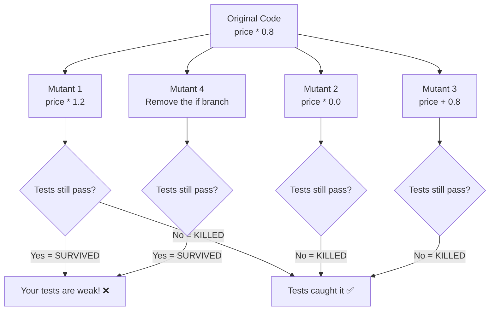

## Using mutmut (Python mutation testing tool)

```bash
pip install mutmut

# Run mutation testing
mutmut run --paths-to-mutate=app/ --tests-dir=tests/

# View results
mutmut results

# See a specific surviving mutant
mutmut show 42
```

## Example output

```
--- Mutation results ---
Total mutants: 87
Killed: 71 (tests caught the bug) ✅
Survived: 12 (tests missed the bug) ❌
Timeout: 4 (mutation caused infinite loop)

Mutation score: 81.6% (goal: >90%)

Surviving mutants:
  app/service.py line 42: changed `>=` to `>` — tests still pass!
  app/service.py line 58: changed `return result` to `return None` — tests still pass!
```

## What to do with surviving mutants

```python
# Surviving mutant: changed >= to >
# Original:
def is_eligible(age):
    return age >= 18

# Mutant (survived!):
def is_eligible(age):
    return age > 18  # tests didn't catch this!

# Fix: add a boundary test
def test_exactly_18_is_eligible():
    assert is_eligible(18) is True  # this kills the mutant
```

## Types of mutations

| Mutation type | Example | What it tests |
|--------------|---------|---------------|
| Arithmetic | `+` → `-`, `*` → `/` | Are you checking computed values? |
| Comparison | `>=` → `>`, `==` → `!=` | Are you testing boundaries? |
| Boolean | `and` → `or`, `True` → `False` | Are you testing conditions? |
| Return value | `return x` → `return None` | Are you checking return values? |
| Remove statement | Delete a line | Are you testing side effects? |
| Constant | `0.8` → `0.9` | Are you testing exact values? |

## When to use mutation testing

- After achieving high code coverage — to verify test quality
- On critical business logic (pricing, eligibility, scoring)
- Before major releases — confidence check
- NOT on every commit (it's slow — runs your test suite once per mutant)

---

# How do you structure tests for a CI/CD pipeline?

## The Principle: Fast feedback first, thorough checks later

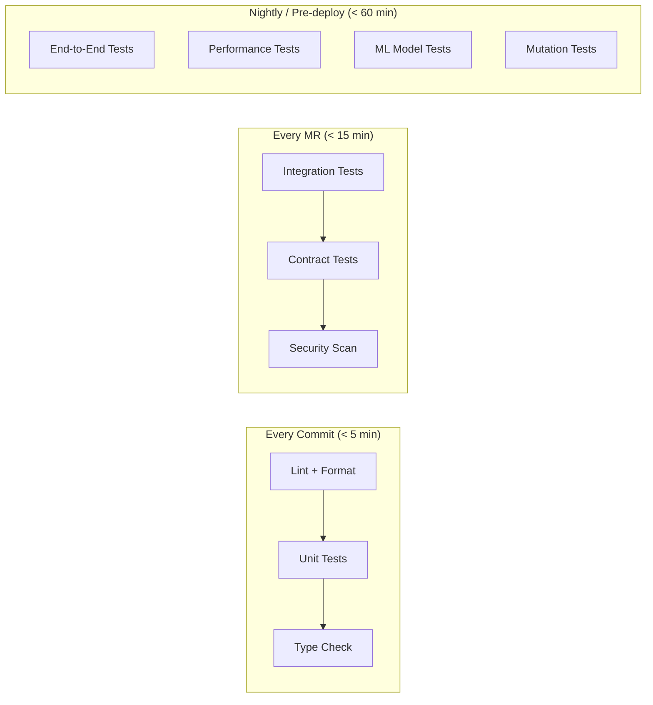

## Concrete CI/CD configuration

```yaml
# .gitlab-ci.yml

stages:
  - fast-checks      # every commit
  - integration      # every MR
  - thorough         # nightly / pre-deploy

# ─── FAST CHECKS (every commit, < 5 min) ───

lint:
  stage: fast-checks
  script:
    - ruff check app/ tests/
    - ruff format --check app/ tests/

unit-tests:
  stage: fast-checks
  script:
    - pytest tests/unit/ -x --timeout=10
    # -x = stop on first failure (fast feedback)
    # --timeout=10 = no test should take >10s

type-check:
  stage: fast-checks
  script:
    - mypy app/ --strict

# ─── INTEGRATION (every MR, < 15 min) ───

integration-tests:
  stage: integration
  services:
    - postgres:15
    - redis:7
  script:
    - alembic upgrade head
    - pytest tests/integration/ --timeout=30

contract-tests:
  stage: integration
  script:
    - pytest tests/contract/ -m "contract"

security-scan:
  stage: integration
  script:
    - pip-audit
    - bandit -r app/

# ─── THOROUGH (nightly or pre-deploy, < 60 min) ───

e2e-tests:
  stage: thorough
  rules:
    - if: $CI_PIPELINE_SOURCE == "schedule"  # nightly
    - if: $CI_COMMIT_TAG                      # release tags
  script:
    - docker-compose up -d
    - pytest tests/e2e/ --timeout=120
    - docker-compose down

performance-tests:
  stage: thorough
  rules:
    - if: $CI_PIPELINE_SOURCE == "schedule"
  script:
    - pytest tests/performance/ --benchmark-only
    - python scripts/check_latency_regression.py

ml-model-tests:
  stage: thorough
  rules:
    - if: $CI_PIPELINE_SOURCE == "schedule"
    - changes:
        - models/**
        - app/inference/**
  script:
    - pytest tests/ml/ --timeout=300
```

## Test markers for selective execution

```python
# pytest.ini
[pytest]
markers =
    unit: Fast, isolated unit tests
    integration: Tests requiring external services
    e2e: Full end-to-end tests
    slow: Tests that take >10 seconds
    ml: ML model quality tests
    contract: API contract tests
```

```python
# tests/unit/test_service.py
import pytest

@pytest.mark.unit
def test_preprocess_text():
    assert preprocess("HELLO") == "hello"

@pytest.mark.integration
@pytest.mark.asyncio
async def test_save_to_real_db(test_db):
    ...

@pytest.mark.e2e
@pytest.mark.slow
def test_full_user_journey():
    ...
```

```bash
# Run only fast tests (every commit)
pytest -m "unit" --timeout=10

# Run integration tests (every MR)
pytest -m "integration" --timeout=30

# Run everything (nightly)
pytest --timeout=300
```

## The decision matrix

| Test type | When to run | Failure action | Typical count |
|-----------|-------------|---------------|---------------|
| Lint + format | Every commit | Block merge | N/A |
| Unit tests | Every commit | Block merge | 100-500 |
| Type checking | Every commit | Block merge | N/A |
| Integration tests | Every MR | Block merge | 20-100 |
| Contract tests | Every MR | Block merge | 10-30 |
| Security scan | Every MR | Block merge (critical) / warn (low) | N/A |
| E2E tests | Nightly + pre-deploy | Alert team, block deploy | 5-20 |
| Performance tests | Nightly | Alert if regression >10% | 5-15 |
| ML model tests | On model/data changes | Block model deploy | 10-30 |
| Mutation tests | Weekly | Inform, improve tests | N/A |

## Key principles

1. **Fast tests gate merges** — developers get feedback in <5 minutes
2. **Slow tests gate deploys** — catch deeper issues before production
3. **Flaky tests get quarantined** — move to nightly, fix or delete
4. **Every test has a timeout** — no test should run forever
5. **Parallel execution** — split test suites across CI runners

---

## Curiosity Questions (Round 4)

1. **What is contract testing (Pact)?** — How do you verify that your API and its consumers agree on the interface without running both together?

2. **How do you handle test data management at scale?** — When you have hundreds of integration tests all needing different database states, how do you manage fixtures without them becoming unmaintainable?

3. **What is snapshot testing and when is it useful?** — How do you test complex outputs (JSON responses, HTML, ML model outputs) without writing assertions for every field?

4. **How do you test distributed systems (microservices)?** — When your service depends on 5 other services, how do you test the interactions?

5. **What is chaos engineering and how does it relate to testing?** — How do you test that your system handles failures gracefully in production?

---

# What is contract testing (Pact)?

## The Problem

You have a frontend that calls your API. You change the API response shape. Your unit tests pass. Their unit tests pass. But in production, the frontend breaks because it expected `user_name` and you renamed it to `username`.

Neither team's tests caught it because each side tests in isolation.

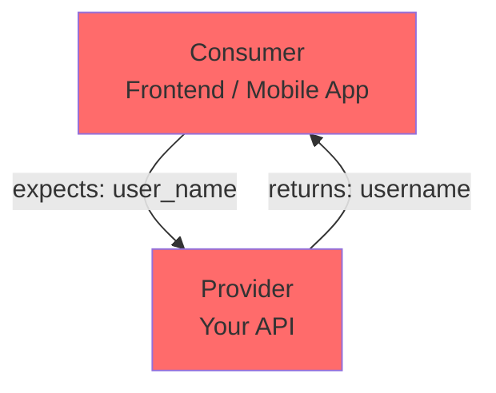

## What contract testing solves

A **contract** is a formal agreement between consumer and provider about the request/response format. Contract tests verify both sides honor the agreement — without needing to run both services together.

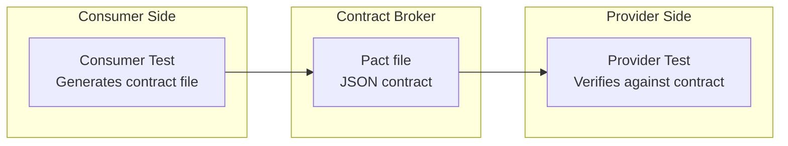

## How Pact works (Python example)

### Consumer side: define what you expect

```python
# tests/contract/test_consumer.py
import pytest
from pact import Consumer, Provider

@pytest.fixture
def pact():
    pact = Consumer("Frontend").has_pact_with(
        Provider("PredictionAPI"),
        pact_dir="./pacts"
    )
    pact.start_service()
    yield pact
    pact.stop_service()
    pact.verify()  # writes the contract file

def test_get_prediction(pact):
    # Define the expected interaction
    (pact
     .given("a model is loaded")
     .upon_receiving("a prediction request")
     .with_request("POST", "/predict", body={"text": "hello", "user_id": "u1"})
     .will_respond_with(200, body={
         "sentiment": "positive",      # consumer expects these exact keys
         "confidence": 0.95,
         "request_id": "some-uuid"
     }))
    
    # Make the actual call against Pact's mock server
    with pact:
        response = requests.post(f"{pact.uri}/predict", json={"text": "hello", "user_id": "u1"})
    
    assert response.json()["sentiment"] == "positive"
```

This generates a `pact.json` file — the contract.

### Provider side: verify you honor the contract

```python
# tests/contract/test_provider.py
from pact import Verifier

def test_provider_honors_contract():
    verifier = Verifier(provider="PredictionAPI", provider_base_url="http://localhost:8000")
    
    output, _ = verifier.verify_pacts(
        "./pacts/frontend-predictionapi.json",
        provider_states_setup_url="http://localhost:8000/_pact/setup"
    )
    
    assert output == 0  # 0 = all interactions verified
```

## When to use contract testing

| Scenario | Use contract testing? |
|----------|---------------------|
| Multiple teams consume your API | ✅ Yes |
| Frontend + Backend in same repo | Maybe (E2E tests might suffice) |
| Microservices calling each other | ✅ Yes |
| Public API with external consumers | ✅ Yes |
| Internal monolith | ❌ Overkill |

---

# How do you handle test data management at scale?

## The Problem

You have 200 integration tests. Each needs specific database state. You end up with:
- Massive fixture files nobody understands
- Tests that depend on other tests' data (fragile)
- Slow test runs because of complex setup/teardown

## Strategy 1: Factory pattern (Factory Boy)

Instead of static fixtures, use factories that generate test data on demand:

```python
# tests/factories.py
import factory
from app.models import User, Prediction

class UserFactory(factory.Factory):
    class Meta:
        model = User
    
    id = factory.LazyFunction(lambda: str(uuid.uuid4()))
    name = factory.Faker("name")
    email = factory.Faker("email")
    created_at = factory.LazyFunction(datetime.utcnow)

class PredictionFactory(factory.Factory):
    class Meta:
        model = Prediction
    
    id = factory.LazyFunction(lambda: str(uuid.uuid4()))
    user = factory.SubFactory(UserFactory)
    text = factory.Faker("sentence")
    sentiment = factory.Iterator(["positive", "negative", "neutral"])
    confidence = factory.LazyFunction(lambda: random.uniform(0.5, 1.0))
```

```python
# tests/integration/test_predictions.py
def test_get_user_predictions(clean_db):
    # Create exactly the data this test needs — nothing more
    user = UserFactory(name="Alice")
    PredictionFactory.create_batch(5, user=user, sentiment="positive")
    PredictionFactory.create_batch(3, user=user, sentiment="negative")
    
    result = get_user_stats(user.id)
    assert result["positive_count"] == 5
    assert result["negative_count"] == 3
```

## Strategy 2: Database transactions for isolation

```python
@pytest.fixture
async def db_session(test_db):
    """Each test runs in a transaction that gets rolled back."""
    transaction = await test_db.transaction()
    yield test_db
    await transaction.rollback()  # undo everything — fast, clean
```

No cleanup needed. Each test starts with the same base state.

## Strategy 3: Layered fixtures

```python
# conftest.py — base data that rarely changes
@pytest.fixture(scope="session")
async def base_data(session_db):
    """Reference data loaded once for all tests."""
    await session_db.execute("INSERT INTO categories VALUES ('electronics'), ('books')")
    await session_db.execute("INSERT INTO config VALUES ('max_batch', '100')")

# Per-test data built on top
@pytest.fixture
async def user_with_history(clean_db, base_data):
    user = await create_user(clean_db, "test@example.com")
    await create_predictions(clean_db, user.id, count=10)
    return user
```

## Key principles

1. **Each test creates its own data** — never depend on data from another test
2. **Use factories over static fixtures** — more flexible, self-documenting
3. **Transaction rollback over DELETE** — faster, no orphaned data
4. **Minimal data** — create only what the test needs, nothing extra
5. **Name fixtures by what they represent** — `user_with_expired_subscription` not `fixture_3`

---

# What is snapshot testing and when is it useful?

## What

Snapshot testing captures the output of your code and saves it to a file. On subsequent runs, it compares the current output to the saved snapshot. If they differ, the test fails — you then decide if the change is intentional (update snapshot) or a bug (fix code).

## How it works

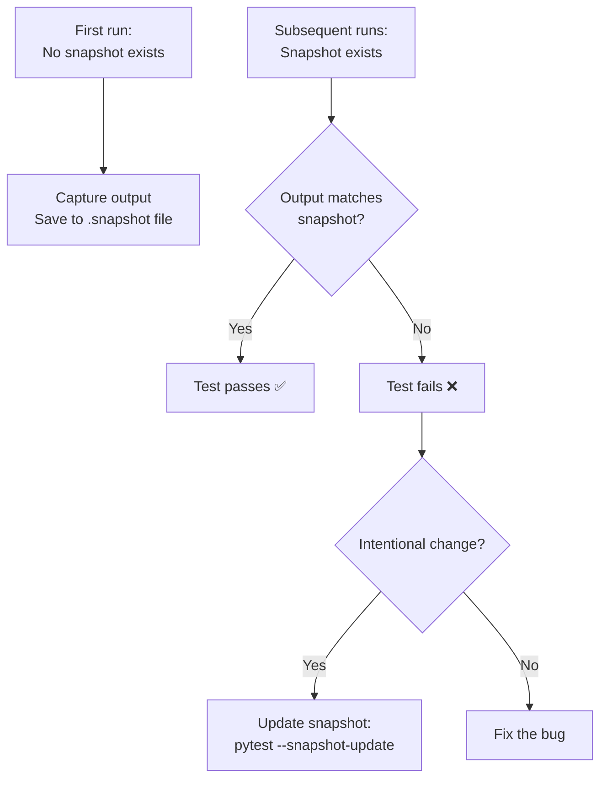

## Using syrupy (pytest snapshot library)

```bash
pip install syrupy
```

```python
# tests/test_api_responses.py

def test_prediction_response_shape(snapshot):
    response = predict("I love this product")
    assert response == snapshot
    # First run: saves response to __snapshots__/test_api_responses/test_prediction_response_shape.json
    # Next runs: compares against saved snapshot

def test_error_response_format(snapshot):
    response = predict("")  # invalid input
    assert response == snapshot

def test_model_output_structure(snapshot):
    """Catch unexpected changes in model output format."""
    model = load_model()
    output = model.predict_raw("test input")
    assert output == snapshot
```

Snapshot file (auto-generated):
```json
# __snapshots__/test_api_responses/test_prediction_response_shape.1.json
{
  "sentiment": "positive",
  "confidence": 0.92,
  "request_id": "...",
  "model_version": "v2.1"
}
```

## When snapshot testing is useful

| Good fit | Bad fit |
|----------|---------|
| Complex JSON API responses | Values that change every run (timestamps, UUIDs) |
| HTML/email template rendering | Floating point values that vary slightly |
| Configuration file generation | Tests where you need to understand WHY it failed |
| CLI output formatting | Simple assertions (just use `assert x == y`) |
| ML model output structure | Performance metrics (use thresholds instead) |

## Handling dynamic values

```python
from syrupy.matchers import path_type

def test_prediction_with_dynamic_fields(snapshot):
    response = predict("hello")
    # Ignore fields that change every run
    assert response == snapshot(matcher=path_type({
        "request_id": (str,),       # just check it's a string
        "timestamp": (str,),        # just check it exists
    }))
```

---

# How do you test distributed systems (microservices)?

## The Challenge

Your prediction service depends on:
- User service (get user profile)
- Feature store (get ML features)
- Model registry (load model version)
- Notification service (send results)

You can't run all 5 services in every test.

## Testing strategies by level

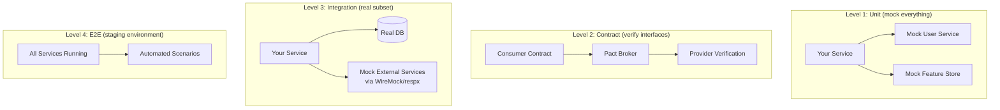

## Strategy 1: Service virtualization (WireMock / respx)

Record real responses from dependencies, replay them in tests:

```python
# tests/integration/test_with_virtual_services.py
import respx
import httpx

@respx.mock
@pytest.mark.asyncio
async def test_prediction_with_virtual_dependencies():
    # Virtualize the user service
    respx.get("http://user-service/users/u1").mock(
        return_value=httpx.Response(200, json={"id": "u1", "tier": "premium"})
    )
    
    # Virtualize the feature store
    respx.get("http://feature-store/features/u1").mock(
        return_value=httpx.Response(200, json={"features": [0.1, 0.5, 0.9]})
    )
    
    # Test YOUR service with virtualized dependencies
    result = await prediction_service.predict("u1", "great product")
    
    assert result["sentiment"] == "positive"
    assert result["user_tier"] == "premium"  # enriched from user service
```

## Strategy 2: Docker Compose for local integration

```yaml
# docker-compose.test.yml
services:
  prediction-service:
    build: .
    depends_on: [postgres, redis, mock-user-service]
    environment:
      USER_SERVICE_URL: http://mock-user-service:8080
  
  postgres:
    image: postgres:15
  
  redis:
    image: redis:7
  
  mock-user-service:
    image: wiremock/wiremock
    volumes:
      - ./tests/wiremock:/home/wiremock/mappings
```

```python
# tests/e2e/test_distributed.py
@pytest.mark.e2e
def test_full_prediction_flow():
    """All services running via docker-compose."""
    response = requests.post("http://localhost:8000/predict", json={
        "text": "amazing product",
        "user_id": "test-user-1"
    })
    
    assert response.status_code == 200
    assert response.json()["sentiment"] in ["positive", "negative", "neutral"]
    
    # Verify notification was sent (check mock service received it)
    notifications = requests.get("http://localhost:8081/__admin/requests").json()
    assert any("/notify" in r["request"]["url"] for r in notifications["requests"])
```

## Strategy 3: Test failure modes

The most important tests for distributed systems are **failure tests**:

```python
@respx.mock
@pytest.mark.asyncio
async def test_user_service_down_returns_degraded_response():
    """When user service is down, prediction still works with defaults."""
    respx.get("http://user-service/users/u1").mock(
        side_effect=httpx.ConnectTimeout("Connection refused")
    )
    
    result = await prediction_service.predict("u1", "hello")
    
    # Should still return a prediction, just without user enrichment
    assert result["sentiment"] in ["positive", "negative", "neutral"]
    assert result["user_tier"] == "unknown"  # graceful degradation

@respx.mock
@pytest.mark.asyncio
async def test_feature_store_slow_triggers_timeout():
    """When feature store is slow, we timeout and use cached features."""
    async def slow_response(request):
        await asyncio.sleep(10)  # simulate slow response
        return httpx.Response(200, json={"features": [0.1]})
    
    respx.get("http://feature-store/features/u1").mock(side_effect=slow_response)
    
    result = await prediction_service.predict("u1", "hello")
    assert result["used_cached_features"] is True
```

---

# What is chaos engineering and how does it relate to testing?

## What

Chaos engineering is the practice of **intentionally injecting failures into production (or staging) systems** to verify they handle failures gracefully. It's testing, but for resilience rather than correctness.

## How it differs from traditional testing

| Traditional testing | Chaos engineering |
|-------------------|-------------------|
| "Does it work when everything is fine?" | "Does it survive when things break?" |
| Controlled environment | Production-like environment |
| Specific inputs → expected outputs | Random failures → graceful degradation |
| Run before deploy | Run continuously in production |
| Finds logic bugs | Finds resilience gaps |

## The philosophy

> "The best way to avoid failure is to fail constantly." — Netflix

If your system can't handle a database going down at 3 AM, you'd rather discover that during business hours when engineers are watching.

## Types of chaos experiments

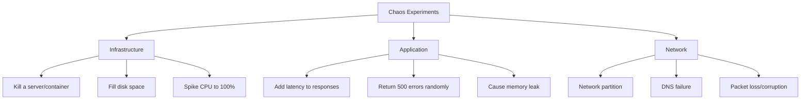

## Implementing chaos in Python (simple approach)

```python
# app/middleware/chaos.py
import random
import asyncio
from fastapi import Request
from starlette.middleware.base import BaseHTTPMiddleware

class ChaosMiddleware(BaseHTTPMiddleware):
    """Only enable in staging/chaos-testing environments."""
    
    def __init__(self, app, failure_rate=0.05, latency_ms=0):
        super().__init__(app)
        self.failure_rate = failure_rate
        self.latency_ms = latency_ms
    
    async def dispatch(self, request: Request, call_next):
        # Random failures
        if random.random() < self.failure_rate:
            return JSONResponse(status_code=500, content={"error": "chaos monkey"})
        
        # Random latency
        if self.latency_ms > 0:
            await asyncio.sleep(random.uniform(0, self.latency_ms) / 1000)
        
        return await call_next(request)

# Only in staging:
if os.environ.get("ENABLE_CHAOS") == "true":
    app.add_middleware(ChaosMiddleware, failure_rate=0.05, latency_ms=200)
```

## Testing resilience patterns

```python
# tests/chaos/test_resilience.py

@pytest.mark.asyncio
async def test_circuit_breaker_opens_after_failures():
    """After 5 consecutive failures, circuit breaker stops calling the service."""
    mock_service = AsyncMock()
    mock_service.call.side_effect = ConnectionError("down")
    
    breaker = CircuitBreaker(mock_service, failure_threshold=5)
    
    # First 5 calls fail normally
    for _ in range(5):
        with pytest.raises(ConnectionError):
            await breaker.call()
    
    # 6th call should fail FAST (circuit is open, doesn't even try)
    with pytest.raises(CircuitOpenError):
        await breaker.call()
    
    # Service was only called 5 times, not 6
    assert mock_service.call.call_count == 5

@pytest.mark.asyncio
async def test_retry_with_backoff():
    """Transient failures are retried with exponential backoff."""
    mock_service = AsyncMock()
    mock_service.call.side_effect = [
        ConnectionError("try 1"),
        ConnectionError("try 2"),
        {"result": "success"},  # succeeds on 3rd try
    ]
    
    result = await retry_with_backoff(mock_service.call, max_retries=3)
    
    assert result == {"result": "success"}
    assert mock_service.call.call_count == 3

@pytest.mark.asyncio
async def test_bulkhead_limits_concurrent_calls():
    """Bulkhead pattern limits concurrent requests to a dependency."""
    semaphore_service = BulkheadService(max_concurrent=3)
    
    # Try to make 10 concurrent calls
    results = await asyncio.gather(
        *[semaphore_service.call() for _ in range(10)],
        return_exceptions=True
    )
    
    # Some should succeed, some should be rejected
    successes = [r for r in results if not isinstance(r, BulkheadFullError)]
    rejections = [r for r in results if isinstance(r, BulkheadFullError)]
    
    assert len(successes) <= 3  # never more than 3 concurrent
```

## Chaos engineering tools

| Tool | What it does |
|------|-------------|
| Chaos Monkey (Netflix) | Randomly kills production instances |
| Litmus (Kubernetes) | Injects failures into K8s pods |
| Toxiproxy | Simulates network conditions (latency, partition) |
| Gremlin | Commercial chaos platform |
| pytest + mocks | DIY chaos for integration tests |

## The relationship to testing

```
Traditional tests: "Does it work?" → Yes/No
Chaos engineering: "How does it fail?" → Gracefully/Catastrophically

Together they answer: "Is this system reliable?"
```

Chaos engineering is NOT a replacement for testing. It's an additional layer:

1. **Unit tests** → Logic is correct
2. **Integration tests** → Components connect properly
3. **E2E tests** → System works end-to-end
4. **Chaos engineering** → System survives real-world failures

---

---

# How do you test ML model fairness at scale?

## The Problem

Simple fairness testing checks one attribute at a time (gender, age, race). But real bias is often **intersectional** — a model might be fair for women overall and fair for older people overall, but unfair for older women specifically.

## Intersectional testing

```python
# tests/ml/test_fairness_intersectional.py
import itertools
import pandas as pd
from sklearn.metrics import accuracy_score

class TestIntersectionalFairness:
    
    PROTECTED_ATTRIBUTES = {
        "gender": ["male", "female", "non-binary"],
        "age_group": ["18-25", "26-40", "41-60", "60+"],
        "ethnicity": ["white", "black", "hispanic", "asian", "other"],
    }
    
    ACCURACY_THRESHOLD = 0.75  # minimum acceptable per subgroup
    MAX_DISPARITY = 0.15       # max gap between best and worst subgroup
    
    def test_no_subgroup_below_threshold(self, trained_model, test_data):
        """Every intersectional subgroup must meet minimum accuracy."""
        results = []
        
        for attrs in itertools.product(*self.PROTECTED_ATTRIBUTES.values()):
            # Filter to this intersectional group
            mask = pd.Series(True, index=test_data.index)
            for attr_name, attr_val in zip(self.PROTECTED_ATTRIBUTES.keys(), attrs):
                mask &= test_data[attr_name] == attr_val
            
            subset = test_data[mask]
            if len(subset) < 30:  # skip groups too small for meaningful stats
                continue
            
            predictions = trained_model.predict_batch(subset["text"].tolist())
            acc = accuracy_score(subset["label"], predictions)
            results.append({"group": attrs, "accuracy": acc, "size": len(subset)})
        
        # Check no group is below threshold
        for r in results:
            assert r["accuracy"] >= self.ACCURACY_THRESHOLD, (
                f"Group {r['group']} accuracy {r['accuracy']:.3f} below {self.ACCURACY_THRESHOLD}"
            )
    
    def test_max_disparity_between_groups(self, trained_model, test_data):
        """Gap between best and worst performing group must be bounded."""
        accuracies = []
        
        for gender in self.PROTECTED_ATTRIBUTES["gender"]:
            subset = test_data[test_data["gender"] == gender]
            if len(subset) < 30:
                continue
            predictions = trained_model.predict_batch(subset["text"].tolist())
            accuracies.append(accuracy_score(subset["label"], predictions))
        
        disparity = max(accuracies) - min(accuracies)
        assert disparity <= self.MAX_DISPARITY, (
            f"Disparity {disparity:.3f} exceeds max {self.MAX_DISPARITY}"
        )
```

## Automated bias discovery (slicing)

Instead of manually defining groups, automatically find underperforming slices:

```python
# tests/ml/test_slice_finder.py
def test_no_hidden_underperforming_slices(trained_model, test_data):
    """Automatically discover data slices where model underperforms."""
    from slicefinder import SliceFinder
    
    predictions = trained_model.predict_batch(test_data["text"].tolist())
    test_data["correct"] = (predictions == test_data["label"]).astype(int)
    
    sf = SliceFinder(min_slice_size=50)
    bad_slices = sf.find(
        data=test_data,
        target_col="correct",
        feature_cols=["gender", "age_group", "text_length", "language"],
        threshold=0.7  # flag slices with accuracy < 70%
    )
    
    assert len(bad_slices) == 0, (
        f"Found {len(bad_slices)} underperforming slices:\n"
        + "\n".join(f"  {s['description']}: accuracy={s['accuracy']:.3f}" for s in bad_slices)
    )
```

## Counterfactual fairness testing

```python
def test_counterfactual_fairness(trained_model):
    """Changing protected attributes should not flip predictions."""
    templates = [
        "The customer named {name} complained about the service",
        "{name} wrote a review saying the product was excellent",
    ]
    
    name_groups = {
        "anglo": ["James", "Emily", "Michael"],
        "hispanic": ["Carlos", "Maria", "José"],
        "asian": ["Wei", "Priya", "Hiroshi"],
    }
    
    for template in templates:
        predictions_by_group = {}
        for group, names in name_groups.items():
            preds = [trained_model.predict(template.format(name=n))["sentiment"] for n in names]
            predictions_by_group[group] = preds
        
        # Majority prediction should be the same across groups
        from collections import Counter
        majorities = {g: Counter(p).most_common(1)[0][0] for g, p in predictions_by_group.items()}
        assert len(set(majorities.values())) == 1, (
            f"Counterfactual bias detected: {majorities}"
        )
```

---

# What is canary deployment testing?

## What

Canary deployment gradually routes a small percentage of production traffic to the new version. You monitor key metrics and automatically roll back if they degrade.

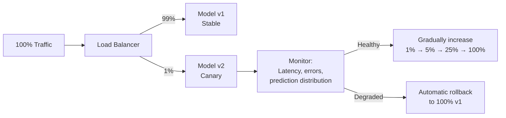

## Testing the canary mechanism itself

```python
# tests/test_canary.py
class TestCanaryDeployment:
    
    def test_traffic_split_respects_percentage(self):
        """1% canary means ~1% of requests go to new version."""
        router = CanaryRouter(canary_percentage=1)
        
        routes = [router.route(f"user-{i}") for i in range(10000)]
        canary_count = routes.count("canary")
        
        # 1% ± 0.5% tolerance
        assert 50 < canary_count < 150
    
    def test_same_user_always_gets_same_route(self):
        """Sticky routing — user shouldn't flip between versions."""
        router = CanaryRouter(canary_percentage=50)
        
        results = [router.route("user-42") for _ in range(100)]
        assert len(set(results)) == 1
    
    def test_rollback_on_high_error_rate(self):
        """Canary auto-rolls back when error rate exceeds threshold."""
        canary = CanaryController(
            error_threshold=0.05,
            latency_threshold_ms=200,
            min_requests=100
        )
        
        # Simulate canary getting 10% errors
        canary.record_metrics(total_requests=100, errors=10, p95_latency_ms=150)
        
        assert canary.should_rollback() is True
        assert canary.rollback_reason == "error_rate_exceeded"
    
    def test_no_rollback_when_healthy(self):
        canary = CanaryController(error_threshold=0.05, latency_threshold_ms=200, min_requests=100)
        
        canary.record_metrics(total_requests=500, errors=2, p95_latency_ms=80)
        
        assert canary.should_rollback() is False
    
    def test_promotion_after_sustained_health(self):
        """Canary promotes after being healthy for N minutes."""
        canary = CanaryController(
            promotion_window_minutes=10,
            error_threshold=0.05
        )
        
        # Simulate 10 minutes of healthy metrics
        for minute in range(10):
            canary.record_metrics(total_requests=100, errors=1, p95_latency_ms=50)
            canary.advance_time(minutes=1)
        
        assert canary.should_promote() is True
```

## Testing metric comparison between canary and stable

```python
def test_canary_metrics_compared_to_baseline():
    """Canary should not be significantly worse than stable."""
    comparator = CanaryComparator(significance_level=0.05)
    
    stable_metrics = {"latencies": [45, 50, 48, 52, 47] * 100}  # ~50ms avg
    canary_metrics = {"latencies": [90, 95, 88, 92, 91] * 20}   # ~90ms avg (worse!)
    
    result = comparator.compare(stable_metrics, canary_metrics)
    
    assert result["latency_regression"] is True
    assert result["recommendation"] == "rollback"

def test_canary_prediction_distribution_shift():
    """Canary should produce similar prediction distribution as stable."""
    stable_predictions = ["positive"] * 60 + ["negative"] * 30 + ["neutral"] * 10
    canary_predictions = ["positive"] * 20 + ["negative"] * 70 + ["neutral"] * 10  # shifted!
    
    from scipy.stats import chi2_contingency
    
    # Chi-squared test for distribution difference
    drift_detected = detect_distribution_shift(stable_predictions, canary_predictions)
    assert drift_detected is True  # canary is behaving differently
```

---

# How do you test feature stores?

## The Problem: Training-Serving Skew

Features computed during training (offline, batch) must match features served during inference (online, real-time). If they differ, your model gets inputs it wasn't trained on → silent accuracy degradation.

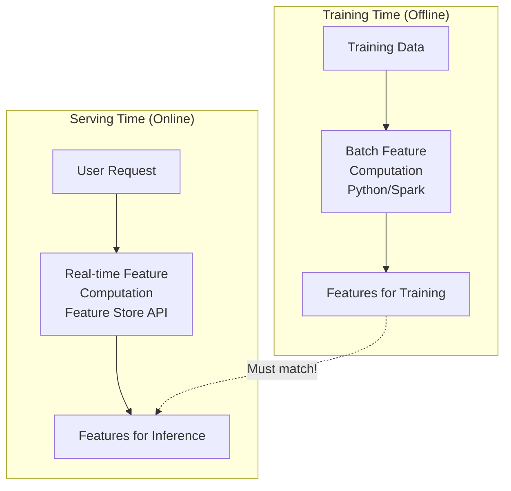

## Testing feature consistency

```python
# tests/test_feature_consistency.py
class TestFeatureConsistency:
    """Verify offline and online feature computation produce same results."""
    
    @pytest.fixture
    def known_user_data(self):
        """User with known raw data for deterministic feature computation."""
        return {
            "user_id": "test-user-1",
            "purchases": [
                {"amount": 100, "date": "2025-01-01", "category": "electronics"},
                {"amount": 50, "date": "2025-01-15", "category": "books"},
                {"amount": 200, "date": "2025-02-01", "category": "electronics"},
            ],
            "profile": {"age": 30, "signup_date": "2024-01-01"}
        }
    
    def test_offline_and_online_features_match(self, known_user_data):
        """Same input → same features, regardless of computation path."""
        offline_features = compute_features_offline(known_user_data)
        online_features = compute_features_online(known_user_data)
        
        for feature_name in offline_features:
            assert abs(offline_features[feature_name] - online_features[feature_name]) < 1e-6, (
                f"Feature '{feature_name}' differs: "
                f"offline={offline_features[feature_name]}, online={online_features[feature_name]}"
            )
    
    def test_feature_freshness(self, feature_store_client):
        """Features should not be stale beyond acceptable window."""
        metadata = feature_store_client.get_feature_metadata("user-1", "purchase_count")
        
        from datetime import datetime, timedelta
        max_staleness = timedelta(hours=24)
        age = datetime.utcnow() - metadata["last_computed_at"]
        
        assert age < max_staleness, f"Feature is {age} old, max allowed is {max_staleness}"
    
    def test_feature_schema_matches_model_expectation(self, feature_store_client):
        """Feature store returns all features the model expects."""
        expected_features = ["purchase_count", "avg_spend", "days_since_signup", "category_mode"]
        
        actual = feature_store_client.get_features("test-user-1")
        
        for feat in expected_features:
            assert feat in actual, f"Missing feature: {feat}"
            assert actual[feat] is not None, f"Feature '{feat}' is None"
```

## Testing feature transformations

```python
class TestFeatureTransformations:
    
    @pytest.mark.parametrize("purchases,expected_avg", [
        ([100, 200, 300], 200.0),
        ([0], 0.0),
        ([], 0.0),  # edge case: no purchases
    ])
    def test_average_spend_calculation(self, purchases, expected_avg):
        result = compute_avg_spend(purchases)
        assert result == expected_avg
    
    def test_category_mode_handles_ties(self):
        """When two categories have equal count, pick deterministically."""
        purchases = [
            {"category": "books", "amount": 10},
            {"category": "electronics", "amount": 20},
        ]
        result = compute_category_mode(purchases)
        # Should pick alphabetically first on tie
        assert result == "books"
    
    def test_feature_computation_is_deterministic(self, known_user_data):
        """Same input always produces same output (no randomness)."""
        results = [compute_features_offline(known_user_data) for _ in range(10)]
        assert all(r == results[0] for r in results)
```

## Integration test: end-to-end feature flow

```python
@pytest.mark.integration
class TestFeatureStoreE2E:
    
    async def test_write_and_read_features(self, feature_store):
        """Write features offline, read them online — should match."""
        features = {"purchase_count": 42, "avg_spend": 99.5}
        
        # Offline write
        await feature_store.write_features("user-1", features)
        
        # Online read
        retrieved = await feature_store.get_features("user-1")
        
        assert retrieved["purchase_count"] == 42
        assert retrieved["avg_spend"] == 99.5
    
    async def test_point_in_time_correctness(self, feature_store):
        """Features at training time should reflect historical state, not current."""
        # Write feature at time T1
        await feature_store.write_features("user-1", {"score": 0.5}, timestamp="2025-01-01")
        # Write updated feature at time T2
        await feature_store.write_features("user-1", {"score": 0.9}, timestamp="2025-06-01")
        
        # Point-in-time lookup for training (as of T1)
        historical = await feature_store.get_features("user-1", as_of="2025-03-01")
        assert historical["score"] == 0.5  # should get T1 value, not T2
```

---

# What is fuzzing and how does it apply to APIs?

## What

Fuzzing automatically generates **random, malformed, or unexpected inputs** and feeds them to your system to find crashes, hangs, memory leaks, and security vulnerabilities that you'd never think to test manually.

## The difference from property-based testing

| Property-based (Hypothesis) | Fuzzing |
|---------------------------|---------|
| Generates valid-ish inputs within constraints | Generates intentionally invalid/malformed inputs |
| Tests logical properties | Tests crash resistance |
| Developer defines input strategy | Tool mutates inputs randomly |
| Finds logic bugs | Finds crashes, security holes |

## API fuzzing with Schemathesis

Schemathesis reads your OpenAPI/Swagger spec and automatically generates thousands of requests:

```bash
pip install schemathesis

# Fuzz your API based on its OpenAPI spec
schemathesis run http://localhost:8000/openapi.json --checks all
```

It automatically tests:
- Invalid types (string where int expected)
- Boundary values (empty strings, huge numbers, negative values)
- Missing required fields
- Extra unexpected fields
- Special characters (null bytes, unicode, SQL injection patterns)
- Extremely long inputs

## Writing fuzz tests in pytest

```python
# tests/fuzz/test_api_fuzz.py
import schemathesis

schema = schemathesis.from_url("http://localhost:8000/openapi.json")

@schema.parametrize()
def test_api_does_not_crash(case):
    """No endpoint should return 500 for any valid-schema input."""
    response = case.call()
    assert response.status_code < 500  # 4xx is fine (validation), 5xx is a bug

@schema.parametrize(endpoint="/predict")
def test_predict_never_crashes(case):
    """Prediction endpoint specifically should handle all inputs."""
    response = case.call()
    assert response.status_code in (200, 422)  # either success or validation error
```

## Custom fuzzing for ML inputs

```python
# tests/fuzz/test_model_fuzz.py
import random
import string

class TestModelFuzzing:
    """Feed garbage to the model — it should never crash."""
    
    def generate_fuzz_inputs(self, count=1000):
        """Generate various malformed inputs."""
        inputs = []
        for _ in range(count):
            choice = random.choice(["empty", "null_bytes", "huge", "unicode", "special", "repeated"])
            
            if choice == "empty":
                inputs.append("")
            elif choice == "null_bytes":
                inputs.append("hello\x00world\x00")
            elif choice == "huge":
                inputs.append("a" * random.randint(100000, 1000000))
            elif choice == "unicode":
                inputs.append("".join(chr(random.randint(0, 0xFFFF)) for _ in range(100)))
            elif choice == "special":
                inputs.append("'; DROP TABLE users; --")
            elif choice == "repeated":
                inputs.append("🔥" * 10000)
            
            return inputs
    
    def test_model_handles_fuzz_inputs(self, trained_model):
        for fuzz_input in self.generate_fuzz_inputs(500):
            try:
                result = trained_model.predict(fuzz_input)
                # If it returns, verify it's valid
                assert result["sentiment"] in ["positive", "negative", "neutral"]
                assert 0.0 <= result["confidence"] <= 1.0
            except (ValueError, ValidationError):
                pass  # expected rejection is fine
            # But RuntimeError, SegFault, hang = BUG
    
    def test_api_handles_malformed_json(self, client):
        """Send invalid JSON — should get 422, not 500."""
        malformed_payloads = [
            b"not json at all",
            b'{"text": }',           # invalid JSON
            b'{"text": null}',       # null value
            b'{"text": 12345}',      # wrong type
            b'{"text": "a"' + b'a' * 1000000 + b'"}',  # huge payload
        ]
        
        for payload in malformed_payloads:
            response = client.post("/predict", content=payload, headers={"Content-Type": "application/json"})
            assert response.status_code < 500, f"Server crashed on: {payload[:50]}"
```

## What fuzzing finds that other tests miss

| Bug type | Example |
|----------|---------|
| Unhandled exceptions | Model crashes on null bytes in input |
| Memory exhaustion | 10MB input causes OOM |
| Infinite loops | Specific regex pattern causes catastrophic backtracking |
| SQL injection | Unescaped input in raw query |
| Denial of service | Specially crafted input takes 60s to process |

---

# How do you test ML model versioning and rollback?

## What needs testing

1. **Version registry** — Can you list, load, and compare model versions?
2. **Rollback mechanism** — Can you switch back to a previous version instantly?
3. **Compatibility** — Does old model work with current preprocessing/postprocessing?
4. **State consistency** — After rollback, is everything consistent?

## Testing the model registry

```python
# tests/test_model_registry.py
class TestModelRegistry:
    
    @pytest.fixture
    def registry(self, tmp_path):
        return ModelRegistry(storage_path=str(tmp_path))
    
    def test_register_and_retrieve_model(self, registry):
        model = train_simple_model()
        registry.register(model, version="v1.0", metadata={"accuracy": 0.92})
        
        loaded = registry.load("v1.0")
        assert loaded.predict("test") == model.predict("test")
    
    def test_list_versions(self, registry):
        registry.register(train_simple_model(), version="v1.0")
        registry.register(train_simple_model(), version="v1.1")
        registry.register(train_simple_model(), version="v2.0")
        
        versions = registry.list_versions()
        assert versions == ["v1.0", "v1.1", "v2.0"]
    
    def test_get_latest_version(self, registry):
        registry.register(train_simple_model(), version="v1.0")
        registry.register(train_simple_model(), version="v1.1")
        
        latest = registry.get_latest()
        assert latest.version == "v1.1"
    
    def test_load_nonexistent_version_raises(self, registry):
        with pytest.raises(ModelNotFoundError):
            registry.load("v99.0")
```

## Testing rollback

```python
# tests/test_rollback.py
class TestModelRollback:
    
    @pytest.mark.asyncio
    async def test_rollback_switches_serving_model(self, serving_app, registry):
        """After rollback, predictions come from the previous model."""
        # Register two models with different behavior
        model_v1 = MockModel(always_returns="negative")
        model_v2 = MockModel(always_returns="positive")
        
        registry.register(model_v1, version="v1")
        registry.register(model_v2, version="v2")
        
        # Deploy v2
        await serving_app.deploy("v2")
        result = await serving_app.predict("test")
        assert result["sentiment"] == "positive"  # v2 serving
        
        # Rollback to v1
        await serving_app.rollback("v1")
        result = await serving_app.predict("test")
        assert result["sentiment"] == "negative"  # v1 serving now
    
    @pytest.mark.asyncio
    async def test_rollback_is_instant(self, serving_app, registry):
        """Rollback should complete within seconds, not minutes."""
        import time
        
        registry.register(train_simple_model(), version="v1")
        registry.register(train_simple_model(), version="v2")
        await serving_app.deploy("v2")
        
        start = time.perf_counter()
        await serving_app.rollback("v1")
        elapsed = time.perf_counter() - start
        
        assert elapsed < 5.0, f"Rollback took {elapsed:.1f}s, should be < 5s"
    
    @pytest.mark.asyncio
    async def test_no_requests_dropped_during_rollback(self, serving_app, registry):
        """In-flight requests should complete, no 500 errors during switch."""
        registry.register(train_simple_model(), version="v1")
        registry.register(train_simple_model(), version="v2")
        await serving_app.deploy("v2")
        
        errors = []
        
        async def send_requests():
            for _ in range(100):
                try:
                    result = await serving_app.predict("test")
                    assert result["sentiment"] in ["positive", "negative", "neutral"]
                except Exception as e:
                    errors.append(e)
                await asyncio.sleep(0.01)
        
        # Send requests while rolling back
        await asyncio.gather(
            send_requests(),
            serving_app.rollback("v1")  # rollback happens mid-stream
        )
        
        assert len(errors) == 0, f"Dropped {len(errors)} requests during rollback"
```

## Testing version compatibility

```python
class TestVersionCompatibility:
    
    def test_old_model_works_with_current_preprocessing(self, registry):
        """After updating preprocessing, old models should still work."""
        old_model = registry.load("v1.0")  # trained with old preprocessing
        
        # Current preprocessing pipeline
        preprocessor = CurrentPreprocessor()
        text = preprocessor.clean("Hello World!")
        
        # Old model should handle current preprocessor output
        result = old_model.predict(text)
        assert result is not None
        assert result["sentiment"] in ["positive", "negative", "neutral"]
    
    def test_model_input_schema_backward_compatible(self, registry):
        """New model should accept same input format as old model."""
        old_model = registry.load("v1.0")
        new_model = registry.load("v2.0")
        
        test_inputs = ["hello", "test sentence", "another example"]
        
        for text in test_inputs:
            old_result = old_model.predict(text)
            new_result = new_model.predict(text)
            
            # Both should return same schema (values may differ)
            assert old_result.keys() == new_result.keys()
```

## Rollback testing in CI/CD

```yaml
# .gitlab-ci.yml
test_rollback:
  stage: thorough
  script:
    # Deploy current version
    - python deploy.py --version $CI_COMMIT_SHA
    - pytest tests/smoke/ --base-url $STAGING_URL
    
    # Deploy new version
    - python deploy.py --version $NEW_MODEL_VERSION
    - pytest tests/smoke/ --base-url $STAGING_URL
    
    # Rollback to previous
    - python deploy.py --rollback --version $CI_COMMIT_SHA
    - pytest tests/smoke/ --base-url $STAGING_URL
    
    # All three states should pass smoke tests
```

---

# How do you test ML model serving under load (load testing)?

## What

Load testing simulates many concurrent users hitting your ML API to find:
- Maximum throughput (requests/second)
- Latency under load (p50, p95, p99)
- Breaking point (when does it start failing?)
- Resource bottlenecks (CPU, memory, GPU)

## Tools

| Tool | Language | Best for |
|------|----------|----------|
| Locust | Python | Python teams, custom scenarios |
| k6 | JavaScript | High-performance, CI-friendly |
| wrk | C | Raw HTTP benchmarking |
| vegeta | Go | Constant-rate load testing |

## Using Locust (Python-native)

```python
# locustfile.py
from locust import HttpUser, task, between

class PredictionUser(HttpUser):
    wait_time = between(0.1, 0.5)  # wait 100-500ms between requests
    
    @task(weight=10)
    def predict_short_text(self):
        self.client.post("/predict", json={
            "text": "Great product, love it!",
            "user_id": "load-test-user"
        })
    
    @task(weight=3)
    def predict_long_text(self):
        self.client.post("/predict", json={
            "text": "This is a much longer review. " * 50,
            "user_id": "load-test-user"
        })
    
    @task(weight=1)
    def health_check(self):
        self.client.get("/health")
```

```bash
# Run load test: 100 concurrent users, ramp up 10 users/second
locust -f locustfile.py --host http://localhost:8000 --users 100 --spawn-rate 10 --run-time 5m --headless
```

## What to measure and assert

```python
# tests/load/test_performance.py
import subprocess
import json

def test_latency_under_load():
    """p95 latency should stay under 200ms with 50 concurrent users."""
    result = subprocess.run([
        "locust", "-f", "locustfile.py",
        "--host", "http://localhost:8000",
        "--users", "50",
        "--spawn-rate", "10",
        "--run-time", "60s",
        "--headless",
        "--json"
    ], capture_output=True, text=True)
    
    stats = json.loads(result.stdout)
    p95 = stats[0]["response_times"]["95%"]
    failure_rate = stats[0]["num_failures"] / stats[0]["num_requests"]
    
    assert p95 < 200, f"p95 latency {p95}ms exceeds 200ms threshold"
    assert failure_rate < 0.01, f"Failure rate {failure_rate:.2%} exceeds 1%"

def test_throughput():
    """System should handle at least 100 requests/second."""
    # ... run load test and check RPS
    assert rps > 100, f"Throughput {rps} RPS below 100 RPS threshold"
```

## Load testing patterns for ML

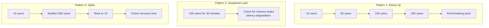

## ML-specific load testing concerns

| Concern | What to test |
|---------|-------------|
| Model loading time | Cold start latency when new worker spawns |
| GPU memory | Does it OOM under concurrent requests? |
| Batch vs single | Does batching improve throughput? |
| Large inputs | How does latency scale with input size? |
| Memory leaks | Does memory grow over hours of serving? |

---

# What is test-driven development (TDD) for ML?

## The Challenge

Traditional TDD: write test → watch it fail → write code → test passes.

ML TDD is harder because:
- You can't predict exact model outputs before training
- Model quality depends on data, not just code
- Training is expensive and slow

## Adapted TDD for ML

Instead of testing exact outputs, you test **properties, contracts, and thresholds**:

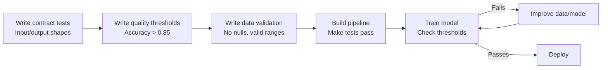

## TDD workflow for ML

### Step 1: Write contract tests FIRST (before any model exists)

```python
# tests/test_model_contract.py — written BEFORE training
class TestModelContract:
    """These define WHAT the model must do, not HOW."""
    
    def test_predict_returns_required_fields(self, model):
        result = model.predict("any text")
        assert "sentiment" in result
        assert "confidence" in result
    
    def test_confidence_is_bounded(self, model):
        result = model.predict("test")
        assert 0.0 <= result["confidence"] <= 1.0
    
    def test_handles_empty_input(self, model):
        result = model.predict("")
        assert result is not None  # should not crash
    
    def test_batch_predict_matches_single(self, model):
        texts = ["hello", "world"]
        batch_results = model.predict_batch(texts)
        single_results = [model.predict(t) for t in texts]
        assert batch_results == single_results
```

### Step 2: Write quality threshold tests (define "good enough")

```python
# tests/test_model_quality.py — written BEFORE training
class TestModelQuality:
    """Define minimum acceptable performance."""
    
    ACCURACY_THRESHOLD = 0.85
    LATENCY_THRESHOLD_MS = 50
    
    def test_accuracy_meets_threshold(self, model, test_dataset):
        predictions = [model.predict(t)["sentiment"] for t in test_dataset["text"]]
        accuracy = sum(p == l for p, l in zip(predictions, test_dataset["label"])) / len(predictions)
        assert accuracy >= self.ACCURACY_THRESHOLD
    
    def test_no_class_has_zero_recall(self, model, test_dataset):
        """Every class must be predicted at least sometimes."""
        predictions = [model.predict(t)["sentiment"] for t in test_dataset["text"]]
        predicted_classes = set(predictions)
        expected_classes = set(test_dataset["label"].unique())
        assert predicted_classes == expected_classes
```

### Step 3: Write data validation tests (before building pipeline)

```python
# tests/test_data.py — written BEFORE building data pipeline
class TestTrainingData:
    def test_minimum_samples_per_class(self, raw_data):
        counts = raw_data["label"].value_counts()
        assert counts.min() >= 100, "Need at least 100 samples per class"
    
    def test_no_duplicate_samples(self, raw_data):
        assert raw_data["text"].duplicated().sum() == 0
```

### Step 4: Build code to make tests pass

Now you build the model, pipeline, and preprocessing — running tests at each step to verify progress.

## What TDD gives you in ML

1. **Clear definition of "done"** — model is done when tests pass
2. **Regression detection** — if you retrain and tests fail, you know immediately
3. **Deployability criteria** — CI/CD can gate deploys on test results
4. **Documentation** — tests describe expected behavior

---

# How do you test data pipelines (ETL)?

## The Layers of a Data Pipeline

```mermaid
flowchart LR
    Extract[Extract<br/>Read from S3/DB/API] --> Transform[Transform<br/>Clean, aggregate,<br/>feature engineer] --> Load[Load<br/>Write to warehouse/<br/>feature store]
```

Each layer needs different testing strategies.

## Testing the Extract layer

```python
# tests/test_extract.py
from unittest.mock import patch, MagicMock
import pandas as pd

class TestExtract:
    
    @patch("app.pipeline.boto3.client")
    def test_extract_from_s3_parses_correctly(self, mock_boto):
        """Test that S3 data is read and parsed into expected format."""
        # Mock S3 response
        mock_s3 = MagicMock()
        mock_boto.return_value = mock_s3
        mock_s3.get_object.return_value = {
            "Body": io.BytesIO(b"id,text,label\n1,hello,positive\n2,bye,negative\n")
        }
        
        extractor = S3Extractor(bucket="ml-data", key="train.csv")
        df = extractor.extract()
        
        assert list(df.columns) == ["id", "text", "label"]
        assert len(df) == 2
    
    def test_extract_handles_missing_file(self):
        """Graceful error when source doesn't exist."""
        with pytest.raises(DataSourceError, match="not found"):
            extractor = S3Extractor(bucket="ml-data", key="nonexistent.csv")
            extractor.extract()
    
    def test_extract_handles_malformed_data(self, tmp_path):
        """Pipeline should fail clearly on corrupt data."""
        bad_file = tmp_path / "bad.csv"
        bad_file.write_text("this,is,not\nvalid,csv,data,extra_column")
        
        with pytest.raises(SchemaValidationError):
            extract_local(str(bad_file), expected_columns=["id", "text", "label"])
```

## Testing the Transform layer

This is where most bugs live. Test transformations with known inputs and outputs:

```python
# tests/test_transform.py
class TestTransform:
    
    def test_clean_text_removes_html(self):
        df = pd.DataFrame({"text": ["<p>Hello <b>world</b></p>"]})
        result = clean_text(df)
        assert result["text"].iloc[0] == "Hello world"
    
    def test_aggregate_user_features(self):
        purchases = pd.DataFrame({
            "user_id": ["u1", "u1", "u1", "u2"],
            "amount": [10, 20, 30, 100],
        })
        
        result = aggregate_user_features(purchases)
        
        assert result.loc[result["user_id"] == "u1", "total_spent"].iloc[0] == 60
        assert result.loc[result["user_id"] == "u1", "purchase_count"].iloc[0] == 3
    
    def test_transform_preserves_row_count(self, sample_data):
        """Transform should not drop rows unexpectedly."""
        result = transform_pipeline(sample_data)
        assert len(result) == len(sample_data)
    
    def test_transform_no_nulls_in_output(self, sample_data):
        result = transform_pipeline(sample_data)
        assert result.isna().sum().sum() == 0
    
    @pytest.mark.parametrize("input_val,expected", [
        ("$1,234.56", 1234.56),
        ("€99.99", 99.99),
        ("free", 0.0),
        ("", 0.0),
    ])
    def test_parse_price(self, input_val, expected):
        assert parse_price(input_val) == expected
```

## Testing the Load layer

```python
# tests/integration/test_load.py
class TestLoad:
    
    @pytest.mark.asyncio
    async def test_load_to_warehouse(self, test_warehouse_db):
        df = pd.DataFrame({
            "user_id": ["u1", "u2"],
            "feature_1": [0.5, 0.8],
            "feature_2": [1.2, 3.4],
        })
        
        loader = WarehouseLoader(connection=test_warehouse_db)
        await loader.load(df, table="user_features")
        
        # Verify data landed correctly
        rows = await test_warehouse_db.fetch("SELECT * FROM user_features")
        assert len(rows) == 2
        assert rows[0]["user_id"] == "u1"
    
    @pytest.mark.asyncio
    async def test_load_is_idempotent(self, test_warehouse_db):
        """Loading same data twice should not create duplicates."""
        df = pd.DataFrame({"user_id": ["u1"], "score": [0.9]})
        
        loader = WarehouseLoader(connection=test_warehouse_db)
        await loader.load(df, table="scores")
        await loader.load(df, table="scores")  # load again
        
        rows = await test_warehouse_db.fetch("SELECT * FROM scores")
        assert len(rows) == 1  # not 2
```

## End-to-end pipeline test

```python
# tests/integration/test_pipeline_e2e.py
class TestPipelineE2E:
    
    def test_full_pipeline_produces_valid_output(self, tmp_path):
        """Run entire pipeline on small test data, verify output."""
        # Create test input
        input_file = tmp_path / "input.csv"
        input_file.write_text("id,text,label\n1,great,positive\n2,bad,negative\n")
        
        output_file = tmp_path / "output.parquet"
        
        # Run pipeline
        run_pipeline(
            source=str(input_file),
            destination=str(output_file),
            config={"batch_size": 1}
        )
        
        # Verify output
        result = pd.read_parquet(output_file)
        assert len(result) == 2
        assert "features" in result.columns
        assert result["features"].isna().sum() == 0
```

## Data pipeline testing principles

1. **Test transforms with small, known data** — don't need 1M rows to verify logic
2. **Test edge cases explicitly** — nulls, empty strings, unicode, extreme values
3. **Test idempotency** — running pipeline twice should be safe
4. **Test schema evolution** — what happens when input adds a new column?
5. **Use Great Expectations or Pandera** for declarative data validation

---

# What is A/B testing infrastructure?

## What

A/B testing infrastructure is the system that:
1. Splits users into groups (A gets old model, B gets new model)
2. Ensures consistent assignment (same user always sees same variant)
3. Collects metrics per group
4. Determines statistical significance

## Architecture

```mermaid
flowchart TD
    Request[User Request] --> Splitter[Traffic Splitter<br/>Hash user_id → group]
    Splitter -->|Group A: 50%| ModelA[Model v1<br/>Current production]
    Splitter -->|Group B: 50%| ModelB[Model v2<br/>Candidate]
    ModelA --> Logger[Event Logger]
    ModelB --> Logger
    Logger --> Analytics[Analytics Pipeline<br/>Compare metrics]
    Analytics --> Decision{Significant<br/>difference?}
    Decision -->|Yes, B better| Promote[Promote Model v2]
    Decision -->|No / B worse| Keep[Keep Model v1]
```

## Testing the traffic splitter

```python
# app/ab_test.py
import hashlib

class ABSplitter:
    def __init__(self, experiment_id: str, traffic_split: float = 0.5):
        self.experiment_id = experiment_id
        self.split = traffic_split
    
    def get_variant(self, user_id: str) -> str:
        """Deterministic assignment based on user_id hash."""
        hash_input = f"{self.experiment_id}:{user_id}"
        hash_value = int(hashlib.sha256(hash_input.encode()).hexdigest(), 16)
        bucket = (hash_value % 1000) / 1000  # 0.000 to 0.999
        return "B" if bucket < self.split else "A"

# tests/test_ab_splitter.py
class TestABSplitter:
    
    def test_same_user_always_gets_same_variant(self):
        splitter = ABSplitter("exp-001", traffic_split=0.5)
        results = [splitter.get_variant("user-42") for _ in range(100)]
        assert len(set(results)) == 1  # always the same
    
    def test_split_is_approximately_correct(self):
        splitter = ABSplitter("exp-001", traffic_split=0.3)  # 30% in B
        
        variants = [splitter.get_variant(f"user-{i}") for i in range(10000)]
        b_ratio = variants.count("B") / len(variants)
        
        assert 0.27 < b_ratio < 0.33  # approximately 30% ± 3%
    
    def test_different_experiments_give_different_assignments(self):
        splitter_1 = ABSplitter("exp-001")
        splitter_2 = ABSplitter("exp-002")
        
        # Same user can be in different groups for different experiments
        assignments = [(splitter_1.get_variant(f"user-{i}"), splitter_2.get_variant(f"user-{i}")) for i in range(1000)]
        
        # Not all assignments should be the same across experiments
        unique_pairs = set(assignments)
        assert len(unique_pairs) > 1  # some users differ between experiments
    
    def test_zero_split_sends_all_to_control(self):
        splitter = ABSplitter("exp-001", traffic_split=0.0)
        variants = [splitter.get_variant(f"user-{i}") for i in range(100)]
        assert all(v == "A" for v in variants)
    
    def test_full_split_sends_all_to_treatment(self):
        splitter = ABSplitter("exp-001", traffic_split=1.0)
        variants = [splitter.get_variant(f"user-{i}") for i in range(100)]
        assert all(v == "B" for v in variants)
```

## Testing metric collection

```python
# tests/test_ab_metrics.py
class TestABMetrics:
    
    @pytest.mark.asyncio
    async def test_prediction_logs_experiment_variant(self, clean_db):
        """Every prediction should log which variant was served."""
        splitter = ABSplitter("model-v2-test", traffic_split=0.5)
        service = PredictionService(splitter=splitter, db=clean_db)
        
        await service.predict("user-1", "great product")
        
        log = await clean_db.fetchrow("SELECT * FROM experiment_logs WHERE user_id = 'user-1'")
        assert log["experiment_id"] == "model-v2-test"
        assert log["variant"] in ["A", "B"]
        assert log["prediction"] is not None
    
    def test_statistical_significance_calculation(self):
        """Test that we correctly detect significant differences."""
        from app.ab_analysis import is_significant
        
        # Clear winner: B has much higher conversion
        group_a = {"conversions": 100, "total": 1000}  # 10%
        group_b = {"conversions": 150, "total": 1000}  # 15%
        
        result = is_significant(group_a, group_b, confidence=0.95)
        assert result["significant"] is True
        assert result["winner"] == "B"
    
    def test_not_significant_with_small_sample(self):
        """Small samples should not be declared significant."""
        from app.ab_analysis import is_significant
        
        group_a = {"conversions": 5, "total": 10}
        group_b = {"conversions": 6, "total": 10}
        
        result = is_significant(group_a, group_b, confidence=0.95)
        assert result["significant"] is False
```

---

# How do you test observability (logging, metrics, tracing)?

## Why test observability?

Your monitoring is only useful if it actually fires when things go wrong. If you change code and accidentally remove a log line or metric, you won't know until an incident happens and your dashboard is blank.

## Testing logging

```python
# tests/test_logging.py
import logging

def test_prediction_logs_request_id(caplog):
    """Verify structured logging includes request_id for tracing."""
    with caplog.at_level(logging.INFO):
        service = PredictionService(model=mock_model, store=mock_store)
        await service.predict("hello", "user-1")
    
    # Find the log entry
    prediction_logs = [r for r in caplog.records if "prediction" in r.message.lower()]
    assert len(prediction_logs) >= 1
    
    # Verify structured fields
    log = prediction_logs[0]
    assert hasattr(log, "request_id") or "request_id" in log.message

def test_error_is_logged_on_model_failure(caplog):
    """Model failures must be logged at ERROR level."""
    mock_model = MagicMock()
    mock_model.predict.side_effect = RuntimeError("model crashed")
    
    with caplog.at_level(logging.ERROR):
        with pytest.raises(RuntimeError):
            service = PredictionService(model=mock_model, store=AsyncMock())
            await service.predict("test", "user-1")
    
    error_logs = [r for r in caplog.records if r.levelno >= logging.ERROR]
    assert len(error_logs) >= 1
    assert "model crashed" in error_logs[0].message
```

## Testing metrics (Prometheus)

```python
# tests/test_metrics.py
from prometheus_client import REGISTRY, CollectorRegistry, Counter, Histogram

@pytest.fixture
def clean_registry():
    """Fresh metrics registry for each test."""
    registry = CollectorRegistry()
    return registry

def test_prediction_counter_increments(clean_registry):
    """Each prediction should increment the counter."""
    counter = Counter("predictions_total", "Total predictions", registry=clean_registry)
    
    service = PredictionService(metrics_counter=counter, ...)
    service.predict("hello")
    service.predict("world")
    
    assert counter._value.get() == 2

def test_latency_histogram_records(clean_registry):
    """Prediction latency should be recorded."""
    histogram = Histogram(
        "prediction_duration_seconds", "Prediction latency",
        registry=clean_registry
    )
    
    service = PredictionService(metrics_histogram=histogram, ...)
    service.predict("test input")
    
    # Verify something was recorded
    assert histogram._sum.get() > 0

def test_error_counter_increments_on_failure(clean_registry):
    """Errors should be counted separately."""
    error_counter = Counter("prediction_errors_total", "Errors", ["error_type"], registry=clean_registry)
    
    mock_model = MagicMock()
    mock_model.predict.side_effect = ValueError("bad input")
    
    service = PredictionService(error_counter=error_counter, model=mock_model, ...)
    
    with pytest.raises(ValueError):
        service.predict("bad")
    
    assert error_counter.labels(error_type="ValueError")._value.get() == 1
```

## Testing alerts (verify alert conditions)

```python
# tests/test_alerts.py
def test_high_error_rate_triggers_alert():
    """If error rate > 5%, alert should fire."""
    alert_checker = AlertChecker(threshold=0.05)
    
    # Simulate metrics window: 10 errors out of 100 requests = 10%
    metrics = {"total_requests": 100, "total_errors": 10}
    
    result = alert_checker.evaluate(metrics)
    assert result.should_fire is True
    assert "error rate 10.0%" in result.message

def test_normal_error_rate_no_alert():
    """Error rate below threshold should not alert."""
    alert_checker = AlertChecker(threshold=0.05)
    
    metrics = {"total_requests": 1000, "total_errors": 2}  # 0.2%
    
    result = alert_checker.evaluate(metrics)
    assert result.should_fire is False
```

## Testing distributed tracing

```python
# tests/test_tracing.py
from unittest.mock import patch

def test_trace_propagated_to_downstream_calls():
    """Trace ID should be passed to all downstream service calls."""
    with patch("app.service.httpx.AsyncClient.get") as mock_get:
        mock_get.return_value = httpx.Response(200, json={})
        
        # Simulate incoming request with trace header
        headers = {"X-Trace-Id": "trace-abc-123"}
        await service.predict("hello", headers=headers)
        
        # Verify trace ID was forwarded to downstream call
        call_headers = mock_get.call_args[1]["headers"]
        assert call_headers["X-Trace-Id"] == "trace-abc-123"

def test_span_created_for_model_inference():
    """Model inference should create its own span for timing."""
    with patch("app.inference.tracer") as mock_tracer:
        model = SentimentModel("model.pkl")
        model.predict("test")
        
        mock_tracer.start_span.assert_called_with("model_inference")
```

## The observability testing principle

```
If you can't test that your monitoring works,
you'll only discover it's broken during an incident
— which is the worst time to find out.
```

Test observability the same way you test features: define expected behavior, verify it happens.


